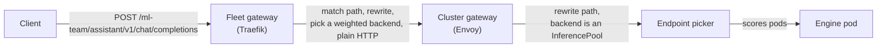
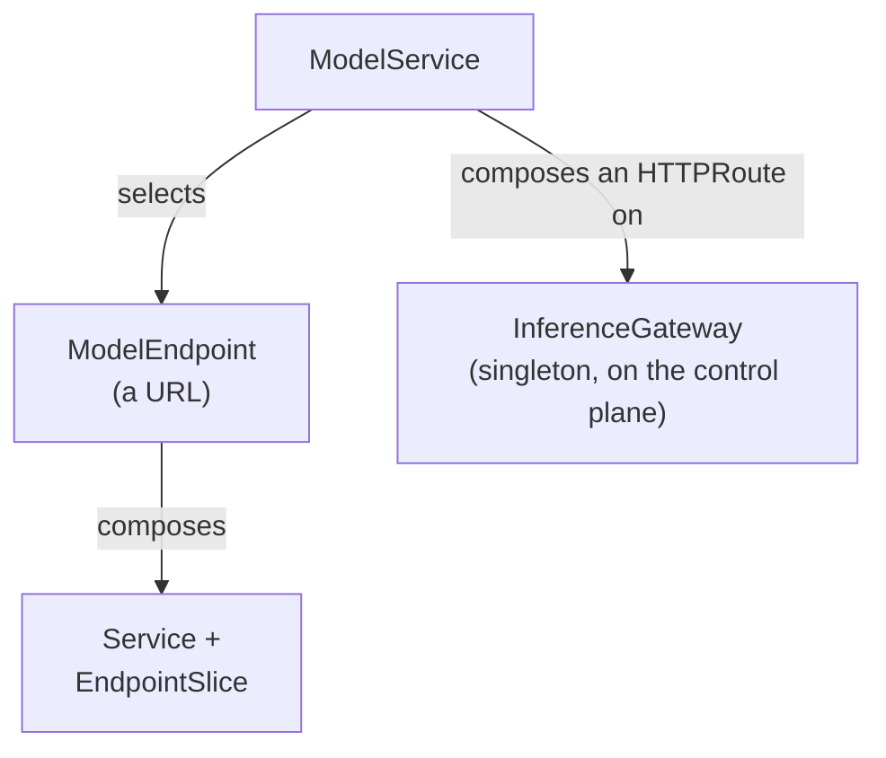
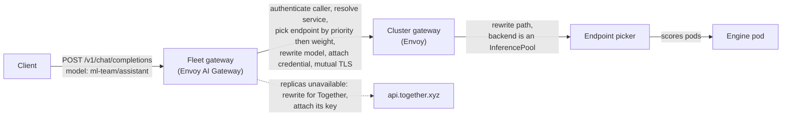
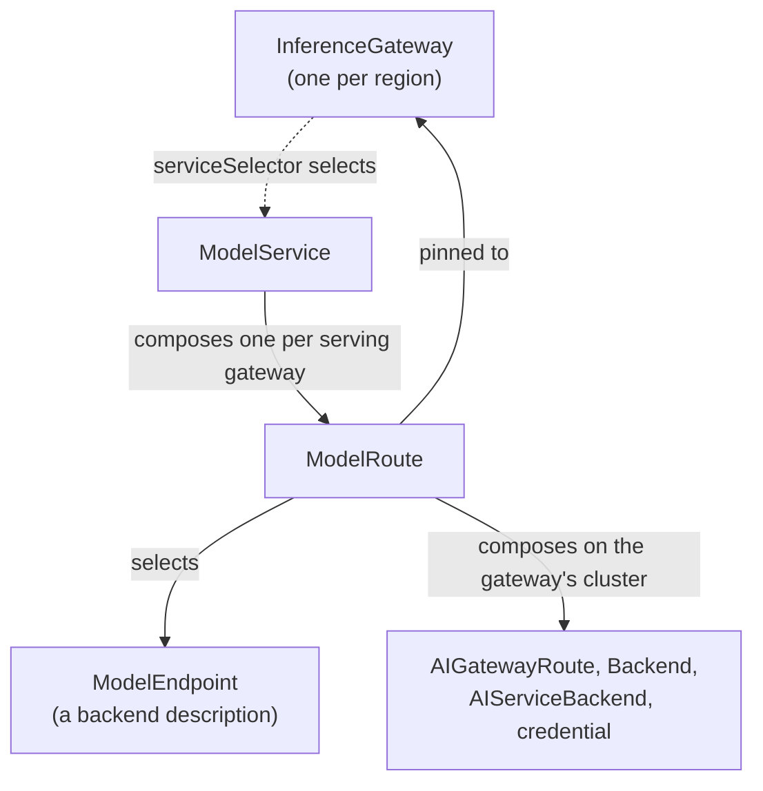

# The fleet gateway

Nic Cope, July 2026

## Background

Modelplane puts two gateways in the path of an inference request. One runs on
the control plane and gives each `ModelService` an OpenAI-compatible URL. The
other runs on every `InferenceCluster` and routes from that cluster's edge to
the engine pods. This document calls them the *fleet gateway* and the *cluster
gateway*. It's about the first. Fleet gateway is synonymous with
`InferenceGateway`.

### What we have today

The cluster gateway exists for two reasons. First, pods generally aren't
addressable outside the cluster. Reaching the engine pods at all needs some form
of ingress. Second, efficiently routing inference requests requires deciding per
engine (i.e. per pod). Which engines hold KV cache for a request? Which have deep
request queues?

To this end Modelplane deploys Envoy Gateway, Envoy AI Gateway, and the [Gateway
API Inference Extension][gaie] to every `InferenceCluster`. Each `ModelReplica`
gets its own endpoint picker, which scores on prefix-cache locality and queue
depth.

The fleet gateway (i.e. `InferenceGateway`) is the front door. It's the only
address a caller uses, and the only point common to every endpoint of a
`ModelService`. Those endpoints may be in different clusters, regions and clouds. Some may even
be at a provider that isn't our infrastructure at all. That
position is the reason it exists. Only the front door acts on a request while it
knows the whole fleet: the reconcile loop knows the fleet but has no request,
and a cluster gateway has a request but knows only its own pods.

The fleet gateway today is Traefik, a generic HTTP router driven by Gateway API.
A caller reaches a `ModelService` by a path prefix, each `ModelService` composes
one `HTTPRoute`, and a `ModelEndpoint` is a URL.



Traefik matches a path and forwards the request without reading the request
body. fleet. It doesn't authenticate anyone: neither gateway checks who is
calling, and any namespace can attach a route, so anything that reaches the
address can invoke any `ModelService`. Every hop is plain HTTP as well, from the
fleet gateway to the cluster edge across the public internet.



## Goals

The fleet gateway has to:

- Identify every caller, by authenticating it at the gateway or accepting an
  identity from a fronting layer that already did.
- Serve one `ModelService` across heterogeneous `ModelEndpoint`s, translating the model,
  credential, path and TLS for each.
- Meter every request per caller, streams included.
- Drop an endpoint that stops answering and failover to a backup.
- Run per region, so a service's traffic can stay in a jurisdiction.
- Encrypt both hops, in front of the gateway and behind it.
- Publish data and expose knobs, and leave the decisions to the operator.

It's not a goal to make policy decisions, like when to scale a deployment or
which caller wins when GPUs are scarce. These decisions depend on an
organization's rate card, contracts and budget, which don't belong in a shared
infrastructure API. Modelplane leaves them to the system above it, the way
Kubernetes leaves scaling to a separate controller.

Nor is it a goal to configure global load balancing across multiple fleet
gateways. The platform team configures that.

## Proposal

I propose the fleet gateway become an AI gateway, one that understands the
inference protocol. That lets it do what a plain HTTP router can't:
authenticate callers, translate a request for each backend, meter tokens, and
fail over.

It propose the `InferenceGateway` run [Envoy AI Gateway][envoy-ai-gateway], the
same software every `InferenceCluster` already runs for its cluster gateway.

I also propose an `InferenceGateway` run on an `InferenceCluster` instead of the
control plane, so a platform can place gateways where it needs them: one per
region to keep traffic in a jurisdiction, or two in a region to survive a
cluster outage.

A request, end to end. Had every self-hosted replica been unavailable, the dotted
path would have taken it to Together instead, under a different model name,
credential and path:



Routing picks a backend, and a second stage then translates the request for the
one that won, each field read off that backend. A caller names a `ModelService`
and gets back whichever model served, the way requesting `gpt-4o` from OpenAI
returns `gpt-4o-2024-08-06`.

### Gateway placement

An `InferenceGateway` runs on an `InferenceCluster`, alongside the rest of
Modelplane's components. A gateway's region is its cluster's, and gateway
placement is free to differ from model placement. A cluster with no GPU pools
can host a gateway and nothing else, which is what a region with callers but no
accelerators needs. A cluster that serves models can host a gateway too.
A cluster hosts at most one: a second would contend for the same listener, so an
`InferenceGateway` naming a cluster that already has one doesn't become ready.

The AI gateway is already installed on every `InferenceCluster`, alongside
cert-manager. Today it's only used to resolve `InferencePool` backends for the
cluster gateway.

An `InferenceGateway` doesn't fail over. Unlike a `ModelDeployment`, whose
replicas re-place onto another viable cluster when theirs goes away, a gateway
names its cluster directly and stays there. That it doesn't move is deliberate: a
gateway is (relatively) cheap supporting infrastructure rather than a workload, so
availability comes from redundancy rather than rescheduling. Run one per
`InferenceCluster` and any live cluster keeps callers served, or run two in a
region to survive a whole-cluster outage there. Failover would change the
gateway's address, forcing every caller (or GSLB layer) to the new one. A
gateway that migrated across regions would also defeat any residency it exists
to provide.

HA across the set of gateways is the platform's to run: geo DNS, an anycast VIP,
or an enterprise's own edge fronting them, each health-checking a gateway's
`status.address`.

### InferenceGateway

Cluster-scoped, one per cluster.

```yaml
apiVersion: modelplane.ai/v1alpha1
kind: InferenceGateway
metadata:
  name: eu
spec:
  # The InferenceCluster the gateway runs on.
  clusterName: gw-gcp-eu
  # The name the gateway answers on.
  hostname: eu.example.com
  # Secrets holding the gateway's certificate.
  tls:
    certificateRefs:
    - name: eu-example-com-tls
  auth:
    # Selects Secrets in modelplane-system holding caller API keys. Adding a
    # caller means writing a Secret, not editing the gateway.
    secretSelector:
      matchLabels:
        modelplane.ai/inference-keys: "true"
  # Selects the ModelServices this gateway serves. Absent, it serves every one.
  # Here it's scoped to a region.
  serviceSelector:
    matchLabels:
      example.org/region: eu
status:
  # The address the gateway answers on, and what hostname should point at.
  address: 34.56.129.3
  # The per-API base URLs a caller uses.
  endpoints:
    openAI: https://eu.example.com/v1
    anthropic: https://eu.example.com/anthropic/v1
  # The CA that signs the client certificates the gateway presents to cluster
  # gateways. See The hop to a cluster gateway.
  clientCACertificate: |
    -----BEGIN CERTIFICATE-----
    …
```

A gateway serves OpenAI at `/v1`, and Anthropic's Messages API at
`/anthropic/v1/messages`. Every service is reachable through both, and the
gateway translates between what the caller sent and what the backend speaks
(e.g. OpenAI -> Anthropic). It also serves a `/healthz` that returns 200 while
it's live and able to route. A geo-routed DNS record or a fronting edge
health-checks that to decide whether an address should be in rotation.

Both `hostname` and `tls` are optional. A gateway with neither serves plain
HTTP. This shape is useful for trying out Modelplane with minimal dependencies,
or if you intend to front Modelplane with an existing gateway that terminates
TLS and authenticates clients. The caller's hop stays plaintext unless someone
supplies a certificate or terminates TLS in front of the gateway.

The Secrets a gateway needs (caller keys, backend credentials, the gateway
certificate) are on the control plane. Modelplane propagates them to the
gateway's cluster.

`serviceSelector` picks the `ModelService`s a gateway serves. Absent, a gateway
serves every service. It's how you scope a gateway: to a region for residency, to
`public` services on an internet-facing front door, or to a set of services on a
dedicated gateway.

### ModelEndpoint

A `ModelEndpoint` describes a backend well enough for a gateway to talk to it.
Modelplane composes one per `ModelReplica`. You write one by hand only to
register a model it doesn't run:

```yaml
apiVersion: modelplane.ai/v1alpha1
kind: ModelEndpoint
metadata:
  name: kimi-k2-together
  namespace: ml-team
  labels:
    # A label of your own for a ModelService to select on. Any label works.
    modelplane.ai/endpoint: kimi-k2-together
spec:
  # Scheme and host, no path. An https origin gets TLS originated to it. This
  # must be a name rather than an address: the gateway only applies per-backend
  # model rewriting, credentials and priority failover when every backend in a
  # route is addressed by hostname.
  origin: https://api.together.xyz
  api:
    # The API this backend speaks, and the path it serves it under. The gateway
    # translates between this and whatever the caller sent. Most providers serve
    # /v1; Groq serves /openai/v1; our own clusters serve a per-replica path.
    schema: OpenAI
    prefix: /v1
  # The name the backend knows the model by. The gateway rewrites the request
  # body's model to it. Unset, the caller's model name passes through unchanged.
  model: moonshotai/Kimi-K2-Instruct
  # The backend's credential, which the gateway attaches on the way out. An
  # endpoint whose Secret is missing won't serve traffic and says so in its
  # conditions.
  credentialRef:
    name: together-api-key
    key: apiKey
```

A self-hosted engine only answers to the name it started with, so Modelplane
injects `MODELPLANE_SERVED_MODEL_NAME` into engine containers and expects the
`args` to reference it:

```yaml
args:
- --model=Qwen/Qwen3-8B
- --served-model-name=$(MODELPLANE_SERVED_MODEL_NAME)
```

`MODELPLANE_SERVED_MODEL_NAME` resolves to the `ModelDeployment`'s namespace and
name, e.g. `ml-team/kimi-k2`. Every composed endpoint has that name, plus
`modelplane.ai/deployment` and `modelplane.ai/cluster` labels a `ModelService`
selects on.

A composed endpoint's `origin` is its cluster gateway's internal name. A gateway
reaches it over mutual TLS, described under [The hop to a cluster
gateway](#the-hop-to-a-cluster-gateway) below.

### The hop to a cluster gateway

A composed endpoint's `origin` is its cluster gateway, and that hop crosses
whatever network separates two clusters. It takes a caller's prompt to the
engines, so it's mutually authenticated in both directions: a cluster gateway
refuses a request that arrives without a client certificate, and the fleet
gateway validates the cluster gateway it reached.

On each cluster, cert-manager issues that cluster's gateway serving certificate,
and on a fleet gateway's cluster it also issues the client certificate the
gateway presents. No private key leaves the cluster that made it. A fleet
gateway publishes its client CA in `status.clientCACertificate`. A cluster
collects every fleet gateway's client CA onto its serving listener and publishes
its own serving CA. Modelplane distributes those CA certificates, so only
certificates cross a cluster boundary, never keys.

The listener fails closed. A cluster becomes schedulable, and publishes the name
its endpoints use to reach it, only once it has an address, its own serving CA,
and at least one fleet gateway's client CA to enforce. So no endpoint exists
before the hop that reaches it can be mutually authenticated. A cluster gateway's
address is an IP or a load balancer's own name, with nowhere to publish DNS for
it, so Modelplane resolves the name itself, by creating a `Service` on each
fleet gateway's cluster.

### ModelService

A priority order over `ModelEndpoint`s, served from one or more gateways.

```yaml
apiVersion: modelplane.ai/v1alpha1
kind: ModelService
metadata:
  name: assistant
  namespace: ml-team
spec:
  endpoints:
  # weight splits traffic between endpoints at the same priority, so this pair
  # is a 90/10 canary across two deployments. name is a stable handle, unique
  # within the service, that Modelplane keys the entry's status by.
  - name: stable
    priority: 0
    weight: 90
    selector:
      matchLabels:
        modelplane.ai/deployment: kimi-k2
  - name: canary
    priority: 0
    weight: 10
    selector:
      matchLabels:
        modelplane.ai/deployment: kimi-k2-next
  # priority is an integer, 0 by default, lower preferred. A higher-numbered
  # priority is only tried when nothing lower-numbered is healthy, so Together
  # is failover here.
  - name: together
    priority: 1
    selector:
      matchLabels:
        modelplane.ai/endpoint: kimi-k2-together
status:
  # The name a caller passes as the request's model. Two services can't collide,
  # and the namespace serving a caller is legible in what it passes.
  model: ml-team/assistant
```

`priority` and `weight` do different jobs.

`priority` handles failover. Modelplane composes a `BackendTrafficPolicy` for
each `ModelService` that retries on a refused connection, timeout or 503 and
ejects the endpoint that caused it, so traffic shifts down a priority as the
tier above it loses healthy endpoints. The gateway retries such a request
against the next endpoint, which gets its own model name, credential and path,
but only until the first byte reaches the client. A backend that dies mid-stream
truncates the response.

`priority` orders the tiers, and `weight` divides traffic within one. Each
endpoint's share is its weight over the tier's total, so a tier with one
endpoint at 90 and another at 10 sends nine requests in ten to the first. It's
the knob for deliberate traffic shaping: a canary between two deployments, an
A/B test, or a standing bias toward capacity you've already paid for.

A caller reaches a `ModelService` by naming it in the request's `model` field, at
any gateway that serves it. There's no per-service address: a `ModelService` has
no `status.address`.

`/v1/models` on any gateway lists the services reachable through it, unscoped:
every key can list and call every one. Narrowing what a key can reach means
narrowing the gateway rather than the key: scope a gateway to a subset of services
with `serviceSelector`, or run a separate gateway with its own keys.

### ModelRoute

Which gateways serve a service is the gateway's choice, not the service's: an
`InferenceGateway`'s `serviceSelector` selects the services it exposes. So every
gateway that selects a `ModelService` needs its own copy of the routing objects,
the `AIGatewayRoute` a caller's model matches and the per-endpoint backends
behind it, on that gateway's cluster.

Modelplane composes them through a `ModelRoute`, one per serving gateway, rather
than from the `ModelService` directly. A `ModelRoute` is the routing analogue of
a `ModelReplica`: a copy of the service pinned to one gateway.



A `ModelService` reports `status.routes`, a ready and total count, and each
`ModelRoute` records the per-gateway detail, listable with `kubectl get
modelroutes -l modelplane.ai/service=<name>`, the way `ModelReplica`s back a
`ModelDeployment`'s replica count. Only Modelplane composes a `ModelRoute`. You
don't write one.

### Residency

Some traffic has to stay in a jurisdiction. An `InferenceGateway` can run per
region, so the front door can be in region. What's left is keeping a service's
traffic from leaving the region once a request reaches a gateway.

A gateway's `serviceSelector` picks the `ModelService`s it serves, and a
`ModelService` selects its endpoints by label. Point both at a region and an EU
service reaches only EU gateways, and from there only EU endpoints.

The region a self-hosted endpoint is in is a fact about the cluster that runs
it. An `InferenceCluster` has a `placement.metadata.labels` set that Modelplane
stamps onto every `ModelEndpoint` and `ModelReplica` composed there, so you
declare the region once on the cluster, and every endpoint inherits it. You must
label an external endpoint by hand. Modelplane can't know where Together serves
from.

Residency is then a service per region (`assistant-eu`, `assistant-us`), each
labelled for its gateways and selecting its endpoints. None of it is on by
default, so enforcing residency needs agreement between the team deploying
gateways and the team deploying services.

### Caller identity

When the gateway authenticates callers (as opposed to trusting an upstream
gateway), `auth.secretSelector` picks the Secrets with their keys. Each is a set
of API keys.

```yaml
apiVersion: v1
kind: Secret
metadata:
  name: ml-team-keys
  namespace: modelplane-system
  labels:
    modelplane.ai/inference-keys: "true"
stringData:
  # Each entry's name is the caller's identity.
  ml-team-assistant: sk-mp-a1b2c3…
  ml-team-nightly-eval: sk-mp-d4e5f6…
```

A credential's life, on the way through:

```
Authorization: Bearer sk-mp-d4e5f6…
  → matched across every selected Secret, resolving to a caller
  → stripped from the request; it travels no further
  → x-modelplane-caller: ml-team-nightly-eval
  → the ModelEndpoint's own credential, in the header its backend expects
```

Everything downstream that needs to know who asked, such as usage records or
anything matching on a request, reads the `x-modelplane-caller` header.
Modelplane has no notion of a caller's class, tier or priority: it stamps the
identity on every request and usage record, and leaves the ranking to whatever
consumes them.

`x-modelplane-caller` is the identity every downstream decision trusts, so who
may set it matters. When the gateway authenticates callers it derives the header
itself and overwrites any a caller sent, so a caller can't forge one. Without
`auth`, the gateway takes the caller from an inbound `x-modelplane-caller`
header, the way a fronting gateway that already authenticated passes the
identity on. Nothing downstream can tell a forged header from a real one, so
running without `auth` means you must ensure the gateway is reachable only
through the front that sets this header.

### Metering

Every request produces a usage record: a structured access log line from the
gateway. Here the same `ModelService` serves two requests, one from a replica and
one sent to Together:

```json
{"caller":"ml-team-assistant","service":"ml-team/assistant","endpoint":"ml-team/kimi-k2-prod-gke-eu-0","served_model":"ml-team/kimi-k2","input_tokens":412,"output_tokens":1180,"status":200}
{"caller":"ml-team-nightly-eval","service":"ml-team/assistant","endpoint":"ml-team/together-kimi-k2","served_model":"moonshotai/Kimi-K2-Instruct","input_tokens":8140,"output_tokens":96,"status":200}
```

Envoy writes the log and Modelplane chooses its shape. Modelplane declares the
token counts as request costs, which is what puts them within the log's reach.
Declaring them also makes the gateway ask for usage on streamed responses, which
otherwise report none.

A record exists even when a request never reaches an engine, but a token count
needs a response to read it from. Fail a request at the door, with every backend
unhealthy, and the record logs its caller, service and a 5xx status with no
tokens: enough to count the attempt and see the failure. The token counts appear
only once a backend answered.

## Alternatives considered

### Another AI gateway

An AI gateway has to meet the goals above, and speak the OpenAI and Anthropic
APIs callers use. One constraint narrows the field beyond features. We prefer a
vendor-neutral project, ideally under the CNCF.


| Option | Data plane | Governance | Disposition |
| --- | --- | --- | --- |
| Envoy AI Gateway | Envoy + ext_proc | Subproject of Envoy (CNCF graduated), multi-vendor | Chosen |
| agentgateway | Custom Rust | Linux Foundation, Solo.io-led | Closest alternative |
| LiteLLM | Python/FastAPI | BerriAI, no foundation, open-core | Rejected |
| Kong AI Gateway | OpenResty/Lua | Kong Inc, no foundation, open-core | Rejected |
| Apache APISIX | nginx/Lua | ASF, vendor-neutral, not CNCF | Rejected |
| Higress | Envoy + Istio, Wasm | CNCF Sandbox, Alibaba-led | Rejected |
| Portkey, Bifrost | TypeScript, Go | Single-vendor, open-core | Rejected |

[agentgateway][agentgateway] is technically the strongest alternative. It
appears to be less vendor-neutral than Envoy, and running it would mean a second
proxy stack alongside the Envoy we already run everywhere.

[LiteLLM][litellm] has strong schema translation and metering, but its request
path is Python/FastAPI, and it's configured by a file plus a database rather
than Kubernetes objects. It's single-vendor open-core, with a paid gateway as
the vendor's commercial product.

[Kong AI Gateway][kong] keeps the routing, failover and metering we need in its
enterprise tier rather than the OSS gateway. Building on it means depending on a
single vendor's paid license.

[Apache APISIX][apisix] is vendor-neutral (ASF) with its AI plugins fully open
source. It's an nginx/Lua stack, not built on the Envoy and Gateway API
substrate the rest of Modelplane uses, and it's ASF rather than CNCF.

[Higress][higress] is the closest of the crowd on architecture and governance,
but it's Alibaba-led with Alibaba defaults throughout, at CNCF's lowest maturity
tier.

### Building our own

This alternative would reproduce a data plane the Envoy community already
maintains, and we already run Envoy AI Gateway at every cluster edge. Building
our own means a second stack to maintain for no clear capability the chosen one
lacks.

### Addressing a `ModelService` by URL

Path addressing is impossible. The Envoy AI Gateway ext_proc recognizes a closed
set of inference-API paths, the OpenAI and Anthropic endpoints it serves, and
matches them exactly. It answers any other path with a 404 before it reads the
body. So a per-service path prefix would get that 404, and the ext_proc would
never read its body or find the model to route on. A caller names the service in
the request's `model` field instead.

### Filtering endpoints per gateway

Residency could instead be a filter on endpoints: a gateway gains an
`endpointSelector`, one `ModelService` spans regions, and each gateway drops the
endpoints that don't match. A service would then mean different things at
different gateways, legible only from computed status. It also hides capacity:
you write a service's `weight` and `priority` once, but they apply to whatever
endpoints survive each gateway's filter, so nine replicas in one region and one
in another silently serve very different loads. Scoping whole services to
gateways keeps a service meaning one thing and capacity a number you set.

### A dedicated cluster kind for gateways

A gateway and inference run fine on one cluster, so a separate kind adds a
concept and more infrastructure to run for little gain.

[gaie]: https://github.com/kubernetes-sigs/gateway-api-inference-extension
[envoy-ai-gateway]: https://aigateway.envoyproxy.io/
[agentgateway]: https://agentgateway.dev/
[litellm]: https://www.litellm.ai/
[kong]: https://konghq.com/products/kong-ai-gateway
[apisix]: https://apisix.apache.org/
[higress]: https://higress.cn/en/
