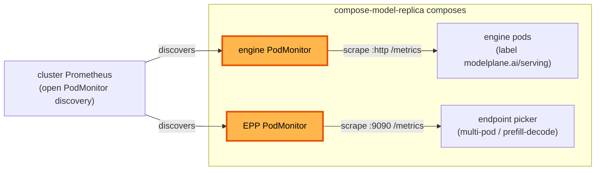

# Metrics collection

**Status:** Draft
**Date:** July 2026
**Author:** Dennis Ramdass

This document proposes managed Prometheus metrics collection for a deployment's
serving stack. Modelplane composes a `PodMonitor` for each source it owns, the
engine and, where present, the endpoint picker, so collection comes up with the
deployment and is removed with it, with nothing to assemble by hand. It is on by
default. It builds on [design.md](./design.md) and addresses
[#269](https://github.com/modelplaneai/modelplane/issues/269).

## Summary

Collecting a deployment's metrics is hand-wired today. vLLM exposes `/metrics` on
its serving port, the serving stack runs a Prometheus on every workload cluster
with open `PodMonitor` discovery, and an operator writes a `PodMonitor` by hand to
scrape the engine pods (the [#264](https://github.com/modelplaneai/modelplane/issues/264)
example). Nothing owns that wiring. The operator builds it by hand and keeps it in
sync with the deployment's shape. They delete it on teardown.

Instead, Modelplane composes the collection, per source:

- **Engine metrics**, for every deployment.
- **Endpoint picker metrics**, wherever Modelplane composes an endpoint picker
  (multi-pod Unified and prefill/decode).

Both come up with the deployment, are reclaimed with it, and share one opt-out
field. On by default:

```yaml
spec:
  replicas: 1
  template:
    spec:
      metrics:
        enabled: false   # default true; collection is composed unless disabled
      engines:
      - name: qwen
        # ...
```

The `ModelCache` and `ModelDeployment` specs are otherwise unchanged.

## Why this is small

Three existing pieces do the hard parts:

- **The serving label already spans every shape.** `modelplane.ai/serving` is on
  standalone pods, LeaderWorkerSet leaders, and both prefill/decode engines (it's
  the label the InferencePool selects on). One selector on it follows the shape,
  so the leader/worker and prefill/decode branching needs no special casing.
- **Prometheus already discovers openly.** `compose-serving-stack` runs
  kube-prometheus-stack with `podMonitorSelectorNilUsesHelmValues: false` and an
  empty namespace selector, so a composed `PodMonitor` is scraped with no operator
  action. It already scrapes the gateway's Envoy proxies this way; the engine and
  picker are the per-deployment sources still missing.
- **Modelplane owns the picker.** The EPP is Modelplane's own Deployment, so its
  metrics port and flags are ours to set.

## Engine metrics

For every deployment, `compose-model-replica` composes a `PodMonitor` on the
workload cluster (the same place it composes the Service and InferencePool),
selecting the replica's serving pods by `modelplane.ai/serving`:

```yaml
apiVersion: monitoring.coreos.com/v1
kind: PodMonitor
metadata:
  name: <replica>-metrics
  namespace: default
spec:
  selector:
    matchLabels:
      modelplane.ai/serving: <replica-name>
  podMetricsEndpoints:
  - port: http
    path: /metrics
    interval: 30s
```

It has no status of its own, so it uses default readiness (Ready once synced),
like the Service. No `mrap.yaml` change is needed: it's a provider-kubernetes
`Object`, already activated, and the CRD is installed by the Prometheus stack.

### Naming the port

The engine's serving port carries `/metrics`, so the backends give it a name (for
example `http`) in `native.py`, `llmd.py`, and the decode engine in `routing.py`.
The pd-sidecar's port stays unnamed. The `PodMonitor` then scrapes that port by
name, which matters for prefill/decode: the decode engine serves on 8001 because
the pd-sidecar takes 8000, so a `PodMonitor` matching port 8000 by number scrapes
the sidecar on decode pods, not the engine. Referencing the port by name scrapes
the engine on every pod regardless of its number. Naming is additive; the Service
and probes that reference the port by number are unaffected.

### What gets scraped

The `PodMonitor` ingests everything the engine exposes on `/metrics`. What the
engine emits is the user's, set through engine flags like everything else
(vLLM's `--disable-log-stats` and friends), so Modelplane doesn't decide which
metrics exist. It scrapes what's there.

Filtering at ingestion, dropping specific metrics for cost or cardinality, is a
Prometheus `metricRelabelings` knob. It's out of scope for now, because a
selection surface reintroduces the per-deployment wiring #269 removes. The nested
`metrics` object leaves room to add it if a real need appears.

## Endpoint picker metrics

Multi-pod Unified and prefill/decode serving front the engines with an endpoint
picker (EPP) that Modelplane composes, today
`llm-d-router-endpoint-picker:v0.9.0`. The EPP makes the routing decisions the
engine metrics don't show: endpoint selection, prefix-cache-aware scoring, and the
prefill/decode split. It exposes a rich `llm_d_epp_*` metric set (request and
error totals, TTFT and per-output-token latency, in-flight requests, pool KV-cache
usage, and scheduler and disaggregation timings), the signal for whether that
routing is working.

Because Modelplane owns the EPP Deployment and its args, collecting these is
straightforward. The EPP serves `/metrics` on a port set by `--metrics-port`
(default 9090), and its auth is a flag, `--metrics-endpoint-auth`. Modelplane sets
`--metrics-endpoint-auth=false` (the metrics are non-sensitive routing stats
reachable only in-cluster), declares the 9090 port on the Deployment, and composes
a plain `PodMonitor` for it, the same shape as the engine's. It's composed
alongside the EPP objects in `routing.py`, so it exists wherever an EPP does. No
ClusterRole, token, or TLS to manage.

## The opt-out field

`spec.template.spec.metrics.enabled` (boolean, default true), copied down to
`ModelReplica.spec`, governs both PodMonitors. A nested `metrics` object leaves
room for `interval` or `path` later; only `enabled` is defined now.
`compose-model-replica` composes the engine `PodMonitor`, and the EPP path
composes the picker's, unless `enabled` is false.

## Architecture



## Alternatives considered

### Opt-in, default off

Closer to today, because the operator still has to remember a toggle. The issue
asks for collection that is managed for them, so the default is on. Anyone who
doesn't want scraping opts out.

### Scrape the engine by port number, not name

The manual example matches `targetPort: 8000`. That scrapes the pd-sidecar on
prefill/decode decode pods instead of the engine, and it re-couples the
`PodMonitor` to a number that moves with the shape. Naming the port removes both
problems.

### Authenticate the EPP metrics endpoint

The EPP can serve `/metrics` behind controller-runtime auth (a `ClusterRole` with
`nonResourceURLs: /metrics` plus a bearer token). Since Modelplane owns the EPP
args and the endpoint carries non-sensitive routing stats reachable only
in-cluster, `--metrics-endpoint-auth=false` collects them with a plain
`PodMonitor` and nothing to manage. Auth would add a `ClusterRole`, a binding, and
a token for no gain here.

### One cluster-wide PodMonitor from the serving stack

`compose-serving-stack` could install a single `PodMonitor` selecting all serving
pods (`modelplane.ai/serving` Exists), close to the manual example. It would have
no per-deployment lifecycle: it wouldn't come and go with a deployment, and it
couldn't be opted out per deployment. Composing per replica ties collection to the
thing it observes.

### ServiceMonitor instead of PodMonitor

A `ServiceMonitor` scrapes through a Service, so it needs a Service per scrape
target. The engine and picker pods are the targets, and a `PodMonitor` scrapes
them directly, matching the manual path.

## Open questions

- **Port name.** `http` (the serving port that also serves `/metrics`) versus
  `metrics`. Leaning `http`, since it's the one serving port.
- **Configurability.** `interval` and `path` are fixed (30s, `/metrics`) for now.
  The nested `metrics` object leaves room to add them if a real need appears.

## Interaction with #264

The [#264](https://github.com/modelplaneai/modelplane/issues/264) example
documents the manual path. Once collection is composed, that example drops its
hand-written `podmonitor.yaml` and shows the opt-out field instead.
</content>
