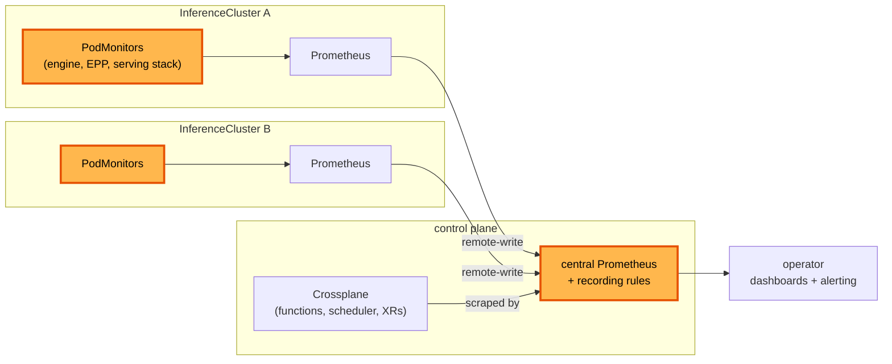

# Metrics collection

**Status:** Draft
**Date:** July 2026
**Author:** Dennis Ramdass

This document proposes managed metrics collection and aggregation across a
Modelplane deployment. Modelplane composes a `PodMonitor` for each source it owns on
every cluster, always on, and feeds them into one central Prometheus an operator
points dashboards and alerting at. It builds on [design.md](./design.md) and
addresses [#269](https://github.com/modelplaneai/modelplane/issues/269).

## What to monitor

There are four things worth watching in a Modelplane deployment.

1. **Inference signal (data plane).** vLLM's `/metrics`, the EPP's `llm_d_epp_*`,
   and Envoy. TTFT, tokens per second, queue depth, KV-cache occupancy, and request
   and error rates per model. It answers "is my model serving well, and is it
   saturated?"
2. **Substrate health.** The stack Modelplane installs on each workload cluster: is
   the gateway up, are cert-manager, the LeaderWorkerSet controller, and the NVIDIA
   DRA driver healthy, are GPUs allocatable. "Is the machinery on this cluster
   working?"
3. **Control-plane health.** Modelplane itself. Crossplane reconcile rates and
   errors, function latency and panics, the fleet scheduler placing replicas, and XR
   `Ready`/`Synced`. "Is the thing I operate working?"
4. **Fleet roll-up.** Across every cluster and deployment: total capacity, GPU
   usage, how many deployments are degraded, and cost.

An MD author cares about (1). The platform team owns the rest. A per-deployment
opt-in would cover only (1). Even then, the platform team has to plumb the metrics
somewhere the author can read them. So this design makes collection always on at
every layer and aggregates it centrally. It does not ask an MD author to manage a
toggle for something the platform team consumes.

## Collection: always-on PodMonitors

On each cluster, Modelplane composes a `PodMonitor` for every source it owns, with
no opt-in or opt-out. Three existing pieces make this cheap:

- **The serving label spans every shape.** `modelplane.ai/serving` is on standalone
  pods, LeaderWorkerSet leaders, and both prefill/decode engines (it's the label the
  InferencePool selects on). One selector on it follows the shape, so the
  leader/worker and prefill/decode branching needs no special casing.
- **Prometheus discovers openly.** `compose-serving-stack` runs kube-prometheus-stack
  with `podMonitorSelectorNilUsesHelmValues: false` and an empty namespace selector,
  so a composed `PodMonitor` is scraped with no operator action. It already scrapes
  the gateway's Envoy proxies this way.
- **Modelplane owns the picker.** The EPP is Modelplane's own Deployment, so its
  metrics port and flags are ours to set.

The sources are the engine (per deployment), the endpoint picker (wherever one
exists), and the serving-stack components (per cluster).

### Engine metrics

`compose-model-replica` composes a `PodMonitor` on the workload cluster (the same
place it composes the Service and InferencePool), selecting the replica's serving
pods by `modelplane.ai/serving`:

```yaml
apiVersion: monitoring.coreos.com/v1
kind: PodMonitor
metadata:
  name: <replica>-metrics
  namespace: default
spec:
  selector:
    matchLabels:
      modelplane.ai/serving: <replica-name>
  podMetricsEndpoints:
  - port: http
    path: /metrics
    interval: 30s
```

It has no status of its own, so it uses default readiness (Ready once synced), like
the Service. No `mrap.yaml` change is needed: it's a provider-kubernetes `Object`,
already activated, and the CRD is installed by the Prometheus stack.

### Naming the port

The engine's serving port carries `/metrics`, so the backends give it a name (for
example `http`) in `native.py`, `llmd.py`, and the decode engine in `routing.py`.
The pd-sidecar's port stays unnamed. The `PodMonitor` then scrapes that port by
name, which matters for prefill/decode: the decode engine serves on 8001 because the
pd-sidecar takes 8000, so a `PodMonitor` matching port 8000 by number scrapes the
sidecar on decode pods, not the engine. Referencing the port by name scrapes the
engine on every pod regardless of its number. Naming is additive; the Service and
probes that reference the port by number are unaffected.

### Endpoint picker metrics

Multi-pod Unified and prefill/decode serving front the engines with an endpoint
picker (EPP) that Modelplane composes, today
`llm-d-router-endpoint-picker:v0.9.0`. The EPP makes the routing decisions the
engine metrics don't show: endpoint selection, prefix-cache-aware scoring, and the
prefill/decode split. It exposes a rich `llm_d_epp_*` metric set (request and error
totals, TTFT and per-output-token latency, in-flight requests, pool KV-cache usage,
and scheduler and disaggregation timings), the signal for whether that routing is
working.

Because Modelplane owns the EPP Deployment and its args, collecting these is
straightforward. The EPP serves `/metrics` on a port set by `--metrics-port`
(default 9090), and its auth is a flag, `--metrics-endpoint-auth`. Modelplane sets
`--metrics-endpoint-auth=false` (the metrics are non-sensitive routing stats
reachable only in-cluster), declares the 9090 port on the Deployment, and composes a
plain `PodMonitor` for it, the same shape as the engine's. It's composed alongside
the EPP objects in `routing.py`, so it exists wherever an EPP does. No ClusterRole,
token, or TLS to manage.

### Serving-stack components

`compose-serving-stack` composes a `PodMonitor` for the substrate it installs: the
gateway's Envoy proxies (already scraped), cert-manager, the LeaderWorkerSet
controller, and the NVIDIA DRA driver. These are per-cluster and outlive any one
deployment, so they belong to the serving stack rather than to a replica.

### What gets scraped

The `PodMonitor` ingests everything a source exposes on `/metrics`. What the engine
emits is the user's, set through engine flags like everything else (vLLM's
`--disable-log-stats` and friends), so Modelplane doesn't decide which metrics
exist. It scrapes what's there.

This scrape feeds Prometheus for dashboards and alerting, so the 30s interval is an
observability default, not a routing input. The EPP scrapes engine `/metrics` on its
own fast internal loop for routing decisions, so routing latency doesn't depend on
this interval. An engine pod exposes on the order of dozens of series (request and
latency histograms, KV-cache, throughput); retention and storage sizing are the
Prometheus configuration below, not the composition of individual monitors.

## Aggregation: a central Prometheus

Each InferenceCluster runs a Prometheus already. This proposal adds a central
Modelplane Prometheus on the control plane. The per-cluster instances feed it, by
remote-write or by the central one federating them, so every cluster's series lands
in one place. The central instance also scrapes the control plane directly, for
Crossplane controller metrics, function latency and panics, the scheduler, and XR
`Ready`/`Synced`. Recording rules there roll up the fleet view of capacity, GPU
usage, and degraded deployments. The central Prometheus is then the single target an
operator points dashboards and an alerting stack at, for the whole deployment rather
than per cluster.

## Architecture



## Alternatives considered

### A per-deployment opt-out field

The earlier shape of this proposal put an `enabled` toggle on the deployment and
composed the engine and picker `PodMonitor`s unless it was false. It covers only the
data plane, and it asks an MD author to opt in or out of collection that the platform
team plumbs and consumes. Always-on collection at every layer fits the ownership
better, so the toggle is dropped.

### Per-cluster Prometheus only, no central instance

Leaving each InferenceCluster's Prometheus standalone is less to compose, but it
gives an operator no single place to query and no home for control-plane or
fleet-roll-up metrics. They'd federate the clusters by hand, which is the wiring
#269 is trying to remove. The central instance is the point.

### One cluster-wide PodMonitor from the serving stack

`compose-serving-stack` could install a single `PodMonitor` selecting all serving
pods (`modelplane.ai/serving` Exists). It would have no per-deployment lifecycle: it
wouldn't come and go with a deployment. Composing the engine monitor per replica ties
that collection to the thing it observes, while the serving-stack monitors, which are
per-cluster, are composed once with the stack.

### ServiceMonitor instead of PodMonitor

A `ServiceMonitor` scrapes through a Service, so it needs a Service per scrape
target. The engine and picker pods are the targets, and a `PodMonitor` scrapes them
directly, matching the manual path.

### Authenticate the EPP metrics endpoint

The EPP can serve `/metrics` behind controller-runtime auth (a `ClusterRole` with
`nonResourceURLs: /metrics` plus a bearer token). Since Modelplane owns the EPP args
and the endpoint carries non-sensitive routing stats reachable only in-cluster,
`--metrics-endpoint-auth=false` collects them with a plain `PodMonitor` and nothing
to manage. Auth would add a `ClusterRole` and a bearer token for no gain here.

## Open questions

- **Feed mechanism.** Per-cluster remote-write into the central instance, or central
  federation of each cluster. Remote-write is more timely and survives a cluster
  Prometheus restart. Federation is simpler to stand up.
- **Central retention and sizing.** The central instance holds every cluster's
  series, so its retention and storage need sizing that the per-cluster instances
  don't. A sensible default belongs with the central instance's composition.
- **Phasing.** Data-plane and substrate collection (1 and 2) are the direct #269
  ask. Control-plane and fleet-roll-up (3 and 4) can land after, once the central
  instance exists.
- **Port name.** `http` (the serving port that also serves `/metrics`) versus
  `metrics`. Leaning `http`, since it's the one serving port.

## Interaction with #264

The [#264](https://github.com/modelplaneai/modelplane/issues/264) example documents
the manual path: a hand-written `PodMonitor` plus the operator wiring to consume it.
Once collection is composed and aggregated, that example drops the hand-written
`podmonitor.yaml`.

On upgrade, an existing hand-written `PodMonitor` has to be deleted, or it
double-scrapes the same pods alongside the composed one. This warrants a release
note.
