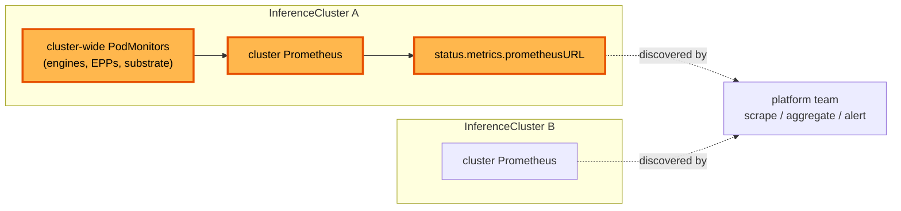

# Metrics collection

**Status:** Draft
**Date:** July 2026
**Author:** Dennis Ramdass

This document proposes managed metrics collection inside each `InferenceCluster`, with
a discoverable Prometheus URL on the cluster's status so the platform team can consume
it. It builds on [design.md](./design.md) and addresses
[#269](https://github.com/modelplaneai/modelplane/issues/269).

Concretely, this proposes:

1. cluster-wide `PodMonitor`s, composed once with the serving stack, that scrape every
   Modelplane source on the cluster (engines, endpoint pickers, substrate), always on
   with no per-deployment toggle
2. a `status.metrics.prometheusURL` on the `InferenceCluster`, so the platform team can
   find the cluster's Prometheus without reaching into Modelplane internals

Cross-cluster aggregation and control-plane monitoring stay with the platform team and
are out of scope. Approving this means agreeing to that scope.

## What to monitor

There are four things worth watching in a Modelplane deployment.

1. **Inference signal (data plane).** vLLM's `/metrics`, the EPP's `llm_d_epp_*`, and
   Envoy. TTFT, tokens per second, queue depth, KV-cache occupancy, and request and
   error rates per model. It answers "is my model serving well, and is it saturated?"
2. **Substrate health.** The stack Modelplane installs on each workload cluster: is the
   gateway up, are cert-manager, the LeaderWorkerSet controller, and the NVIDIA DRA
   driver healthy, are GPUs allocatable. "Is the machinery on this cluster working?"
3. **Control-plane health.** Modelplane itself. Crossplane reconcile rates and errors,
   function latency and panics, the fleet scheduler placing replicas, and XR
   `Ready`/`Synced`. "Is the thing I operate working?"
4. **Fleet roll-up.** Across every cluster and deployment: total capacity, GPU usage,
   how many deployments are degraded, and cost.

This proposal covers (1) and (2) inside each cluster and makes the data discoverable. An
MD author cares about (1), and the platform team owns the rest. Aggregating across
clusters and monitoring the control plane stay with the platform team, and the end of
this document returns to them.

## Collection: cluster-wide PodMonitors

The serving stack composes a small fixed set of `PodMonitor`s per cluster, always on,
with no opt-in or opt-out. Because there's no toggle and nothing per-deployment to track,
one cluster-wide selector per source is simpler than a monitor composed per replica.
Three existing pieces make it cheap:

- **The serving label spans every shape.** `modelplane.ai/serving` is on standalone
  pods, LeaderWorkerSet leaders, and both prefill/decode engines (it's the label the
  InferencePool selects on). One selector on it follows the shape, so the leader/worker
  and prefill/decode branching needs no special casing.
- **Prometheus discovers openly.** `compose-serving-stack` runs kube-prometheus-stack
  with `podMonitorSelectorNilUsesHelmValues: false` and an empty namespace selector, so
  a composed `PodMonitor` is scraped with no operator action. It already scrapes the
  gateway's Envoy proxies this way.
- **Modelplane owns the picker.** The EPP is Modelplane's own Deployment, so its metrics
  port and flags are ours to set.

### Engine metrics

`compose-serving-stack` composes one `PodMonitor` that selects every serving pod on the
cluster by `modelplane.ai/serving`, so it scrapes every engine of every deployment:

```yaml
apiVersion: monitoring.coreos.com/v1
kind: PodMonitor
metadata:
  name: modelplane-engines
  namespace: modelplane-system
spec:
  selector:
    matchExpressions:
    - {key: modelplane.ai/serving, operator: Exists}
  podMetricsEndpoints:
  - port: http
    path: /metrics
    interval: 30s
```

One monitor covers every replica of every deployment. Collection is a cluster property,
composed once with the stack, not something that comes and goes with each
`ModelDeployment`.

### Naming the port

The engine's serving port carries `/metrics`, so the backends give it a name such as
`http` in `native.py`, `llmd.py`, and the decode engine in `routing.py`. The pd-sidecar's
port stays unnamed. The `PodMonitor` scrapes that port by name, which matters for
prefill/decode: the decode engine serves on 8001 because the pd-sidecar takes 8000, so a
`PodMonitor` matching port 8000 by number scrapes the sidecar on decode pods, not the
engine. Referencing the port by name scrapes the engine on every pod regardless of its
number. Naming is additive; the Service and probes that reference the port by number are
unaffected.

### Endpoint picker metrics

Multi-pod Unified and prefill/decode serving front the engines with an endpoint picker
(EPP) that Modelplane composes, today `llm-d-router-endpoint-picker:v0.9.0`. The EPP makes
the routing decisions the engine metrics don't show: endpoint selection,
prefix-cache-aware scoring, and the prefill/decode split. It exposes a rich `llm_d_epp_*`
metric set (request and error totals, TTFT and per-output-token latency, in-flight
requests, pool KV-cache usage, and scheduler and disaggregation timings), the signal for
whether that routing is working.

A second cluster-wide `PodMonitor` selects every EPP by its Modelplane label. Because
Modelplane owns the EPP Deployment and its args, this is cheap: it sets
`--metrics-endpoint-auth=false` (the metrics are non-sensitive routing stats reachable
only in-cluster) and declares the port (default 9090) on the Deployment. No ClusterRole,
token, or TLS to manage.

### Substrate

`compose-serving-stack` also composes a `PodMonitor` for the substrate it installs: the
gateway's Envoy proxies (already scraped), cert-manager, the LeaderWorkerSet controller,
and the NVIDIA DRA driver. Same shape, same place, so all three sources are composed
together with the stack.

### What gets scraped

A `PodMonitor` ingests everything a source exposes on `/metrics`. What the engine emits is
the user's, set through engine flags like everything else (vLLM's `--disable-log-stats`
and friends), so Modelplane doesn't decide which metrics exist. It scrapes what's there.

This scrape feeds Prometheus for dashboards and alerting, so the 30s interval is an
observability default, not a routing input. The EPP scrapes engine `/metrics` on its own
fast internal loop for routing decisions, so routing latency doesn't depend on this
interval. An engine pod exposes on the order of dozens of series (request and latency
histograms, KV-cache, throughput); retention and storage sizing are the cluster
Prometheus's configuration, not the composition of individual monitors.

## Making the per-cluster Prometheus discoverable

Each `InferenceCluster` already runs a Prometheus, installed by `compose-serving-stack`
(kube-prometheus-stack). With the `PodMonitor`s above composed, that Prometheus holds all
of the cluster's Modelplane sources, from the engines and EPPs to the substrate.
Modelplane exposes its in-cluster URL on the `InferenceCluster` status:

```yaml
status:
  metrics:
    prometheusURL: http://prometheus-operated.modelplane-system.svc:9090
```

Modelplane publishes where the Prometheus is, and does not expose it outside the cluster.
Reaching it across clusters stays the platform team's job, through whatever cross-cluster
path they already run, the same way they reach any in-cluster service. Publishing the URL
saves them from digging into Modelplane internals to locate the cluster's Prometheus.

## Aggregation, and where this stops

This proposal stops at per-cluster collection and the discoverable URL. Beyond that, the
platform team wires up cross-cluster aggregation and control-plane monitoring itself.
Whether Modelplane should later package a managed central Prometheus for the whole
deployment is out of scope here, and the main open question below.

## Architecture



## Alternatives considered

### A PodMonitor per replica

`compose-model-replica` could compose a `PodMonitor` per replica, so collection comes and
goes with the deployment. With no opt-out and a cluster-wide Prometheus, that per-deployment
lifecycle buys nothing over one cluster-wide monitor, and it composes N monitors where one
does the same job. Collection is a cluster property, so it's composed once with the stack.

### A per-deployment opt-out field

An earlier shape put an `enabled` toggle on the deployment. It covers only the data plane
and asks an MD author to opt in or out of collection that the platform team plumbs and
consumes. Always-on collection fits the ownership better, so the toggle is dropped.

### A managed central Prometheus in this proposal

Composing one central Prometheus for the whole deployment, federating every cluster and
scraping the control plane, would give an operator a single endpoint. It is more to own
than wiring up what each cluster already runs, so this proposal leaves aggregation to the
platform team and stops at the discoverable URL.

### ServiceMonitor instead of PodMonitor

A `ServiceMonitor` scrapes through a Service, so it needs a Service per scrape target. The
engine and picker pods are the targets, and a `PodMonitor` scrapes them directly, matching
the manual path.

### Authenticate the EPP metrics endpoint

The EPP can serve `/metrics` behind controller-runtime auth (a `ClusterRole` with
`nonResourceURLs: /metrics` plus a bearer token). Since Modelplane owns the EPP args and
the endpoint carries non-sensitive routing stats reachable only in-cluster,
`--metrics-endpoint-auth=false` collects them with a plain `PodMonitor` and nothing to
manage. Auth would add a `ClusterRole` and a bearer token for no gain here.

## Open questions

- **Central aggregation.** Whether Modelplane should package a managed central Prometheus
  for the whole deployment, or leave cross-cluster aggregation and control-plane
  monitoring to the platform team. This proposal leaves it out; that is the main call to
  make.
- **Port name.** `http` (the serving port that also serves `/metrics`) versus `metrics`.
  Leaning `http`, since it's the one serving port.

## Interaction with #264

The [#264](https://github.com/modelplaneai/modelplane/issues/264) example documents the
manual path: a hand-written `PodMonitor` plus the operator wiring to consume it. Once
collection is composed and the cluster's Prometheus URL is exposed, that example drops the
hand-written `podmonitor.yaml`.

On upgrade, an existing hand-written `PodMonitor` has to be deleted, or it double-scrapes
the same pods alongside the composed one. This warrants a release note.
