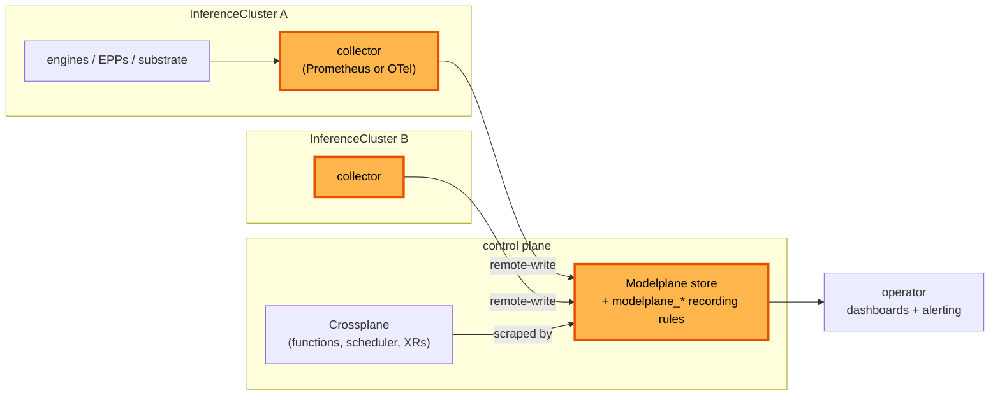

# Metrics collection

**Status:** Draft
**Date:** August 2026
**Author:** Dennis Ramdass

This document proposes collecting metrics on every cluster and aggregating them up to
one Modelplane-level view at the control plane, with every series rebranded under a
`modelplane_*` namespace. It builds on [design.md](./design.md) and addresses
[#269](https://github.com/modelplaneai/modelplane/issues/269).

Concretely, this proposes:

1. per-cluster collection of every Modelplane source (engines, endpoint pickers,
   substrate), always on, with no per-deployment toggle
2. aggregation up to a single Modelplane view at the control plane, so one query covers
   the whole deployment
3. recording rules that rebrand every series under `modelplane_*` with normalized
   labels, such as `modelplane_tokens_total{engine="vllm", cluster="...",
   deployment="..."}`

Approving this means agreeing that central aggregation is Modelplane's job, not the
platform team's, and to the `modelplane_*` naming. The collection mechanism, a
Prometheus stack or an OpenTelemetry collector, is the main open choice, below.

## What to monitor

There are four things worth watching in a Modelplane deployment.

1. **Inference signal (data plane).** vLLM's `/metrics`, the EPP's `llm_d_epp_*`, and
   Envoy. TTFT, tokens per second, queue depth, KV-cache occupancy, and request and
   error rates per model. It answers "is my model serving well, and is it saturated?"
2. **Substrate health.** The stack Modelplane installs on each workload cluster: is the
   gateway up, are cert-manager, the LeaderWorkerSet controller, and the NVIDIA DRA
   driver healthy, are GPUs allocatable. "Is the machinery on this cluster working?"
3. **Control-plane health.** Modelplane itself. Crossplane reconcile rates and errors,
   function latency and panics, the fleet scheduler placing replicas, and XR
   `Ready`/`Synced`. "Is the thing I operate working?"
4. **Fleet roll-up.** Across every cluster and deployment: total capacity, GPU usage,
   how many deployments are degraded, and cost.

All four are in the central view. The data plane and substrate are collected on each
cluster and aggregated up; the control plane is scraped at the center; the fleet roll-up
is a set of recording rules over the aggregate.

## Collection: per cluster, always on

On each cluster, Modelplane collects from every source it owns, with no opt-in or
opt-out. The targets are the same whichever mechanism scrapes them: the engine pods, the
endpoint picker, and the substrate. Three existing pieces make it cheap.

- **The serving label spans every shape.** `modelplane.ai/serving` is on standalone
  pods, LeaderWorkerSet leaders, and both prefill/decode engines (it's the label the
  InferencePool selects on). One selector on it follows the shape, so the leader/worker
  and prefill/decode branching needs no special casing.
- **The stack already scrapes.** `compose-serving-stack` runs a metrics stack on every
  workload cluster, so adding a scrape target is composition, not new infrastructure. It
  already scrapes the gateway's Envoy proxies.
- **Modelplane owns the picker.** The EPP is Modelplane's own Deployment, so its metrics
  port and flags are ours to set.

### The scrape targets

A cluster-wide selector on `modelplane.ai/serving` covers every engine of every
deployment, so collection is a cluster property rather than something composed per
replica. A second selector covers the endpoint pickers by their Modelplane label, and a
third covers the substrate `compose-serving-stack` installs (the gateway's Envoy proxies,
cert-manager, the LeaderWorkerSet controller, the NVIDIA DRA driver).

The engine's serving port carries `/metrics`, so the backends name it (say `http`) in
`native.py`, `llmd.py`, and the decode engine in `routing.py`. The pd-sidecar's port
stays unnamed. Scraping the port by name matters for prefill/decode. The decode engine serves on 8001
because the pd-sidecar takes 8000, so matching port 8000 by number would scrape the
sidecar. Referencing the port by name scrapes the engine on every pod regardless of its
number.

What a source exposes on `/metrics` is the user's, set through engine flags like anything
else (vLLM's `--disable-log-stats` and friends). Modelplane scrapes what's there and
doesn't decide which metrics exist.

## Aggregation: one Modelplane view

Per-cluster collection is only half the ask. Each cluster's series aggregate up to a
single Modelplane store at the control plane, which also scrapes the control plane's own
metrics (Crossplane, the functions, the scheduler). One query then covers the whole
deployment, rather than a per-cluster island an operator has to stitch together by hand.

Recording rules over the aggregate produce the `modelplane_*` surface. A raw
`vllm:num_requests_running` from one engine and an `llm_d_epp_*` from a picker become
`modelplane_*` series with a consistent label set (`engine`, `cluster`, `deployment`,
`model`), so a dashboard queries Modelplane's own vocabulary and doesn't track each
engine's native metric names. The fleet roll-up (capacity, GPU usage, degraded
deployments) is more recording rules over the same aggregate.

## Mechanism: a Prometheus stack or an OpenTelemetry collector

The targets and the `modelplane_*` surface are the same either way. The open choice is
what collects and forwards them.

- **Prometheus stack.** Each cluster runs the kube-prometheus-stack `compose-serving-stack`
  already installs, with composed `PodMonitor`s for the targets above. Each cluster
  remote-writes to a central Prometheus (or Thanos, Mimir, or Cortex) at the control
  plane, and recording rules there produce the `modelplane_*` series. It's the incumbent,
  and recording rules and PromQL are standard.
- **OpenTelemetry collector.** A collector per cluster scrapes the same targets (the
  Prometheus receiver), rebrands them in the pipeline (the transform processor), and
  remote-writes up, with a central collector or store aggregating. It runs no full
  Prometheus per cluster, does the `modelplane_*` rename in-pipeline rather than through
  recording rules, and is something Upbound already runs elsewhere.

The collector is the lighter and more familiar path, and worth taking unless the
per-cluster Prometheus earns a place for something aggregation doesn't need. This is the
call to settle.

Whichever collects, the central layer reaches a cluster either because the cluster pushes
(remote-write) or because the center pulls. On the pull path Modelplane publishes each
cluster's endpoint on the `InferenceCluster` status; on the push path no such endpoint is
needed, and nothing is exposed outside the cluster.

## Architecture

## Alternatives considered

### Stop at per-cluster collection

An earlier shape of this proposal collected on each cluster and left aggregation to the
platform team, publishing a Prometheus URL on the `InferenceCluster` status. Aggregating
up to a Modelplane view is the actual ask, so leaving it out just means everyone rebuilds
the same fleet view by hand. Per-cluster collection stays, but as the bottom half of the
pipeline, not the whole of it.

### Raw engine metric names, no rebranding

Aggregating the engines' native names (`vllm:*`, `llm_d_epp_*`) as-is is less work, but it
hands an operator a different vocabulary per engine and per component. The `modelplane_*`
surface is the point of aggregating in the first place: one set of names and labels for
the whole deployment.

### A PodMonitor per replica

`compose-model-replica` could compose a `PodMonitor` per replica, so collection comes and
goes with the deployment. With no opt-out and a cluster-wide store, that per-deployment
lifecycle buys nothing over one cluster-wide selector, and it composes N monitors where
one does the same job.

### A per-deployment opt-out field

An earlier shape put an `enabled` toggle on the deployment. It covers only the data plane
and asks an MD author to opt in or out of collection the platform team consumes.
Always-on collection fits the ownership better, so the toggle is dropped.

### Authenticate the EPP metrics endpoint

The EPP can serve `/metrics` behind controller-runtime auth (a `ClusterRole` with
`nonResourceURLs: /metrics` plus a bearer token). Since Modelplane owns the EPP args and
the endpoint carries non-sensitive routing stats reachable only in-cluster,
`--metrics-endpoint-auth=false` collects them with nothing to manage. Auth would add a
`ClusterRole` and a bearer token for no gain here.

## Open questions

- **Prometheus stack or OpenTelemetry collector.** The mechanism above. The collector is
  the lean, familiar default. Is there a reason to keep the per-cluster Prometheus?
- **Central store.** A single Prometheus is simplest to start; a horizontally scaled
  backend (Thanos, Mimir, Cortex) is the answer once the aggregate outgrows one instance.
  Which, and when.
- **Port name.** `http` (the serving port that also serves `/metrics`) versus `metrics`.
  Leaning `http`, since it's the one serving port.

## Interaction with #264

The [#264](https://github.com/modelplaneai/modelplane/issues/264) example documents the
manual path: a hand-written `PodMonitor` plus the operator wiring to consume it. Once
collection is composed and aggregated, that example drops the hand-written
`podmonitor.yaml`.

On upgrade, an existing hand-written `PodMonitor` has to be deleted, or it double-scrapes
the same pods alongside the composed one. This warrants a release note.
