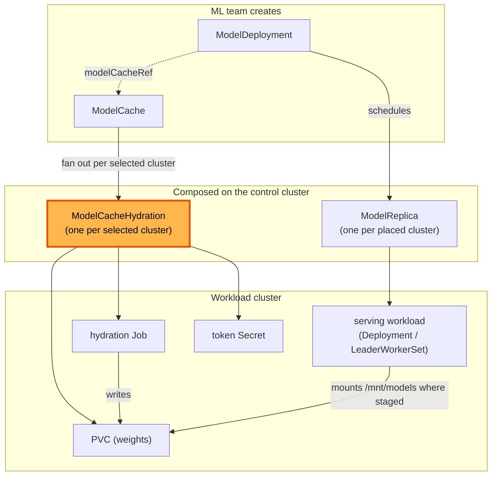
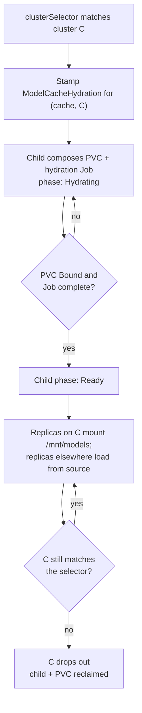

# ModelCacheHydration

**Status:** Draft
**Date:** July 2026
**Author:** Dennis Ramdass

This document proposes `ModelCacheHydration`, a per-cluster child of `ModelCache`,
and makes a cache's `clusterSelector` the authoritative footprint that Modelplane
pre-warms ahead of deployment. It builds on [modelcache.md](./modelcache.md) and
[design.md](./design.md), and addresses
[#210](https://github.com/modelplaneai/modelplane/issues/210) (decompose
`ModelCache`) and [#186](https://github.com/modelplaneai/modelplane/issues/186)
(footprint diverges from placement) together.

## Summary

`ModelCache` today does two jobs in one function: it fans a cache out to matched
clusters, and it runs each cluster's hydration lifecycle inline (the PVC, the
hydration `Job`, the token `Secret`, a four-phase machine, and the
drop-Job-after-Ready cleanup), threading a `cluster_name` through every method.
It's also the only fan-out that doesn't follow the `ModelDeployment` →
`ModelReplica` pattern.

Two changes:

1. **Split out `ModelCacheHydration`**, a per-cluster child that owns one
   cluster's hydration. Pinned by `spec.clusterName`, it resolves its
   `InferenceCluster` and auth `Secret`, composes the PVC, token `Secret`, and
   `Job`, runs the phase machine, and drops the `Job`/`Secret` once Ready.
2. **Pre-warm from the selector.** A cache's `clusterSelector` is the authoritative
   footprint. The platform team declares which clusters hold the weights, and
   Modelplane hydrates them ahead of any deployment. A deployment schedules on its
   own selector and loads from the cache where the cache is staged, or from the
   source where it isn't. No deployment pays the download twice.

```yaml
apiVersion: modelplane.ai/v1alpha1
kind: ModelCache
metadata:
  name: kimi-k2
  namespace: ml-team
spec:
  source: HuggingFace
  huggingFace:
    repo: moonshotai/Kimi-K2-Instruct
    authSecret:
      name: hf-token
    sizeGiB: 1500
  clusterSelector:              # the footprint: pre-warm these clusters
    matchLabels:
      modelplane.ai/tier: a100
```

The `ModelCache` and `ModelDeployment` specs are otherwise unchanged.
`ModelCacheHydration` is composed, never authored, the same as `ModelReplica`.

Approving this means agreeing to both changes: the `ModelCacheHydration`
decomposition (#210), and the pre-warm-authoritative footprint (#186) where a
deployment loads from the source on clusters the cache isn't staged to.

## Architecture

Both fan-outs are per-cluster. `ModelCache` stages onto the clusters its
`clusterSelector` matches. `ModelReplica` mounts the cache PVC where it exists and
loads from the source where it doesn't. The two are placed independently.



## The per-cluster child

`ModelCacheHydration` is a namespaced composite pinned to one cluster, the cache
analogue of `ModelReplica`. Its spec carries what one cluster's hydration needs
and nothing about fan-out:

- **`clusterName`**, the cluster it stages onto. Pinned at creation; the parent
  re-places only if the cluster disappears.
- **`huggingFace`**, the source, copied down verbatim (`repo`, `revision`,
  `sizeGiB`).
- **`authSecret`**, the reference only (`name`, `key`, the cache's `namespace`),
  never the token value. The child resolves it and propagates it to the workload
  cluster itself, so a credential never lives in a CR spec. Same trust boundary as
  today.
- **`cacheName`**, the parent `ModelCache` name, so the child reproduces the
  stable PVC/Job/Secret names the serving side mounts by.

Its status carries a `phase` (Pending/Hydrating/Ready/Failed), so the parent reads
`status.clusters[].phase` straight from the child. This is richer than
`ModelReplica`'s conditions-only status, to preserve the per-cluster phase
`ModelCache` shows today.

The child is the current per-cluster body of `compose-model-cache` lifted out
whole: the PVC/Job/Secret manifests, the completion-marker skip, the
`_JOB_MANAGEMENT` cleanup, and the Ready-latch (now read from its own prior
`status.phase`). The hydration mechanism is unchanged. It just lives in one place.

### Naming continuity

The child keeps the names the monolith produced: PVC
`child_name("modelcache", <ns>, <name>)`, Job `…,"hydrate"`, Secret `…,"auth"`.
Two things depend on this:

1. The serving side mounts the PVC by that name (`base.cache_pvc_name` in
   `compose-model-replica` is the same function), so the mount contract is
   untouched.
2. On upgrade the child adopts the existing, already-Bound PVC instead of
   provisioning a new one and re-downloading the weights.

`child_name` truncates the prefix and appends a hash, so every composed name stays
a valid DNS label at or under 63 characters, including the child's own name with
the cluster folded in.

## Pre-warm-authoritative footprint

The divergence (#186): a cache's `clusterSelector` and a deployment's placement are
set independently. If a replica is scheduled onto a cluster the cache didn't stage
to, the PVC is missing and the pod fails to mount at runtime, with nothing visible
at apply time.

There are two ways to close that gap. Make the cache chase placement (hydrate
on-demand wherever a replica lands), or make placement tolerate a missing cache
(load from the source there). This proposal takes the second. The cache's
`clusterSelector` is the footprint the platform team declares, Modelplane pre-warms
those clusters ahead of any deployment, and a deployment that schedules elsewhere
loads from the source.

Pre-warm is what makes a large model usable. Hydrating a 1.5TB cache PVC and
loading the model into a replica are two sequential copies. Paid on-demand, the
first deployment onto a new cluster must wait for both, which was roughly an hour
for a model the size of Kimi in testing. Pre-warm moves that hydration ahead of
time. The platform team pays it once. An author onto a warmed cluster then waits
only for the load of roughly fifteen minutes. No deployment ever pays the two
copies in series.

Because the footprint is the static selector, `ModelCache` does not watch replica
placement and does not recompose when replicas move. It needs no cross-resource
watch to stay correct.

### Cache or source, per replica

A deployment keeps `modelCacheRef`, and the resolution already exists.
`compose-model-deployment` resolves the referenced cache's footprint today
(`resolve_cache_footprint`), which is how #189 constrains placement. Here it serves
a different purpose. For each replica, the function knows whether that replica's
cluster is in the footprint and passes the answer down. On a footprint cluster the
replica mounts the PVC and `base.cache_mount` injects `--model=<mount>`. Off the
footprint it injects nothing and the engine loads from the source, the existing
no-cache path. The cache-versus-source decision is known at compose time, so
forming engine args needs no runtime lookup.

### Hydrating before ready

A replica can be scheduled onto a footprint cluster while its pre-warm is still
hydrating. Rather than fail the mount, the replica gates readiness on that cluster's
`ModelCacheHydration`, holding at `Hydrating` until the PVC is Bound. A replica
loading from the source doesn't gate at all. The replica watches the
`ModelCacheHydration` object, not the PVC directly, so a future cache that doesn't
use a PVC keeps the same readiness contract.

Gating can't be open-ended. If hydration fails, a bad token, a bad revision, or
exhausted storage, the child reports `Failed`, the parent surfaces
`ArtifactReady=False` with reason `HydrationFailed`, and the gated replica fails
with that reason instead of sitting in `Hydrating`. The hydration `Job`'s
`backoffLimit` bounds retries, so a permanent failure stops and is reported rather
than retried forever.

### Lifecycle

The selector is the footprint. A cluster enters when it starts matching and leaves
when it stops (or when the `ModelCache` is deleted). The parent stamps a child per
matched cluster and reclaims the child and its PVC when the cluster drops out. No
replica reference counting is involved, because placement no longer drives the
footprint.



## What the parent composes

`compose-model-cache` becomes fan-out plus roll-up:

- **Resolve** the clusters the `clusterSelector` matches.
- **Stamp** one child per matched cluster, named
  `child_name("modelcache", ns, cache-name, cluster)`, copying down `huggingFace`,
  `clusterName`, the `authSecret` reference, and `cacheName`.
- **Roll up** each child's `status.phase`/`Ready` into `status.clusters[]`,
  `status.summary`, and the `ClustersMatched`/`ArtifactReady` conditions, marking a
  child `READY_TRUE` only when observed Ready.
- **Shed** the per-cluster machinery to the child: `_wrap_remote`, the
  PVC/Job/Secret builders, `derive_cluster_phase`, `_observed_status`,
  `_resolve_auth_data`, the phase constants, and the hydration image.

Registering the new kind takes the usual four touches, plus a schema regen:

- `apis/modelcachehydrations/` with its XRD and Composition;
- a `functionNames` entry in `flake.nix`;
- a Tarball entry in `crossplane-project.yaml`;
- `nix run .#build` to regenerate the model.

No `mrap.yaml` change is needed, because it composes
`objects.kubernetes.m.crossplane.io`, already activated.

## Alternatives considered

### Hydrate on-demand from placement

Derive the footprint from where replicas are placed. When a replica is scheduled
onto a cluster new to the model, the cache follows it there. This was the earlier
shape of this proposal and reads as the most automatic option. Three costs turned
it down:

1. It needs [crossplane#7572](https://github.com/crossplane/crossplane/pull/7572)
   to function. Without a watch on referencing `ModelReplica`s, nothing re-triggers
   `compose-model-cache` when a new replica is placed, so the parent never learns to
   stamp the new child. That change is approved and expected in Crossplane v2.4, so
   the on-demand shape can't be built until then.
2. The first deployment onto a new cluster pays the hydrate and the load in series,
   the download twice, which is the hour-long wait pre-warm removes.
3. A model implicitly carries its private weights and download token onto any
   cluster it happens to be scheduled to, rather than onto the clusters the platform
   team chose.

Pre-warm avoids all three. A model never carries the cache to a cluster the
platform team didn't pre-hydrate.

### Constrain placement to the footprint (#189)

[#189](https://github.com/modelplaneai/modelplane/pull/189) prevents the stuck
mount by making the scheduler refuse to place a replica outside the cache
footprint. That closes the divergence but removes capacity. A cluster with room to
run the model stays unusable for it until the cache is staged there. Pre-warm takes
the opposite tack. A replica may schedule anywhere its own selector allows. Off the
footprint it loads from the source rather than being turned away.

### Drop `modelCacheRef`; derive the model from the deployment

#186 floats going further: drop the explicit `ModelCache` and `modelCacheRef`, and
derive caching from the model the deployment declares. Nothing structured declares
it today. The model lives in opaque engine args (`--model=…`), with the source
structured only on `ModelCache`. Fully automatic caching would need:

- a structured model source on the deployment (`spec.template.spec.model`), and
- hydration keyed by model identity (a content hash) rather than cache name, so
  two deployments of one model share a copy per cluster, which also changes the
  serving mount contract.

That is a larger, user-facing change with its own migration. This proposal keeps
`modelCacheRef`, which is also what lets `compose-model-deployment` resolve the
footprint for the cache-or-source decision above. Identity-keyed sharing can be
added on top later, since the child already carries a source independent of how it
was requested.

### A separate fleet reconciler kind

A single hydration per cluster serves replicas across deployments, and Crossplane
composed resources are single-owner, so a `ModelReplica` can't compose a shared
hydration directly. A new fleet-scoped reconciler kind could own all hydrations.
Reusing `ModelCache` is simpler: it is already the per-model, per-namespace
resource, it already fans out per cluster, and pre-warm keeps ownership and the
namespace security boundary where they are. A dedicated reconciler is worth
revisiting only if caching becomes fully deployment-derived (the alternative
above).

### Conditions-only child status, like `ModelReplica`

Mirroring `ModelReplica` exactly would collapse `ModelCache`'s per-cluster `phase`
(Pending/Hydrating/Ready/Failed) to a boolean, losing detail that
`kubectl get modelcache` shows today. The child carries a structured `status.phase`
so the parent preserves it.

### Deliver the decomposition and the footprint change separately

The decomposition (#210) is a pure refactor and could merge first. The footprint
change (#186) is lighter under pre-warm, since the selector stays authoritative as
it is today. The two are kept together because designing the child's ownership once
against the final footprint model is easier than doing it twice.

## Open questions

- **Child kind name:** `ModelCacheHydration` (chosen) versus `ModelCacheReplica`
  for symmetry with `ModelReplica`. `Hydration` names the lifecycle the child
  owns; `Replica` implies a copy.
- **Empty selector:** whether a `ModelCache` with no `clusterSelector` stages
  nowhere (nothing to pre-warm, so every replica loads from the source) or is
  rejected at apply time as a likely mistake. Leaning toward staging nowhere.
- **Surfacing the source fallback:** a replica loading from the source on an
  un-warmed cluster is slower to start, and that should be visible on the
  `ModelDeployment` so an operator can see they missed a pre-warm.

## Interaction with related issues

- **#189 (constrain placement):** superseded here. Pre-warm relaxes the placement
  constraint and loads from the source off the footprint, as above.
- **#115 (Modelplane-owned hydration image):** the Job builder moves to the child;
  #115 becomes a localized image swap there.
- **#281 (multiple models per deployment):** the child stays single-source (one
  repo, one PVC). #281 fans out per source later.
- **#204 (EFS load slow), #72 (KVOffloadTier), #71 (routing affinity):**
  orthogonal. These are storage read performance and KV or prefix cache, not
  model-weight staging.
- **#341 (ImageCache):** a different problem, pre-pulling the container image into
  each node's local image store, which a PVC-based cache cannot do (the Kubelet
  starts containers from node-local image layers, not a mounted volume). It shares
  only the per-cluster fan-out shape, not the mechanism.
