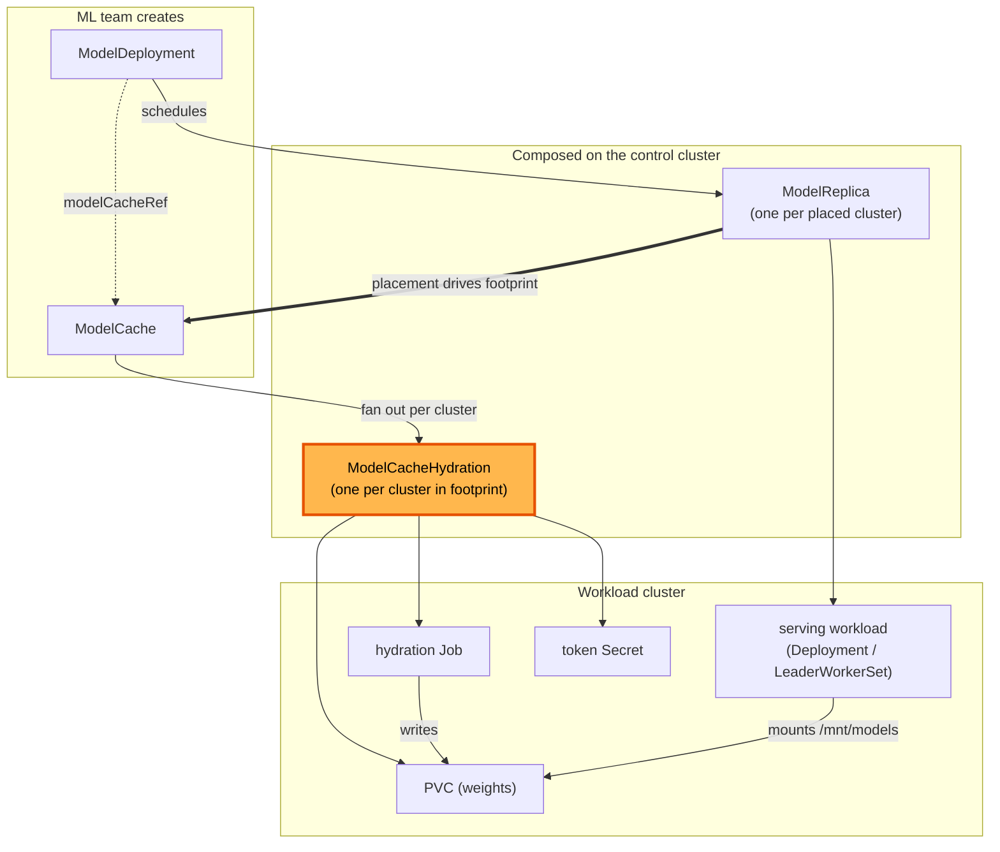
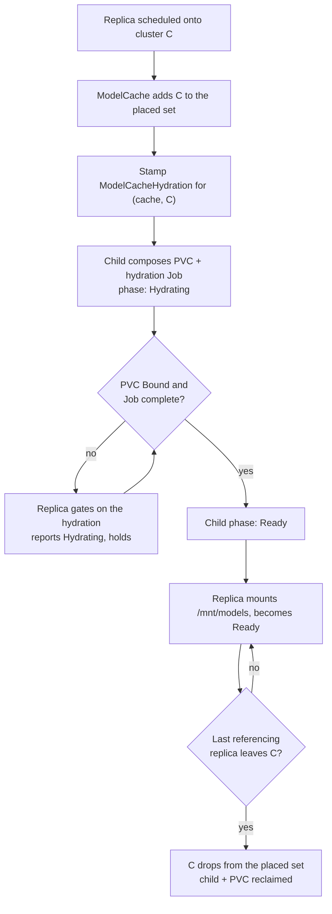

# ModelCacheHydration

**Status:** Draft
**Date:** July 2026
**Author:** Dennis Ramdass

This document proposes `ModelCacheHydration`, a per-cluster child of `ModelCache`,
and uses it to make a cache's footprint follow where replicas are scheduled. It
builds on [modelcache.md](./modelcache.md) and [design.md](./design.md), and
addresses [#210](https://github.com/modelplaneai/modelplane/issues/210) (decompose
`ModelCache`) and [#186](https://github.com/modelplaneai/modelplane/issues/186)
(footprint diverges from placement) together.

## Summary

`ModelCache` today does two jobs in one function: it fans a cache out to matched
clusters, and it runs each cluster's hydration lifecycle inline (the PVC, the
hydration `Job`, the token `Secret`, a four-phase machine, and the
drop-Job-after-Ready cleanup), threading a `cluster_name` through every method.
It's also the only fan-out that doesn't follow the `ModelDeployment` →
`ModelReplica` pattern.

Two changes:

1. **Split out `ModelCacheHydration`**, a per-cluster child that owns one
   cluster's hydration. Pinned by `spec.clusterName`, it resolves its
   `InferenceCluster` and auth `Secret`, composes the PVC, token `Secret`, and
   `Job`, runs the phase machine, and drops the `Job`/`Secret` once Ready.
2. **Derive the footprint from placement.** `ModelCache` stages onto the
   clusters where its referencing replicas are placed, not onto a hand-maintained
   `clusterSelector`. A selector, if set, is an opt-in pre-warm set, not the whole
   footprint.

A cache with no selector stages exactly where its consumers run:

```yaml
apiVersion: modelplane.ai/v1alpha1
kind: ModelCache
metadata:
  name: kimi-k2
  namespace: ml-team
spec:
  source: HuggingFace
  huggingFace:
    repo: moonshotai/Kimi-K2-Instruct
    authSecret:
      name: hf-token
    sizeGiB: 1500
  # No clusterSelector: footprint follows the ModelDeployments that
  # reference this cache. Set one only to pre-warm ahead of placement.
```

The `ModelCache` and `ModelDeployment` specs are otherwise unchanged.
`ModelCacheHydration` is composed, never authored, the same as `ModelReplica`.

## Architecture

Both fan-outs are per-cluster. The new link is `ModelReplica → ModelCache` (bold):
the cache's footprint is the set of clusters its referencing replicas are placed
on.



## The per-cluster child

`ModelCacheHydration` is a namespaced composite pinned to one cluster, the cache
analogue of `ModelReplica`. Its spec carries what one cluster's hydration needs
and nothing about fan-out:

- **`clusterName`**, the cluster it stages onto. Pinned at creation; the parent
  re-places only if the cluster disappears.
- **`huggingFace`**, the source, copied down verbatim (`repo`, `revision`,
  `sizeGiB`).
- **`authSecret`**, the reference only (`name`, `key`, the cache's `namespace`),
  never the token value. The child resolves it and propagates it to the workload
  cluster itself, so a credential never lives in a CR spec. Same trust boundary as
  today.
- **`cacheName`**, the parent `ModelCache` name, so the child reproduces the
  stable PVC/Job/Secret names the serving side mounts by.

Its status carries a `phase` (Pending/Hydrating/Ready/Failed), so the parent reads
`status.clusters[].phase` straight from the child. This is richer than
`ModelReplica`'s conditions-only status, to preserve the per-cluster phase
`ModelCache` shows today.

The child is the current per-cluster body of `compose-model-cache` lifted out
whole: the PVC/Job/Secret manifests, the completion-marker skip, the
`_JOB_MANAGEMENT` cleanup, and the Ready-latch (now read from its own prior
`status.phase`). The hydration mechanism is unchanged. It just lives in one place.

### Naming continuity

The child keeps the names the monolith produced: PVC
`child_name("modelcache", <ns>, <name>)`, Job `…,"hydrate"`, Secret `…,"auth"`.
Two things depend on this:

1. The serving side mounts the PVC by that name (`base.cache_pvc_name` in
   `compose-model-replica` is the same function), so the mount contract is
   untouched.
2. On upgrade the child adopts the existing, already-Bound PVC instead of
   provisioning a new one and re-downloading the weights.

`child_name` truncates the prefix and appends a hash, so every composed name stays
a valid DNS label at or under 63 characters, including the child's own name with
the cluster folded in.

## Placement-driven footprint

The problem (#186): a cache's `clusterSelector` and a deployment's placement are
set independently. The scheduler places a replica on whichever matching cluster
has capacity; if the cache didn't stage there, the PVC is missing and the pod
fails to mount at runtime, with nothing visible at apply time. Staging everywhere
is the only safe workaround, and it wastes storage and pushes the download token
and private weights onto clusters running none of the team's deployments.

Instead, derive the footprint from placement. Each reconcile, `ModelCache`:

1. requires every `ModelReplica` in the fleet (the scheduler already does this for
   capacity accounting);
2. keeps those that reference it (`spec.modelCacheRef.name` and namespace);
3. takes the clusters they're placed on. That set is the footprint, one
   `ModelCacheHydration` each.

A replica is then never placed on a cluster the model isn't staged to, and
credentials and weights reach only the clusters that run the model.

`clusterSelector` stays, as an opt-in pre-warm set unioned with the placed set. It
covers the one thing pure placement can't do: warm a tier before any deployment
exists. The default (no selector) follows placement.

### Reference counting and reclaim

The placed set is the reference count:

- Two deployments sharing the cache on cluster X contribute one entry; either one
  tearing down leaves the other's, so X's hydration stays.
- When the last referencing replica leaves X (and X isn't pre-warmed), X drops
  out, the parent stops composing that child, and the child and its PVC are
  reclaimed.

No hydration is retracted out from under a live replica, and an unreferenced cache
reclaims itself per cluster with no manual cleanup.

### Hydrating before ready

A replica can be scheduled onto a cluster new to the model before its PVC exists.
Rather than fail the mount, the replica gates readiness on its cluster's
`ModelCacheHydration`: it reports `Hydrating` until the PVC is Bound, then
proceeds. The first replica on a new cluster pays the download once, as a visible
state rather than a mount error.

Gating can't be open-ended. If hydration fails, a bad token, a bad revision, or
exhausted storage, the child reports `Failed`, the parent surfaces
`ArtifactReady=False` with reason `HydrationFailed`, and the gated replica fails
with that reason instead of sitting in `Hydrating`. The hydration `Job`'s
`backoffLimit` bounds retries, so a permanent failure stops and is reported rather
than retried forever.

### Lifecycle

Placement adds a cluster to the footprint. The last replica leaving removes it.



## What the parent composes

`compose-model-cache` becomes fan-out plus roll-up:

- **Resolve** the referencing `ModelReplica`s (the placed set) and, for pre-warm,
  the `clusterSelector`.
- **Stamp** one child per cluster in `placed ∪ preWarm`, named
  `child_name("modelcache", ns, cache-name, cluster)`, copying down `huggingFace`,
  `clusterName`, the `authSecret` reference, and `cacheName`.
- **Roll up** each child's `status.phase`/`Ready` into `status.clusters[]`,
  `status.summary`, and the `ClustersMatched`/`ArtifactReady` conditions, marking a
  child `READY_TRUE` only when observed Ready.
- **Shed** the per-cluster machinery to the child: `_wrap_remote`, the
  PVC/Job/Secret builders, `derive_cluster_phase`, `_observed_status`,
  `_resolve_auth_data`, the phase constants, and the hydration image.

Registering the new kind takes the usual four touches, plus a schema regen:

- `apis/modelcachehydrations/` with its XRD and Composition;
- a `functionNames` entry in `flake.nix`;
- a Tarball entry in `crossplane-project.yaml`;
- `nix run .#build` to regenerate the model.

No `mrap.yaml` change is needed, because it composes
`objects.kubernetes.m.crossplane.io`, already activated.

## Alternatives considered

### Keep `clusterSelector` as the whole footprint

The status quo, and the divergence #186 is about: the selector and placement
drift, and the failure is a runtime mount error with nothing at apply time.
Deriving the footprint from placement removes the class of bug by construction.
The selector survives only for the case placement can't serve, pre-warming ahead
of a deployment.

### Drop `modelCacheRef`; derive the model from the deployment

#186 floats going further: drop the explicit `ModelCache` and `modelCacheRef`, and
derive caching from the model the deployment declares. Nothing structured declares
it today. The model lives in opaque engine args (`--model=…`), with the source
structured only on `ModelCache`. Fully automatic caching would need:

- a structured model source on the deployment (`spec.template.spec.model`), and
- hydration keyed by model identity (a content hash) rather than cache name, so
  two deployments of one model share a copy per cluster, which also changes the
  serving mount contract.

That is a larger, user-facing change with its own migration. This proposal keeps
`modelCacheRef` and solves the divergence, waste, sprawl, and lifecycle problems
without it. Identity-keyed sharing can be added on top later, since the child
already carries a source independent of how it was requested.

### A separate fleet reconciler kind for reference counting

A single hydration per cluster serves replicas across deployments and outlives any
one of them, and Crossplane composed resources are single-owner, so a
`ModelReplica` can't compose a shared hydration directly. A new fleet-scoped
reconciler kind could own all hydrations. Reusing `ModelCache` is simpler: it is
already the per-model, per-namespace resource, it already fans out per cluster,
and computing the placed set keeps ownership and the namespace security boundary
where they are. A dedicated reconciler is worth revisiting only if caching becomes
fully deployment-derived (the alternative above).

### Conditions-only child status, like `ModelReplica`

Mirroring `ModelReplica` exactly would collapse `ModelCache`'s per-cluster `phase`
(Pending/Hydrating/Ready/Failed) to a boolean, losing detail that
`kubectl get modelcache` shows today. The child carries a structured `status.phase`
so the parent preserves it.

### Deliver the decomposition and the footprint change separately

The decomposition (#210) is a pure refactor and could merge first. They are kept
together because the placed-set footprint only works once the per-cluster
hydration is its own reconciled unit. Splitting them would mean designing the
child's ownership twice.

## Open questions

- **Child kind name:** `ModelCacheHydration` (chosen) versus `ModelCacheReplica`
  for symmetry with `ModelReplica`. `Hydration` names the lifecycle the child
  owns; `Replica` implies a copy.
- **Readiness gating:** whether a replica gates its readiness on its cluster's
  hydration (the `Hydrating` state above), or lets the mount block until the PVC
  appears (less coupling, worse failure surface). Leaning toward the gate.

## Interaction with related issues

- **#115 (Modelplane-owned hydration image):** the Job builder moves to the child;
  #115 becomes a localized image swap there.
- **#281 (multiple models per deployment):** the child stays single-source (one
  repo, one PVC). #281 fans out per source later.
- **#204 (EFS load slow), #72 (KVOffloadTier), #71 (routing affinity):**
  orthogonal. These are storage read performance and KV or prefix cache, not
  model-weight staging.
- **#341 (ImageCache):** a different problem, pre-pulling the container image into
  each node's local image store, which a PVC-based cache cannot do (the Kubelet
  starts containers from node-local image layers, not a mounted volume). It shares
  only the per-cluster fan-out shape, not the mechanism.
</content>
