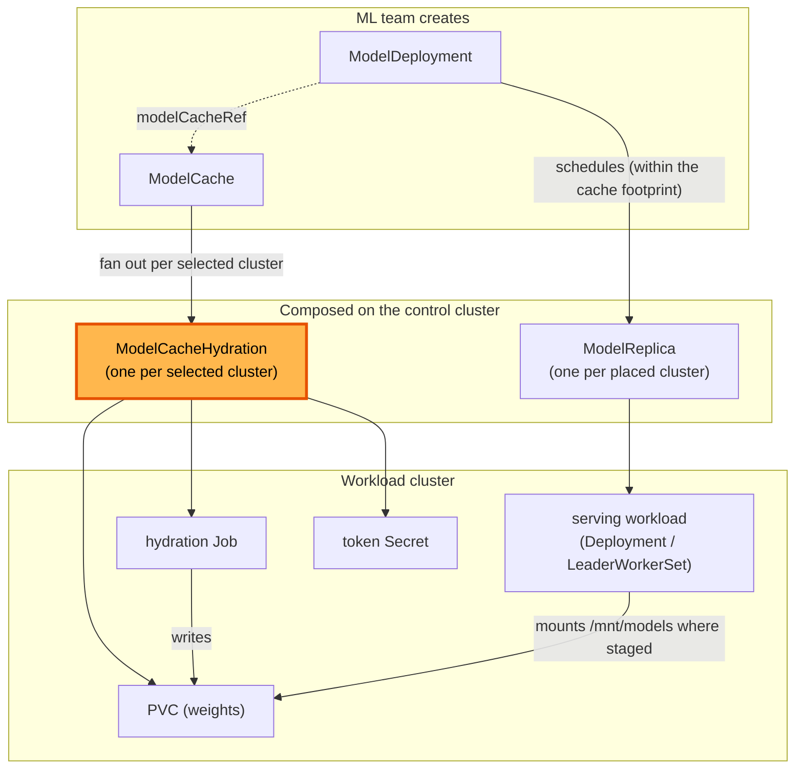
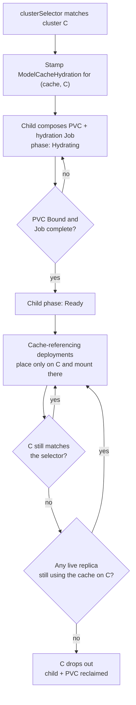

# ModelCacheHydration

**Status:** Draft
**Date:** July 2026
**Author:** Dennis Ramdass

This document proposes `ModelCacheHydration`, a per-cluster child of `ModelCache`,
and makes a cache's `clusterSelector` the authoritative footprint that Modelplane
pre-warms ahead of deployment. It builds on [modelcache.md](./modelcache.md) and
[design.md](./design.md), and addresses
[#210](https://github.com/modelplaneai/modelplane/issues/210) (decompose
`ModelCache`) and [#186](https://github.com/modelplaneai/modelplane/issues/186)
(footprint diverges from placement) together.

## Summary

`ModelCache` today does two jobs in one function: it fans a cache out to matched
clusters, and it runs each cluster's hydration lifecycle inline (the PVC, the
hydration `Job`, the token `Secret`, a four-phase machine, and the
drop-Job-after-Ready cleanup), threading a `cluster_name` through every method.
It's also the only fan-out that doesn't follow the `ModelDeployment` →
`ModelReplica` pattern.

Two changes:

1. **Split out `ModelCacheHydration`**, a per-cluster child that owns one
   cluster's hydration. Pinned by `spec.clusterName`, it resolves its
   `InferenceCluster` and auth `Secret`, composes the PVC, token `Secret`, and
   `Job`, runs the phase machine, and drops the `Job`/`Secret` once Ready.
2. **Pre-warm from the selector, and place where it's warmed.** A cache's
   `clusterSelector` is the authoritative footprint. The platform team declares which
   clusters hold the weights, and Modelplane hydrates them ahead of any deployment. A
   deployment that references the cache runs only on those clusters. A deployment that
   references no cache runs anywhere its own selector allows and loads from the source
   itself. No deployment pays the download twice.

```yaml
apiVersion: modelplane.ai/v1alpha1
kind: ModelCache
metadata:
  name: kimi-k2
  namespace: ml-team
spec:
  source: HuggingFace
  huggingFace:
    repo: moonshotai/Kimi-K2-Instruct
    authSecret:
      name: hf-token
    sizeGiB: 1500
  clusterSelector:              # the footprint: pre-warm these clusters
    matchLabels:
      modelplane.ai/tier: a100
```

The `ModelCache` and `ModelDeployment` specs are otherwise unchanged.
`ModelCacheHydration` is composed, never authored, the same as `ModelReplica`.

Approving this means agreeing to both changes: the `ModelCacheHydration`
decomposition (#210), and a pre-warm-authoritative footprint (#186) where a
deployment that references a cache is placed only where that cache is pre-warmed.
Modelplane injects no engine flags for any of this. The section below explains why.

## Architecture

Both fan-outs are per-cluster. `ModelCache` stages onto the clusters its
`clusterSelector` matches, and a deployment that references the cache is placed only
onto those clusters, so the cache is present wherever its replicas run.



## The per-cluster child

`ModelCacheHydration` is a namespaced composite pinned to one cluster, the cache
analogue of `ModelReplica`. The name states the lifecycle the child owns, where
`ModelCacheReplica` would imply a copy of the parent. Its spec carries what one
cluster's hydration needs and nothing about fan-out:

- **`clusterName`**, the cluster it stages onto. Pinned at creation; the parent
  re-places only if the cluster disappears.
- **`huggingFace`**, the source, copied down verbatim (`repo`, `revision`,
  `sizeGiB`).
- **`authSecret`**, the reference only (`name`, `key`, the cache's `namespace`),
  never the token value. The child resolves it and propagates it to the workload
  cluster itself, so a credential never lives in a CR spec. Same trust boundary as
  today.
- **`cacheName`**, the parent `ModelCache` name, so the child reproduces the
  stable PVC/Job/Secret names the serving side mounts by.

Its status carries a `phase` (Pending/Hydrating/Ready/Failed), so the parent reads
`status.clusters[].phase` straight from the child. This is richer than
`ModelReplica`'s conditions-only status, to preserve the per-cluster phase
`ModelCache` shows today.

The child is the current per-cluster body of `compose-model-cache` lifted out
whole: the PVC/Job/Secret manifests, the completion-marker skip, the
`_JOB_MANAGEMENT` cleanup, and the Ready-latch (now read from its own prior
`status.phase`). The hydration mechanism is unchanged. It just lives in one place.

### Naming continuity

The child keeps the names the monolith produced: PVC
`child_name("modelcache", <ns>, <name>)`, Job `…,"hydrate"`, Secret `…,"auth"`.
Two things depend on this:

1. The serving side mounts the PVC by that name (`base.cache_pvc_name` in
   `compose-model-replica` is the same function), so the mount contract is
   untouched.
2. On upgrade the child adopts the existing, already-Bound PVC instead of
   provisioning a new one and re-downloading the weights.

`child_name` truncates the prefix and appends a hash, so every composed name stays
a valid DNS label at or under 63 characters, including the child's own name with
the cluster folded in.

## Pre-warm-authoritative footprint

The divergence (#186): a cache's `clusterSelector` and a deployment's placement are
set independently. If a replica is scheduled onto a cluster the cache didn't stage
to, the PVC is missing and the pod fails to mount at runtime, with nothing visible
at apply time.

The fix is to make the cache's `clusterSelector` the authoritative footprint and
place against it. The platform team declares which clusters hold the weights,
Modelplane pre-warms them ahead of any deployment, and a deployment that references
the cache is scheduled only onto them.

Pre-warm is what makes a large model usable. Hydrating a 1.5TB cache PVC and loading
the model into a replica are two sequential copies. Paid on-demand, the first
deployment onto a new cluster waits for both, roughly an hour for a model the size of
Kimi in testing. Pre-warm moves that hydration ahead of time. The platform team
absorbs it once. An author onto a warmed cluster then waits only for the load,
roughly fifteen minutes.

Because the footprint is the static selector, `ModelCache` does not watch replica
placement and does not recompose when replicas move. A `ModelCache` with no
`clusterSelector` stages nowhere, so Modelplane rejects it at apply time rather
than admit a cache no deployment can place against.

### Two modes

A deployment is in one of two modes, and the two actors split cleanly.

- **With a cache.** The ML team references a `ModelCache` and writes the engine
  command. Modelplane places the deployment only on the clusters where the platform
  team pre-warmed that cache. The cache is present wherever the replica runs, so the
  start command is the same on every cluster it runs on.
- **Without a cache.** The ML team references no cache and writes the engine to load
  from the source, with its own token. Modelplane places it on any cluster the ML
  team's selector allows. This suits small or experimental models, and is slow for
  large ones, since every replica downloads from the source.

If a deployment references a cache but no cluster both matches its own selector and
holds that cache, it isn't placed, and the scheduler reports why rather than leaving
it Pending without a reason.

### Modelplane injects env values, never engine flags

The engine command stays the ML team's. Where a value depends on the cluster,
Modelplane injects an env var the command references, the way it injects
`MODELPLANE_LEADER_ADDRESS` today. It never writes an engine flag.

A cache presents its weights to the engine one of two ways.

- **A path.** Most backends put the weights at a path (a PVC mount, an object-store
  CSI mount, a node-local cache), so the ML team writes `--model=<path>` with nothing
  engine-specific.
- **A loader plugin.** A few, such as NVIDIA ModelExpress or the Run:ai streamer, are
  engine loader plugins that need an engine-specific `--load-format` and a
  loader-capable image. The ML team writes that flag and uses that image, because they
  chose that cache, and Modelplane wires the env and the cluster-side pieces.

Either way, placing only where the cache is pre-warmed makes the command valid wherever
the replica runs. How the bytes reach the cluster (a shared filesystem, peer-to-peer
distribution, GPU-to-GPU streaming) is the platform team's concern and orthogonal to
the command. The catalog of backends is a separate design, and each backend has to
present one of these two contracts.

### Hydrating before ready

Placement puts a replica on a footprint cluster as soon as the cluster matches the
selector, which can be before its pre-warm has finished hydrating. Rather than fail
the mount, the replica gates readiness on that cluster's `ModelCacheHydration`,
holding at `Hydrating` until the PVC is Bound. It watches the `ModelCacheHydration`
object, not the PVC directly, so a future cache that doesn't use a PVC keeps the same
readiness contract.

Gating can't be open-ended. If hydration fails, a bad token, a bad revision, or
exhausted storage, the child reports `Failed`, the parent surfaces
`ArtifactReady=False` with reason `HydrationFailed`, and the gated replica fails
with that reason instead of sitting in `Hydrating`. The hydration `Job`'s
`backoffLimit` bounds retries, so a permanent failure stops and is reported rather
than retried forever.

### Lifecycle

The selector is the footprint. A cluster enters when it starts matching and drops out
when it stops. The parent stamps a child per matched cluster and reclaims the child
and its PVC once the cluster drops out. One guard: reclaim holds while a live replica
still uses the cache on that cluster, so it is never pulled out from under a running
pod. For the same reason a `ModelCache` with live referencing deployments can't be
deleted. A finalizer holds it until they leave.



## What the parent composes

`compose-model-cache` becomes fan-out plus roll-up:

- **Resolve** the clusters the `clusterSelector` matches.
- **Stamp** one child per matched cluster, named
  `child_name("modelcache", ns, cache-name, cluster)`, copying down `huggingFace`,
  `clusterName`, the `authSecret` reference, and `cacheName`.
- **Roll up** each child's `status.phase`/`Ready` into `status.clusters[]`,
  `status.summary`, and the `ClustersMatched`/`ArtifactReady` conditions, marking a
  child `READY_TRUE` only when observed Ready.
- **Shed** the per-cluster machinery to the child: `_wrap_remote`, the
  PVC/Job/Secret builders, `derive_cluster_phase`, `_observed_status`,
  `_resolve_auth_data`, the phase constants, and the hydration image.

Registering the new kind takes the usual four touches, plus a schema regen:

- `apis/modelcachehydrations/` with its XRD and Composition;
- a `functionNames` entry in `flake.nix`;
- a Tarball entry in `crossplane-project.yaml`;
- `nix run .#build` to regenerate the model.

No `mrap.yaml` change is needed, because it composes
`objects.kubernetes.m.crossplane.io`, already activated.

## Alternatives considered

### Hydrate on-demand from placement

Derive the footprint from where replicas are placed, so a cache follows a replica
onto a cluster new to the model. This was the earlier shape of this proposal and
reads as the most automatic. Three costs turned it down.

- It needs [crossplane#7572](https://github.com/crossplane/crossplane/pull/7572) to
  re-trigger `compose-model-cache` when a new replica appears, which isn't out until
  Crossplane v2.4.
- The first deployment onto a new cluster still pays the hydrate and the load in
  series, the hour-long wait pre-warm removes.
- A model carries its private weights and token onto whatever cluster it happens to
  run on, rather than the clusters the platform team chose.

### Load from the source off the footprint

Let a cache-referencing deployment run anywhere and load from the source where the
cache is absent, so a cache never limits placement. This needs Modelplane to vary the
model reference per replica, which works for a plain mount but not for a loader-plugin
cache like ModelExpress, whose flag and image are invalid off the cache. Constraining
placement for every cache is simpler and keeps Modelplane out of the engine's flags.
A deployment that wants no cache references none.

### Always populate a fixed path

Make the start command uniform another way: require every deployment to use a cache,
or reintroduce `spec.model` and pre-fetch it before the engine starts. Requiring a
cache drops the lightweight no-cache path. A per-pod pre-fetch has no reuse, so it
costs a load plus an extra copy with none of a cache's benefit. Neither earns the
uniformity.

### Drop `modelCacheRef`; derive the model from the deployment

#186 floats dropping the explicit `ModelCache` and `modelCacheRef` and deriving
caching from the model the deployment declares. Nothing structured declares the model
today. It lives in opaque engine args. Automatic caching would need a structured model
source on the deployment and hydration keyed by model identity rather than cache name,
which also changes the serving mount contract. That is a larger user-facing change with
its own migration. This proposal keeps `modelCacheRef`, and identity-keyed sharing can
be added on top later, since the child already carries a source independent of how it
was requested.

### A separate fleet reconciler kind

A single hydration per cluster serves replicas across deployments, and Crossplane
composed resources are single-owner, so a `ModelReplica` can't compose a shared
hydration. A new fleet-scoped reconciler could own all hydrations. Reusing `ModelCache`
is simpler, since it is already the per-model, per-namespace resource that fans out per
cluster and keeps the namespace boundary where it is. A dedicated reconciler is worth
revisiting only if caching becomes fully deployment-derived.

### Conditions-only child status

Mirroring `ModelReplica`'s boolean conditions would collapse `ModelCache`'s per-cluster
`phase` (Pending/Hydrating/Ready/Failed) that `kubectl get modelcache` shows today. The
child carries a structured `status.phase` so the parent preserves it.

### Deliver the decomposition and the footprint change separately

The decomposition (#210) is a pure refactor and could merge first. The two are kept
together because designing the child's ownership once against the final footprint model
is easier than doing it twice.

## Interaction with related issues

- **#189 (constrain placement):** kept, not superseded. #189's rule (a
  cache-referencing deployment places only within the cache footprint) is the design
  here; pre-warm makes the cache's `clusterSelector` the footprint that rule uses.
- **#115 (Modelplane-owned hydration image):** the Job builder moves to the child;
  #115 becomes a localized image swap there.
- **#281 (multiple models per deployment):** the child stays single-source (one
  repo, one PVC). #281 fans out per source later.
- **#204 (EFS load slow), #72 (KVOffloadTier), #71 (routing affinity):**
  orthogonal. These are storage read performance and KV or prefix cache, not
  model-weight staging.
- **#341 (ImageCache):** a different problem, pre-pulling the container image into
  each node's local image store, which a PVC-based cache cannot do (the Kubelet
  starts containers from node-local image layers, not a mounted volume). It shares
  only the per-cluster fan-out shape, not the mechanism.
