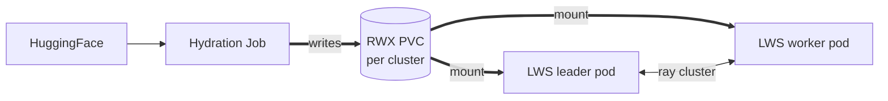

# ModelCache — v0.1 design

A fleet-aware primitive that stages an artifact (model weights, tokenizer, generic bytes) onto every matched `InferenceCluster` exactly once, so `ModelReplica`s on those clusters skip the per-replica fetch and a multi-pod LWS gang can mount the same bytes.

**Status:** v0.1 implemented in PR #78. This doc covers what shipped. Anything more ambitious (content-addressed substrate, cross-cluster dedup, lazy load) is explicitly v0.2+ and lives outside this repo.

## Problem v0.1 solves

Multi-node serving with `TensorPipeline` topology needs **every pod in the LWS gang to see the same weight bytes at the same path**. The two existing paths both fail:

- Per-pod download: thundering-herd on HuggingFace, plus N× the egress.
- KServe's `storage-initializer` init-container: OOMs at 4 / 8 / 16 GiB on real models (Llama 70B, Kimi K2, etc.) because the init-container shares the serving pod's resource limits.

Single-node scale-up has a softer version of the same pain — every new replica re-pulls.

The minimum primitive that unblocks both: **one RWX PVC per cluster, hydrated once by a side Job, mounted read-only by every pod that references it.** That's what v0.1 ships.

## Shape

```yaml
apiVersion: modelplane.ai/v1alpha1
kind: ModelCache
metadata:
  name: qwen-2-5-0-5b
  namespace: ml-team
spec:
  artifact:
    kind: Weights              # v0.1: Weights | Tokenizer | Bytes
    source:                    # one of:
      huggingFace:
        repo: Qwen/Qwen2.5-0.5B-Instruct
        revision: main
      # s3: { uri, secretRef? }
      # http: { url }
      # oci: { ref, pullSecretRef? }
  mount:
    path: /mnt/model           # informational; KServe injects its own path
  storage:
    backend: PVC               # v0.1: PVC | ExistingPVC
    pvc:
      storageClassName: modelplane-rwx
      sizeGiB: 5
  replication: AllMatchingClusters
  clusterSelector:             # optional; default = all ready clusters
    matchLabels: { modelplane.ai/cluster: "true" }
```

`ModelDeployment` references it:

```yaml
spec:
  caches:
  - name: qwen-2-5-0-5b
```

…and the composition function sets the underlying `LLMInferenceService.spec.model.uri = pvc://modelcache-qwen-2-5-0-5b`. The engine container's `--model=/mnt/models` is appended automatically.

## What gets composed

```
ModelCache (user XR)
├── per matched cluster:
│   ├── Object → PersistentVolumeClaim  (RWX, sized to source)
│   └── Object → Job                    (one-shot: hf download → PVC)
└── status.clusters[].phase  = Pending | Hydrating | Ready | Failed

ModelDeployment.spec.caches[]
  ↓ (composition function wires)
LLMInferenceService.spec.model.uri = pvc://modelcache-<name>
                       .worker.containers[0].args += [--model=/mnt/models]
```

`InferenceCluster.spec.storage` declares the cluster's capability:

```yaml
spec:
  storage:
    storageClassName: modelplane-rwx           # default; auto-composed
    csiDrivers: [SharedFilesystem]             # cloud-agnostic capability
```

The GKE branch of `compose-inference-cluster` reads the underlying VPC name from `GKECluster.status.network.name` and composes the `modelplane-rwx` StorageClass on the workload cluster with `parameters.network = <our VPC>`. EKS / AKS branches will follow the same pattern with their respective knobs (fileSystemId, shareName). `compose-gke-cluster` also auto-enables `file.googleapis.com` when Filestore CSI is on. User-facing API stays cloud-agnostic.

## Multi-node serving — the key path



`compose-model-replica` injects a 5-line shell wrapper as the container `command` when `topology.strategy == TensorPipeline`:

```sh
if [ "$LWS_WORKER_INDEX" = "0" ]; then
  ray start --head --port=6379
  exec python -m vllm.entrypoints.openai.api_server "$@"
else
  exec ray start --address="$LWS_LEADER_ADDRESS:6379" --block
fi
```

Lives as a Python constant in the function — when we replace KServe with a Modelplane-native LeaderWorkerSet composition later, the same constant moves verbatim into that composition's pod template.

## Invalidation in v0.1

- Source version pinned via `revision` (HF) / version path (S3) / OCI digest. Source identity *is* cache identity.
- Tags resolve to immutable digests at hydration time; `status.resolvedDigest` records the `sha256:` pin even when the user specified `revision: main`.
- Source version change → create a new ModelCache (immutable-cache pattern).
- Refcount surfaced in `status.references` (deployments using this cache). Operator retires via `kubectl delete modelcache`; PVCs reclaimed per K8s `reclaimPolicy`. No substrate-level auto-GC.

## Explicitly out of scope for v0.1

| Item | Reason |
|---|---|
| `Adapter` artifact kind (LoRA, ControlNet, IP-Adapter) | Dynamic-load semantics differ from static weights; v0.2 |
| `Engine` artifact kind (compiled engine + `(model, hw, config)` tuple) | Needs the content-addressed substrate to be useful; v0.2 |
| `ContentAddressed` storage backend | Requires the commercial substrate (Xet-class CDC, Dragonfly delivery, dedup index); separate track |
| `Custom` storage backend (OSS webhook) | Lands with `ContentAddressed` so both extension points appear together |
| Lazy load / streaming weights | Engine-side adapters (FUSE / HTTP-range) — needs the chunked substrate first |
| Cross-deployment / cross-tenant dedup | Requires content-addressed bytes |
| Cross-cluster content sharing | v0.2+ |
| `AllMatchingNodes` replication granularity | Only fits per-node SSD caches with content-addressed substrate |

## What this proves

Live demo: PR #78 `examples/qwen-cached-demo/`.

- `InferenceCluster` provisions a GKE cluster with Filestore CSI (auto-enabled API + VPC-pinned StorageClass).
- `ModelCache` hydrates Qwen 2.5 0.5B-Instruct onto an RWX PVC.
- `ModelDeployment` with `TensorPipeline 1×2` boots a 2-pod LWS gang on two T4 nodes.
- Both pods mount the same PVC, leader runs vLLM with `--model=/mnt/models --pipeline-parallel-size=2 --dtype=half`, worker joins the leader's Ray cluster.
- `ModelService` exposes the deployment via the control-plane gateway.
- Real chat completion returns over HTTP 200.

See [`examples/qwen-cached-demo/TOPOLOGY.md`](../../examples/qwen-cached-demo/TOPOLOGY.md) for the XR / MR layout.

## v0.2 hooks (named, not designed here)

The v0.1 user-facing API is forward-compatible: `spec.storage.backend` is a discriminator, `spec.artifact.source` is a discriminated union, `spec.replication` is an enum, and `spec.clusterSelector` already accepts the v0.1 `matchLabels` shape that v0.2's CEL form will extend. v0.2 work happens behind the same XRD without breaking v0.1 users.
