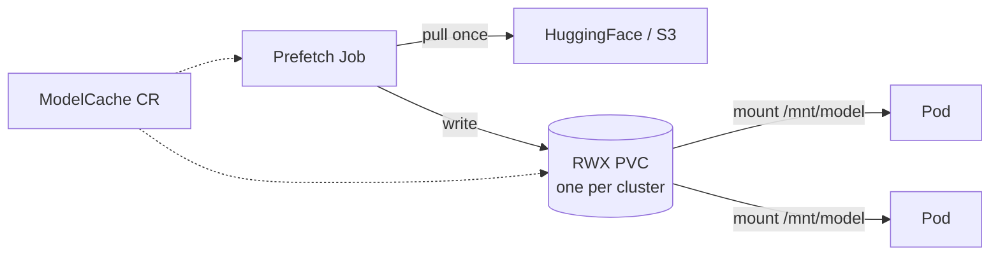
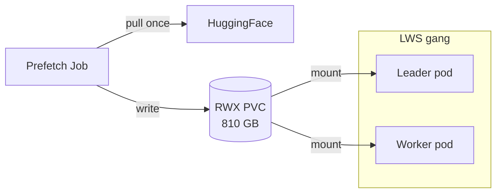
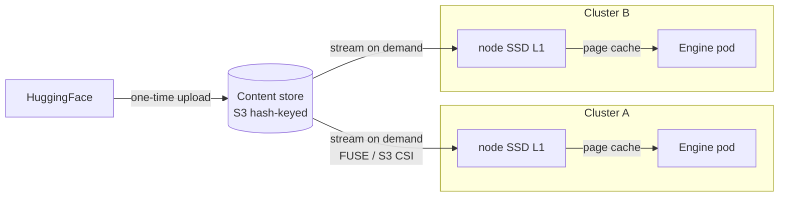
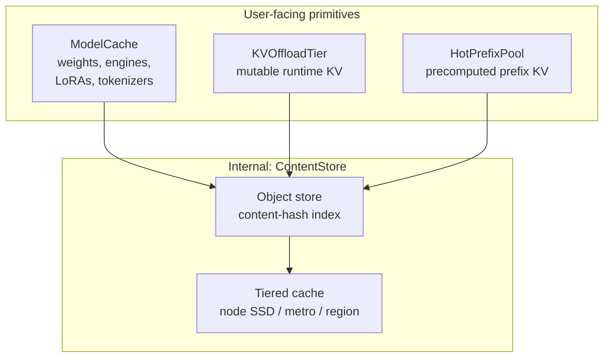

# ModelCache — Fleet-aware artifact staging

**Status**: Draft for review — supersedes the sketch in [#66](https://github.com/modelplaneai/modelplane/issues/66)
**Owners**: Dennis
**Related**: [#66](https://github.com/modelplaneai/modelplane/issues/66) (v0.1 implementation tracker), [#61](https://github.com/modelplaneai/modelplane/issues/61) (closed; mechanism here), [#56 DRA alignment](https://github.com/modelplaneai/modelplane/issues/56) (also v0.1), [#72 KVOffloadTier](https://github.com/modelplaneai/modelplane/issues/72), [#73 HotPrefixPool](https://github.com/modelplaneai/modelplane/issues/73), [#74 Fleet signal bus](https://github.com/modelplaneai/modelplane/issues/74), [PR #64 API design](https://github.com/modelplaneai/modelplane/pull/64), [PR #75 implementation spike](https://github.com/modelplaneai/modelplane/pull/75)

## Problem

LLM inference cold starts are dominated by artifact loading. Weights are 140 GB (Llama 70B) to 800 GB+ (frontier MoE). Compiled engines, tokenizers, LoRA adapters, and chat templates add more. Today the engine downloads bytes on every replica boot:

- New replicas pay full download every scale-up (~30–60 min HF pull for a 70B model, hours for 405B)
- Multi-cluster deployments fetch the same bytes N times
- Multi-node serving (TensorPipeline) requires shared weights across LWS pods. Per-pod download is impractical and KServe's storage-initializer init container OOMs at 4/8/16 GiB on very large models.
- Burst-scale deployments thundering-herd HuggingFace
- Air-gapped and regulated environments need controlled fetch paths; serving pods shouldn't see source credentials
- Platform teams want to pre-stage commonly-used artifacts before any deployment exists

Multiple deployments share base weights, the bytes don't change once written, and pre-staging belongs above the cluster layer. The primitive stages artifacts once per cluster (v0.1) and eventually once per fleet (v0.2+).

## Design principle: pluggable backends across the cache family

ModelCache, [#72 KVOffloadTier](https://github.com/modelplaneai/modelplane/issues/72), and [#73 HotPrefixPool](https://github.com/modelplaneai/modelplane/issues/73) share an architectural pattern:

- **Domain-meaningful user-facing CRD** with a stable contract (artifact, mount, replication, selector)
- **Pluggable storage backend** discriminator that swaps the mechanism without changing user intent
- **Composition function renders** the actual infrastructure (PVCs, Jobs, DaemonSets, scrape configs) from declarative intent

ModelCache starts with a PVC backend in v0.1 and evolves to content-addressed in v0.2+ without breaking the user-facing API. The same shape applies when [#72](https://github.com/modelplaneai/modelplane/issues/72) ships with LMCache/Mooncake/NIXL backends and when [#73](https://github.com/modelplaneai/modelplane/issues/73) adds object-store/LMCache/Mooncake/Custom backends.

## Shape

```yaml
apiVersion: modelplane.ai/v1alpha1
kind: ModelCache
metadata:
  name: llama-3-3-70b
  namespace: ml-team
spec:
  artifact:
    kind: Weights                       # | Tokenizer | LoraAdapter | Engine | Bytes
    source:
      huggingFace:
        repo: meta-llama/Llama-3.3-70B-Instruct
        revision: main
        secretRef: { name: hf-token, key: token }
    baseRef:                            # only for kind: LoraAdapter
      cacheName: llama-3-3-70b
  mount:
    path: /mnt/model
  storage:
    backend: PVC                        # v0.1 — PVC + Job
    pvc:
      storageClassName: filestore-rwx
      sizeGiB: 200                      # optional; derived from source if omitted
  clusterSelector: { matchLabels: { tier: prod } }
  replication: AllMatchingClusters      # one PVC per matching cluster
```

`ModelDeployment.spec.caches: [{ name: llama-3-3-70b }]` references the cache by name. The renderer threads the mount path into the engine container and adjusts engine args (e.g. `--model=/mnt/model` instead of `--model=hf://repo`).

**Mount path is intrinsic to the cache.** One ModelCache, one canonical `spec.mount.path`. No per-reference override.

**Artifact kind discriminator** keeps one primitive instead of fracturing into `ModelWeights`, `EngineCache`, `LoraCache`. Kind affects validation (`LoraAdapter` requires `baseRef`; `Engine` requires a `(model, hardware, config)` tuple) and engine wiring (LoRA flags, engine-dir args).

### Sources

v0.1 sources:

| Source | Use |
|---|---|
| `huggingFace` | Repo + revision + optional `HF_TOKEN` Secret. Common case for open models. |
| `s3` | URI + region + Secret-ref credentials. Internal mirrors, private fine-tunes, compliance buckets. |
| `http` | URL + optional bearer Secret. NIM/NGC URLs, internal artifact servers. |
| `inline` | Literal bytes in the CR. Small text artifacts only — chat templates, config snippets. |
| `configMap` | Reference an existing ConfigMap. Same shape as `inline`. |

v0.2 sources: `gcs`, `azure`, `oci`, `pvc-clone`.

## Scope boundary — ModelCache vs the engine block

ModelCache covers anything **mountable as a path the engine reads**. The engine block (defined in [PR #64](https://github.com/modelplaneai/modelplane/pull/64), partly shipped in [PR #75](https://github.com/modelplaneai/modelplane/pull/75)) handles pod-spec knobs that don't fit the mount-as-path model.

**In scope for ModelCache:**
- Model weights from HF, S3, GCS, etc.
- Compiled engine artifacts — TRT-LLM `.engine` files, vLLM compiled kernels, prefill checkpoints
- Tokenizer files when not bundled with the model
- Custom chat templates, engine config files (vLLM `--config-file`, SGLang `--config-yaml`)
- Any auth-gated artifact — serving pods never see source credentials

**Out of scope** (engine block):
- Container images — NIM bundles weights into the image; the auth problem is at the registry. ModelCache could extend to image pre-pull via DaemonSet later, but it's a different mechanism.
- Runtime env vars (`NCCL_*`, `VLLM_*`, downward-API pod-IP) — covered by `engine.env`, shipped in [PR #75](https://github.com/modelplaneai/modelplane/pull/75)
- `shmSize` / `/dev/shm` for vLLM multi-process IPC (still open on [PR #64](https://github.com/modelplaneai/modelplane/pull/64))
- Generic pod-spec knobs (probes, lifecycle hooks, resources)

Under this boundary the engine block needs only `imagePullSecrets`, `shmSize`, and `env`.

## v0.1 — PVC backend, eager, multi-node ready

Dense models on TensorPipeline gangs without per-pod download races, plus proactive pre-staging by platform teams.

**Mechanism** (absorbs [#61](https://github.com/modelplaneai/modelplane/issues/61)):
- ReadWriteMany PVC per cluster, sized to the source (explicit `spec.storage.pvc.sizeGiB` or derived)
- One-shot Job pulls from source, writes to PVC, exits
- All pods in the LWS gang (leader + workers) mount the same PVC read-only
- ModelReplica scheduling gated on per-cluster cache `Ready` condition
- Storage class declared on `InferenceCluster.spec.storage.storageClassName` (GCP Filestore, AWS EFS/FSx, Azure Files, BYO CSI)
- **Fail-fast**: target cluster with no RWX storage class → matcher rejects placement; clear status condition
- **Cluster selection**: `clusterSelector.matchLabels` is the v0.1 baseline (matches PR #75). Once [#56](https://github.com/modelplaneai/modelplane/issues/56) lands, `clusterSelector` accepts a CEL form over InferenceCluster pool attributes — e.g. "clusters with at least one H100 pool with FP8 support."



**Why Job-based, not init-container**: KServe's storage-initializer runs inside the serving pod's init container and OOMs at 4/8/16 GiB on Kimi K2 / Llama 405B. A Job has its own pod and resource limits, sized for the artifact independently of the serving pod.

**Artifact kinds in v0.1**:
- `Weights` — primary case
- `Tokenizer` — bundled with HF weight download; separate cache when custom
- `Bytes` — opaque escape hatch (compiled engines, chat templates, eval datasets)

**Replication modes in v0.1**:
- `AllMatchingClusters` (default) — one PVC per cluster matching the selector, shared across all pods in that cluster
- `AllMatchingNodes` is v0.2 — only fits content-addressed backend with per-node local SSDs

**Out of scope for v0.1**:
- `LoraAdapter` kind (dynamic-load semantics differ; v0.2)
- `Engine` kind with `(model, hardware, config)` tuple keying (v0.2)
- Lazy loading / streaming (v0.2)
- Cross-deployment / cross-tenant dedup (v0.2 content-addressed)
- Cross-cluster content sharing (v0.2+)

### Multi-node serving



Without this, every pod independently downloads 810 GB (impractical) or KServe's init container OOMs.

## v0.2 — Content-addressed backend, lazy loading, full artifact taxonomy

**Storage backend**: object store keyed by content hash + per-cluster tiered cache (per-node SSD L1, object store L2). Bytes stored once globally; clusters hydrate on demand. Cross-deployment dedup is automatic — 50 deployments of Llama 3.3 70B = one set of bytes. Cross-tenant dedup for public artifacts (opt-in for non-public).



**Lazy loading**: engine starts before all bytes arrive; weights stream via FUSE or S3 CSI mountpoint. Cold-start target: vLLM 95s → ~14s ([Modal benchmark](https://modal.com/blog/truly-serverless-gpus)). Path conventions stable from v0.1 so backend swap is transparent.

**New artifact kinds**:
- `LoraAdapter` — per-adapter mounting, base-model `baseRef`. Fits multi-LoRA serving (thousands of small adapters per base, RFT-class deployments).
- `Engine` — compiled TRT-LLM blobs keyed by `(model, hardware, config)`. Compile cost is minutes per tuple.

**New replication mode**:
- `AllMatchingNodes` — pre-stage to every node in every matching cluster (per-node SSD L1). Viable because bytes are deduplicated.

Market signal (Modal, Tensormesh, others) points at content-addressed as the right pattern for AI artifacts. PVC ships v0.1 fast; content-addressed wins v0.2 on dedup, cold-start, and scale.

## v0.3 — Substrate unification (architectural option)



- **ModelCache** — immutable static artifacts (weights, engines, LoRAs, tokenizers)
- **[#72 KVOffloadTier](https://github.com/modelplaneai/modelplane/issues/72)** — mutable runtime state (live KV cache offload)
- **[#73 HotPrefixPool](https://github.com/modelplaneai/modelplane/issues/73)** — immutable precomputed runtime state (KV blocks for common prefixes)

One substrate, three user-facing primitives. Users still write `ModelCache`; internal composition shares infrastructure. Cross-region replication and intra-metro caching tiers land here.

Architectural option, not a v0.1 commitment. Decide once v0.2 ships and we have measured numbers from the [#73](https://github.com/modelplaneai/modelplane/issues/73) prefix-distribution work and Modal-style cold-start benchmarks.

## Key decisions

1. **Name**: `ModelCache`. Matches the `Model*` family. Internal substrate (when unified) becomes `ContentStore`.
2. **One artifact per ModelCache.** Mount path intrinsic (`spec.mount.path`). Deployments reference by name only.
3. **Artifact kind discriminator** instead of separate primitives.
4. **Pluggable storage backends** (PVC, ContentAddressed, Custom). Same pattern as [#72](https://github.com/modelplaneai/modelplane/issues/72) and [#73](https://github.com/modelplaneai/modelplane/issues/73).
5. **Lazy loading is architectural prep in v0.1, ships in v0.2.** v0.1 doesn't bake "all files must exist at boot" into the engine pod contract.
6. **Scheduler gates on per-cluster cache readiness** before placing a ModelReplica. Fail-fast on missing RWX storage class.
7. **Storage class on the cluster, override on the cache.** `InferenceCluster.spec.storage.storageClassName` is the default; `ModelCache.spec.storage.pvc.storageClassName` overrides.
8. **Substrate unification deferred to v0.3.**

## Alternatives considered

**Per-deployment download init container (today's behavior).** Trivial; breaks at scale and on multi-node (KServe storage-initializer OOMs at 4/8/16 GiB on large models).

**Content-addressed from day one.** Cleaner long-term, much more complex to land. Pluggable backends let us start with PVC and evolve.

**Engine-native solutions only** (KServe storage initializer, vLLM downloader). Cluster-bounded, no fleet primitive, no LoRA story, no shared substrate path.

**Separate primitives per artifact kind** (`ModelWeights`, `EngineCache`, `LoraCache`). More surface, fractured mental model.

**Per-reference mount path** (mountPath on the cache reference, original [#66](https://github.com/modelplaneai/modelplane/issues/66) shape). Allows different deployments to mount the same cache at different paths. Rare in practice and complicates engine-args generation.

**`ContentCache` name.** Worse for the `Model*` family. Use `ContentStore` for the internal substrate.

**`nodeSelector.cel` for per-node placement** (original [#66](https://github.com/modelplaneai/modelplane/issues/66)). Node-level filtering doesn't fit the v0.1 shared-PVC semantic. Becomes useful in v0.2 alongside `AllMatchingNodes`, at which point DRA capability matching ([#56](https://github.com/modelplaneai/modelplane/issues/56), v0.1) is the right vocabulary.

## Open questions for review

1. v0.1 artifact kinds — `Weights` + `Tokenizer` + `Bytes` enough, or also `LoraAdapter` for early multi-LoRA cases?
2. v0.1 sources — `huggingFace` + `s3` + `http` + `inline` + `configMap` enough, or also `gcs` / `azure` from day one?
3. Eviction policy for v0.1 PVC backend — LRU, TTL, manual? Lean is manual; smarter eviction is a v0.2 substrate feature.
4. Migration from v0.1 PVC to v0.2 ContentAddressed — backend switch transparent or destructive? Lean transparent: PVC stays, gradually evolves when operator flips the backend field.
5. v0.3 substrate unification — file as roadmap marker now, or wait until v0.2 ships?
6. Cross-namespace cache references — can `ml-team-a/llama-3-3-70b` be referenced from `ml-team-b/deployment`, or are caches strictly namespace-local? Affects the platform-team-stages-shared-models story.

## Roadmap / issue alignment

This doc is the source of truth. Issues track implementation:

- **[#66](https://github.com/modelplaneai/modelplane/issues/66)** — body refactored to point at this doc; scoped to v0.1 (PVC + multi-node + Weights/Tokenizer/Bytes/inline/configMap)
- **New (to file)**: "ModelCache v0.2 — content-addressed backend, lazy loading, LoRA/Engine kinds"
- **New (optional)**: "v0.3 ContentStore substrate unification" placeholder
- **[#61](https://github.com/modelplaneai/modelplane/issues/61)** — closed; mechanism absorbed here
- **[#72](https://github.com/modelplaneai/modelplane/issues/72), [#73](https://github.com/modelplaneai/modelplane/issues/73)** — cross-reference comments posted pointing at this doc
- **[PR #64](https://github.com/modelplaneai/modelplane/pull/64)** — link here from there once this lands
- **[PR #75](https://github.com/modelplaneai/modelplane/pull/75)** — Nic's spike ships `engine.env` + `imagePullSecrets`; ModelCache rides on those for credential-bearing sources

## Examples

See `examples/` for complete (ModelCache + ModelDeployment) references. Cold-start estimates are rough order-of-magnitude (~50 MB/s typical HF pull, ~1 GB/s typical intra-region S3):

- `01-basic-weights.yaml` — single-cluster Llama 3.3 70B. *Saves ~45 min cold start per replica.*
- `02-multi-node-llama-405b.yaml` — 405B TensorPipeline gang with shared RWX PVC. *Saves ~3-4 hours per gang restart; unblocks the case entirely (per-pod pull would OOM KServe init).*
- `03-multi-cluster-replication.yaml` — Qwen3-32B replicated across regions. *One ~25 min pull per cluster instead of per replica.*
- `04-separate-tokenizer.yaml` — Weights + Tokenizer as distinct ModelCaches.
- `05-private-s3-source.yaml` — air-gapped / GDPR. *Intra-region S3 ~10× faster than HF (~3 min vs ~30+ min for 140 GB).*
- `06-v0.2-content-addressed.yaml` *(preview)* — same as 01 on ContentAddressed backend. *vLLM 95s → ~14s ([Modal](https://modal.com/blog/truly-serverless-gpus)).*
- `07-v0.2-lora-adapter.yaml` *(preview)* — base model + per-tenant LoRA. *Adapter dedup across tenants; small per-adapter bytes.*
- `08-v0.2-compiled-engine.yaml` *(preview)* — TRT-LLM compiled engine keyed by `(model, hardware, config)`. *Saves ~10-30 min compile per replica.*
- `09-bytes-opaque.yaml` — `Bytes` kind for chat templates / eval datasets. Also illustrates cross-deployment cache reuse (refs `llama-3-3-70b` from example 01).

## References

- Modal's truly serverless GPUs: https://modal.com/blog/truly-serverless-gpus
- Kiely's *Inference Engineering* §7.2.2 (cold-start phases), §5.3 (caching), §7.3 (multi-cloud capacity)
- [#61](https://github.com/modelplaneai/modelplane/issues/61) Shared storage for multi-node inference (closed)
- [#66](https://github.com/modelplaneai/modelplane/issues/66) Original ModelCache sketch (this doc supersedes the body)
