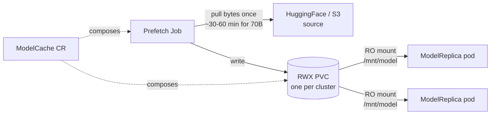
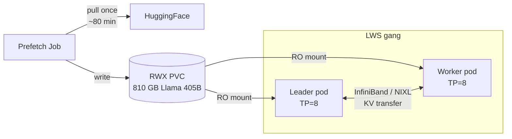
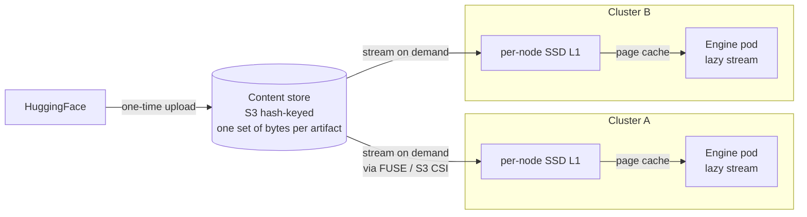
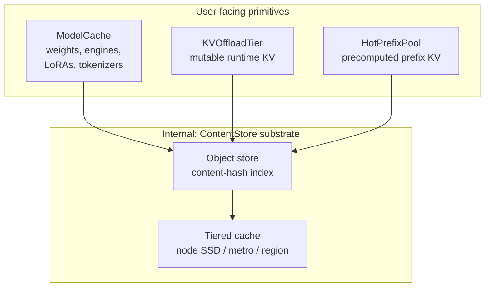

# ModelCache — Fleet-aware artifact staging

**Status**: Draft for review — supersedes the sketch in [#66](https://github.com/modelplaneai/modelplane/issues/66)
**Owners**: Dennis
**Related**: [#66](https://github.com/modelplaneai/modelplane/issues/66) (now the v0.1 implementation tracker), [#61](https://github.com/modelplaneai/modelplane/issues/61) (closed; mechanism here), [#56 DRA alignment](https://github.com/modelplaneai/modelplane/issues/56) (also v0.1), [#72 KVOffloadTier](https://github.com/modelplaneai/modelplane/issues/72), [#73 HotPrefixPool](https://github.com/modelplaneai/modelplane/issues/73), [#74 Fleet signal bus](https://github.com/modelplaneai/modelplane/issues/74), [PR #64 API design](https://github.com/modelplaneai/modelplane/pull/64), [PR #75 implementation spike](https://github.com/modelplaneai/modelplane/pull/75)

## Problem

LLM inference cold starts are dominated by artifact loading. Model weights are 140 GB (Llama 70B) to 800 GB+ (frontier MoE). Compiled engines, tokenizers, LoRA adapters, and custom chat templates add more. Today the engine downloads bytes on every replica boot:

- New replicas pay full download every scale-up (typical HuggingFace pull: 30–60 min for a 70B model, hours for 405B)
- Multi-cluster deployments fetch the same bytes N times
- Multi-node serving (TensorPipeline) requires shared weights across LWS pods — per-pod download is wasteful and racy, and KServe's storage-initializer init container hits OOM at 4/8/16 GiB on very large models
- Burst-scale deployments thundering-herd HuggingFace
- Air-gapped and regulated environments need controlled fetch paths — serving pods shouldn't see source credentials
- Platform teams want to **pre-stage commonly-used artifacts proactively**, before any ML team's deployment exists

This is fleet-level territory. Multiple deployments share base weights, the bytes themselves don't change once written, and pre-staging belongs at a layer where "stage these artifacts to these clusters" can be expressed independently of any specific deployment. The right primitive stages artifacts once per cluster (v0.1) and eventually once per fleet (v0.2+).

## Design principle: pluggable backends across the cache family

ModelCache, [#72 KVOffloadTier](https://github.com/modelplaneai/modelplane/issues/72), and [#73 HotPrefixPool](https://github.com/modelplaneai/modelplane/issues/73) share an architectural pattern:

- **Domain-meaningful user-facing CRD** with a stable contract (artifact, mount, replication, selector)
- **Pluggable storage backend** discriminator that swaps the mechanism underneath without changing user intent
- **Composition function renders** the actual infrastructure (PVCs, Jobs, DaemonSets, scrape configs) from declarative intent

The pattern lets us start simple in v0.1 (PVC for ModelCache, single backend for each) and evolve to content-addressed / tiered substrates in v0.2+ without breaking the user-facing API. Same shape will apply when [#72 KVOffloadTier](https://github.com/modelplaneai/modelplane/issues/72) ships with LMCache/Mooncake/NIXL backends, and when [#73 HotPrefixPool](https://github.com/modelplaneai/modelplane/issues/73) adds object-store / LMCache / Mooncake / Custom backends. ModelCache is the first instance; the pattern generalizes.

## Shape

```yaml
apiVersion: modelplane.ai/v1alpha1
kind: ModelCache
metadata:
  name: llama-3-3-70b
  namespace: ml-team
spec:
  artifact:
    kind: Weights                       # | Tokenizer | LoraAdapter | Engine | Bytes
    source:
      huggingFace:
        repo: meta-llama/Llama-3.3-70B-Instruct
        revision: main
        secretRef: { name: hf-token, key: token }
    baseRef:                            # only for kind: LoraAdapter
      cacheName: llama-3-3-70b
  mount:
    path: /mnt/model
  storage:
    backend: PVC                        # v0.1 — PVC + Job
    pvc:
      storageClassName: filestore-rwx
      sizeGiB: 200                      # optional; derived from source if omitted
  clusterSelector: { matchLabels: { tier: prod } }
  replication: AllMatchingClusters      # one PVC per matching cluster
```

Referenced from `ModelDeployment.spec.caches: [{ name: llama-3-3-70b }]`. The renderer threads the mount path into the engine container; engine args auto-adjust (e.g. `--model=/mnt/model` instead of `--model=hf://repo`).

**Mount path is intrinsic to the cache.** One ModelCache has one canonical mount path, set in `spec.mount.path`. Deployments reference by name only — no per-reference path override. Keeps mount conventions stable across deployments and across backend swaps.

**Artifact kind discriminator** keeps one primitive instead of fracturing into `ModelWeights`, `EngineCache`, `LoraCache`, etc. The kind affects validation (LoraAdapter requires `baseRef`; Engine requires a `(model, hardware, config)` tuple) and engine wiring (LoRA flags, engine-dir args), not the user-visible top-level fields.

### Sources

v0.1 sources:

| Source | Use |
|---|---|
| `huggingFace` | Repo + revision + optional `HF_TOKEN` Secret. The common case for open models. |
| `s3` | URI + region + Secret-ref credentials. Internal mirrors, private fine-tunes, compliance buckets. |
| `http` | URL + optional bearer Secret. NIM/NGC URLs, internal artifact servers. |
| `inline` | Literal bytes embedded in the CR. For small text artifacts only — chat templates, config snippets. |
| `configMap` | Reference an existing ConfigMap. Same shape as `inline` but separately managed. |

v0.2 sources (deferred until cloud-provider story matures):
- `gcs`, `azure`, `oci`, `pvc-clone`

The `inline` and `configMap` sources cover the small-text case (chat templates, vLLM `--config-file`, SGLang `--config-yaml`) without needing object storage for things that are kilobytes.

## Scope boundary — ModelCache vs the engine block

ModelCache covers anything **mountable as a path the engine reads**. The engine block (defined in [PR #64](https://github.com/modelplaneai/modelplane/pull/64) and partly shipped in [PR #75](https://github.com/modelplaneai/modelplane/pull/75)) handles **pod-spec knobs that don't fit the mount-as-path model**.

**In scope for ModelCache:**
- Model weights from HF, S3, GCS, etc.
- Compiled engine artifacts — TensorRT-LLM `.engine` files, vLLM compiled kernels, prefill checkpoints
- Tokenizer files when not bundled with the model
- Custom chat templates, engine config files (vLLM `--config-file`, SGLang `--config-yaml`)
- Any auth-gated artifact — serving pods never see source credentials

**Out of scope** (lives on the engine block):
- Container images — NIM bundles weights into the image, so the auth problem is at the registry, not the artifact source. ModelCache could extend to image pre-pull via DaemonSet later, but it's a different mechanism.
- Runtime env vars (`NCCL_*`, `VLLM_*`, downward-API pod-IP) — covered by `engine.env`, shipped in [PR #75](https://github.com/modelplaneai/modelplane/pull/75)
- `shmSize` / `/dev/shm` for vLLM multi-process IPC (still open on [PR #64](https://github.com/modelplaneai/modelplane/pull/64))
- Generic pod-spec knobs (probes, lifecycle hooks, resources)

If this boundary holds, the engine block needs only `imagePullSecrets`, `shmSize`, and `env` — small pod-spec extensions, not new abstractions. Everything else flows through ModelCache.

## v0.1 — PVC backend, eager, multi-node ready

Targets the load-bearing case: dense models on TensorPipeline gangs without per-pod download races, plus platform teams pre-staging artifacts proactively.

**Mechanism** (absorbing [#61](https://github.com/modelplaneai/modelplane/issues/61)'s design):
- ReadWriteMany PVC per cluster, sized to the source artifact (explicit `spec.storage.pvc.sizeGiB` or derived from source)
- One-shot Job pulls from source, writes to PVC; runs to completion, then exits
- All pods in the LWS gang (leader + workers) mount the same PVC read-only
- ModelReplica scheduling gated on per-cluster cache `Ready` condition
- Storage class declared on `InferenceCluster.spec.storage.storageClassName` (RWX-capable: GCP Filestore, AWS EFS, AWS FSx, Azure Files, BYO CSI)
- **Fail-fast scheduling**: if a target cluster has no RWX storage class, the matcher rejects placement for any ModelDeployment referencing a cache that needs `AllMatchingClusters` mode. Clear condition surfaces the gap.
- **Cluster selection**: `clusterSelector.matchLabels` is the v0.1 baseline (matches PR #75). Once [#56 DRA alignment](https://github.com/modelplaneai/modelplane/issues/56) lands in v0.1, `clusterSelector` can also accept a CEL form that matches against InferenceCluster pool attributes/capacity — useful for "stage weights only to clusters that have at least one H100 pool with FP8 support."



**Why Job-based, not init-container**: KServe's storage-initializer runs inside the serving pod's init container and has hit OOMs at 4/8/16 GiB on very large models (Kimi K2, Llama 405B). A Job has its own pod with separate resource limits; it can be sized for the artifact without affecting the serving pod's resource budget. Job runs once per cluster cache; serving pods just mount the populated PVC.

**Artifact kinds in v0.1**:
- `Weights` — primary case
- `Tokenizer` — naturally bundles with HF weight download, separate when custom
- `Bytes` — opaque escape hatch (compiled engines, chat templates, eval datasets) without dedicated typing

**Replication modes in v0.1**:
- `AllMatchingClusters` (default) — one PVC per cluster matching the selector, shared across all pods in that cluster. The PVC-backed semantic.
- `AllMatchingNodes` is **v0.2** — only makes sense with content-addressed backend + per-node local SSDs.

**Out of scope for v0.1**:
- `LoraAdapter` kind (dynamic-load semantics differ; v0.2)
- `Engine` kind with `(model, hardware, config)` tuple keying (v0.2)
- Lazy loading / streaming (v0.2)
- Cross-deployment / cross-tenant dedup (v0.2 content-addressed)
- Cross-cluster content sharing (v0.2+)

No dedup, no streaming, no tiering. But it solves the v0.1 problem: engine doesn't redownload at every replica restart, multi-node gangs share weights cleanly, platform teams own the source/auth path, and proactive pre-staging works.

### Multi-node serving — the load-bearing case



The mechanism [#61](https://github.com/modelplaneai/modelplane/issues/61) proposed becomes the v0.1 default. Without it, every pod independently downloads (impractical for 810 GB × N pods) or KServe's init container OOMs.

## v0.2 — Content-addressed backend, lazy loading, full artifact taxonomy

**Storage backend**: object store keyed by content hash + per-cluster tiered cache (per-node SSD as L1, object store as L2). Bytes are stored once globally; clusters hydrate on demand. Cross-deployment dedup is automatic — 50 deployments of Llama 3.3 70B = one set of bytes. Cross-tenant dedup for public artifacts (with opt-in for non-public).



**Lazy loading**: engine starts before all bytes have arrived; weights stream via FUSE or S3 CSI mountpoint. Cold-start target: vLLM 95s → ~14s ([Modal benchmark](https://modal.com/blog/truly-serverless-gpus)). Path conventions stable from v0.1 so the backend swap is transparent to the engine container.

**New artifact kinds**:
- `LoraAdapter` — per-adapter mounting, base-model `baseRef`. Natural fit for multi-LoRA serving (thousands of small adapters per base — RFT-class deployments).
- `Engine` — compiled TRT-LLM blobs keyed by `(model, hardware, config)`. Compile cost is minutes per tuple; cache wins big.

**New replication mode**:
- `AllMatchingNodes` — pre-stage to every node in every matching cluster (per-node SSD L1 tier). Only viable with content-addressed backend because bytes are deduplicated.

**Why now**: market signal is clear (Modal's content-addressed serverless GPUs, Tensormesh's LMCache commercial offering, others) that content-addressed is the right pattern for AI artifacts. v0.1 PVC ships fast and gives us the user-facing shape; v0.2 wins on dedup, cold-start, and scale.

## v0.3 — Substrate unification (architectural option)

The cache family fits a single mechanism with three user-facing primitives, each retaining its domain identity:



The pattern repeats with progressively more interesting artifacts:
- **ModelCache** stages *immutable static* artifacts (weights, engines, LoRAs, tokenizers)
- **[#72 KVOffloadTier](https://github.com/modelplaneai/modelplane/issues/72)** stages *mutable runtime state* (live KV cache offload)
- **[#73 HotPrefixPool](https://github.com/modelplaneai/modelplane/issues/73)** stages *immutable precomputed runtime state* (KV blocks for common prefixes)

One object-store + tiered-cache substrate, three user-facing primitives. Users still write `ModelCache` (domain-meaningful name); internal composition shares infrastructure. Cross-region replication and intra-metro caching tiers land here.

This is an architectural option, not a v0.1 commitment. Decide when v0.2 ships and we have measured numbers from the [#73 HotPrefixPool](https://github.com/modelplaneai/modelplane/issues/73) prefix-distribution work and Modal-style cold-start benchmarks.

## Key decisions

1. **Name**: `ModelCache`. Matches the `Model*` naming family. Internal substrate (when unified) becomes `ContentStore` — users never write that.
2. **One artifact per ModelCache.** Mount path is intrinsic to the cache (`spec.mount.path`). Deployments reference by name only — no per-reference path override. Keeps semantics clean across backend swaps.
3. **Artifact kind discriminator** instead of separate primitives. One ModelCache, multiple kinds.
4. **Pluggable storage backends** (PVC, ContentAddressed, Custom). Same pattern as [#72](https://github.com/modelplaneai/modelplane/issues/72) and [#73](https://github.com/modelplaneai/modelplane/issues/73) — the family's unifying architectural principle.
5. **Lazy loading is architectural prep in v0.1, ships in v0.2**. v0.1 doesn't bake "all files must exist at boot" into the engine pod contract.
6. **Scheduler gates on per-cluster cache readiness** before placing a ModelReplica. Fail-fast on missing RWX storage class.
7. **Storage class on the cluster**, override on the cache. `InferenceCluster.spec.storage.storageClassName` is the cluster default; `ModelCache.spec.storage.pvc.storageClassName` overrides for special cases.
8. **Substrate unification deferred to v0.3.** Decide once v0.2 numbers are in hand.

## Alternatives considered

**Per-deployment download init container (today's behavior).** Trivial; breaks at scale and on multi-node (KServe storage-initializer OOMs at 4/8/16 GiB on large models). The status quo we're replacing.

**Content-addressed from day one.** Cleaner long-term, much more complex to land. Pluggable backends let us start with PVC and evolve. Lower risk to v0.1 timeline.

**Engine-native solutions only** (KServe storage initializer, vLLM downloader). Cluster-bounded, no fleet primitive, no LoRA story, no shared substrate path. Also doesn't generalize to compiled engines or non-weight artifacts.

**Separate primitives per artifact kind** (`ModelWeights`, `EngineCache`, `LoraCache`). More surface area, fractured mental model. Unified `ModelCache` with kind discriminator is cleaner.

**Per-reference mount path** (mountPath on the cache reference, as in the original [#66](https://github.com/modelplaneai/modelplane/issues/66) sketch). Allows different deployments to mount the same cache at different paths. Rare in practice and complicates engine-args generation. Keep mount path intrinsic to the cache.

**`ContentCache` name.** Better for positioning if Modelplane is "the AI content CAS company"; worse for the `Model*` naming family. Use `ContentStore` for the internal substrate; keep `ModelCache` user-facing.

**`nodeSelector.cel` for per-node placement** (in the original [#66](https://github.com/modelplaneai/modelplane/issues/66) sketch). v0.1 ModelCache uses cluster-level `clusterSelector.matchLabels` because `AllMatchingClusters` (RWX PVC per cluster) is the only v0.1 replication mode — node-level filtering doesn't fit the shared-PVC semantic. `nodeSelector.cel` becomes useful in v0.2 alongside `AllMatchingNodes` mode (per-node SSD staging via content-addressed backend), at which point DRA capability matching ([#56](https://github.com/modelplaneai/modelplane/issues/56), v0.1) is the right vocabulary.

## Open questions for review

1. v0.1 artifact kinds — `Weights` + `Tokenizer` + `Bytes` enough, or also `LoraAdapter` for early multi-LoRA cases?
2. v0.1 source taxonomy — `huggingFace` + `s3` + `http` + `inline` + `configMap` enough, or also `gcs` / `azure` from day one?
3. Eviction policy for v0.1 PVC backend — LRU, TTL, manual? My lean is manual (`spec.retention.policy: Manual`); smarter eviction is a v0.2 substrate feature.
4. Migration from v0.1 PVC to v0.2 ContentAddressed — backend switch transparent or destructive? My lean is transparent: PVC stays, gradually evolves to ContentAddressed when operator flips the backend field.
5. v0.3 substrate unification — file as roadmap marker now, or wait until v0.2 ships?
6. Cross-namespace cache references — can `ml-team-a/llama-3-3-70b` cache be referenced from `ml-team-b/deployment`, or are caches strictly namespace-local? Affects platform-team-stages-shared-models story.

## Roadmap / issue alignment

This doc is the source of truth. Issues track implementation:

- **[#66 ModelCache](https://github.com/modelplaneai/modelplane/issues/66)** — body refactored to point at this doc and scope to v0.1 (PVC + multi-node + Weights/Tokenizer/Bytes/inline/configMap)
- **New issue (to file): "ModelCache v0.2 — content-addressed backend, lazy loading, LoRA/Engine kinds"** — cites Modal + this design doc
- **New issue (optional): "v0.3 ContentStore substrate unification"** — placeholder marker
- **[#61](https://github.com/modelplaneai/modelplane/issues/61)** — already closed, mechanism absorbed; no further action
- **[#72 KVOffloadTier](https://github.com/modelplaneai/modelplane/issues/72), [#73 HotPrefixPool](https://github.com/modelplaneai/modelplane/issues/73)** — small follow-up comments referencing the shared pluggable-backends design principle and the v0.3 substrate-unification path
- **[PR #64](https://github.com/modelplaneai/modelplane/pull/64) design doc** — link from there to here once this lands
- **[PR #75](https://github.com/modelplaneai/modelplane/pull/75)** — Nic's spike adds `engine.env` and `imagePullSecrets`; ModelCache rides on those for credential-bearing sources

## Examples

See `examples/` for complete (ModelCache + ModelDeployment) references for each use case. Cold-start time estimates are rough order-of-magnitude (~50 MB/s typical HF pull, ~1 GB/s typical intra-region S3):

- `01-basic-weights.yaml` — single-cluster Llama 3.3 70B. *Saves ~45 min cold start per replica.*
- `02-multi-node-llama-405b.yaml` — 405B TensorPipeline gang with shared RWX PVC. *Saves ~3-4 hours per gang restart; unblocks the case entirely (per-pod pull would OOM KServe init).*
- `03-multi-cluster-replication.yaml` — Qwen3-32B replicated across regions. *One ~25 min pull per cluster instead of per replica.*
- `04-separate-tokenizer.yaml` — Weights + Tokenizer as distinct ModelCaches.
- `05-private-s3-source.yaml` — air-gapped / GDPR. *Intra-region S3 ~10× faster than HF (~3 min vs ~30+ min for 140 GB).*
- `06-v0.2-content-addressed.yaml` *(preview)* — same as 01 on ContentAddressed backend. *vLLM cold start 95s → ~14s ([Modal](https://modal.com/blog/truly-serverless-gpus)).*
- `07-v0.2-lora-adapter.yaml` *(preview)* — base model + per-tenant LoRA. *Adapter dedup across tenants; small per-adapter bytes.*
- `08-v0.2-compiled-engine.yaml` *(preview)* — TensorRT-LLM compiled engine keyed by `(model, hardware, config)` tuple. *Saves ~10-30 min TRT-LLM compile per replica.*
- `09-bytes-opaque.yaml` — `Bytes` kind for chat templates / eval datasets / arbitrary artifacts. Also illustrates cross-deployment cache reuse (refs `llama-3-3-70b` from example 01).

## References

- Modal's truly serverless GPUs (content-addressed tiered cache): https://modal.com/blog/truly-serverless-gpus
- Kiely's *Inference Engineering* §7.2.2 (cold-start phases), §5.3 (caching), §7.3 (multi-cloud capacity management)
- [#61](https://github.com/modelplaneai/modelplane/issues/61) Shared storage for multi-node inference (closed; mechanism absorbed here)
- [#66](https://github.com/modelplaneai/modelplane/issues/66) Original ModelCache sketch (this doc supersedes the body)
