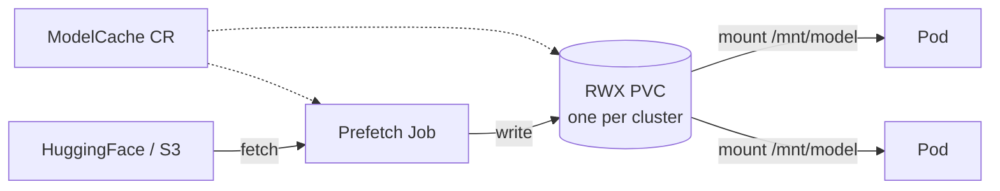
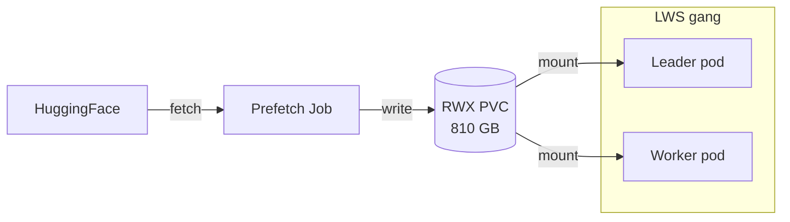
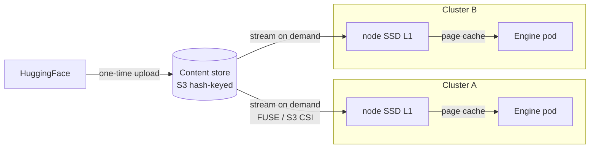
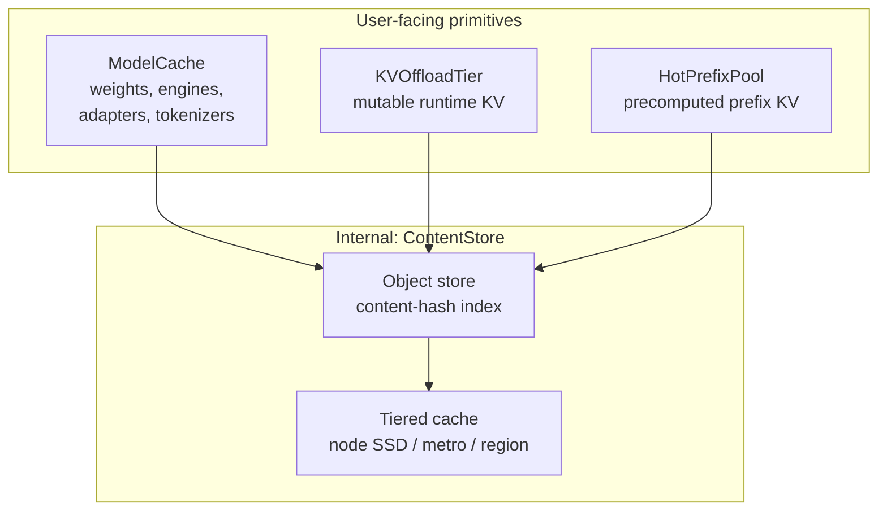
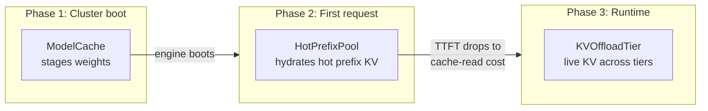

# ModelCache — Fleet-aware artifact staging

**Status**: Draft for review — supersedes the sketch in [#66](https://github.com/modelplaneai/modelplane/issues/66).
**Timeline shift**: Advances ModelCache from v0.2 (per the original [PR #64](https://github.com/modelplaneai/modelplane/pull/64) review framing) to v0.1, driven by multi-node serving needs ([#61](https://github.com/modelplaneai/modelplane/issues/61) closure) and DRA landing in v0.1 ([#56](https://github.com/modelplaneai/modelplane/issues/56)). Flag for explicit team alignment.
**Owners**: Dennis
**Related**: [#66](https://github.com/modelplaneai/modelplane/issues/66) (v0.1 implementation tracker), [#61](https://github.com/modelplaneai/modelplane/issues/61) (closed; mechanism here), [#56 DRA alignment](https://github.com/modelplaneai/modelplane/issues/56) (also v0.1), [#72 KVOffloadTier](https://github.com/modelplaneai/modelplane/issues/72), [#73 HotPrefixPool](https://github.com/modelplaneai/modelplane/issues/73), [#74 Fleet signal bus](https://github.com/modelplaneai/modelplane/issues/74), [PR #64 API design](https://github.com/modelplaneai/modelplane/pull/64), [PR #75 implementation spike](https://github.com/modelplaneai/modelplane/pull/75)

## Problem

LLM inference cold starts are dominated by artifact loading. Weights are 140 GB (Llama 70B) to 800 GB+ (frontier MoE). Compiled engines, tokenizers, LoRA adapters, and chat templates add more. Today the engine downloads bytes on every replica boot:

- New replicas pay full download every scale-up (~30–60 min HF pull for a 70B model, hours for 405B)
- Multi-cluster deployments fetch the same bytes N times
- Multi-node serving (TensorPipeline) requires shared weights across LWS pods. Per-pod download is impractical and KServe's storage-initializer init container OOMs at 4/8/16 GiB on very large models.
- Burst-scale deployments thundering-herd HuggingFace
- Air-gapped and regulated environments need controlled fetch paths; serving pods shouldn't see source credentials
- Platform teams want to pre-stage commonly-used artifacts before any deployment exists

Multiple deployments share the same bytes; pre-staging belongs above the cluster layer. v0.1 stages once per cluster; v0.2+ once per fleet.

## Three packaging patterns

LLM serving has settled into three factorings of `(runtime, weights, optional compiled engine)`:

1. **Engine fetches weights at startup.** Generic engine image (vLLM, SGLang, TGI); engine pulls weights via its native mechanism (`--model=<repo>`). Dominant pattern for OSS engines.
2. **Engine image bakes in weights** (NIM). Runtime + optimization + weights in one OCI image. The registry handles distribution.
3. **Runtime and artifacts stored separately.** Generic runtime image + separately-stored weights / compiled engines / tokenizers / configs. The runtime mounts artifacts at a known path and reads from there.

These three are MECE — *mutually exclusive* (no overlap between categories) and *collectively exhaustive* (no gaps) — on the axis of *whole-artifact fetch responsibility at engine pod boot*: who pulls the bytes (engine vs registry vs external stager). Hybrid factorings (image bakes a tokenizer while runtime fetches weights; small base baked + larger variant fetched) are linear combinations of these patterns, not a fourth pattern. The doc calls out the MECE axis explicitly for each taxonomy below so the categorizations don't drift across discriminators.

ModelCache is the v0.1 primitive for **Pattern 3** and accelerates **Pattern 1** by staging weights once per cluster instead of once per replica. **Pattern 2** (NIM) splits further on *where the weights live × who put them there*:

- **2a**: weights baked into the NIM image. No ModelCache needed; OCI registry + `engine.imagePullSecrets` + `engine.env` (for `NGC_API_KEY`) handle it.
- **2b**: NIM image is runtime-only and fetches weights into `/opt/nim/.cache` on first run. ModelCache pre-seeds the cache dir on a PVC so replicas don't refetch (see `examples/11-nim-cache.yaml`).
- **2c**: NIM air-gap. Customer pre-seeds the cache dir out-of-band; ModelCache `backend: ExistingPVC` mounts it (see `examples/10-byo-existing-pvc.yaml`).

NVIDIA's [NIM Operator](https://docs.nvidia.com/nim-operator/) (with its own `NIMService` / `NIMCache` CRDs) composes with ModelCache rather than competing — ModelCache stages the cache dir at the K8s storage layer; NIM Operator (or a bare NIM pod) consumes the mounted path. Customers already on the NIM Operator can keep using it.

## Design principle: pluggable backends across the cache family

ModelCache, [#72 KVOffloadTier](https://github.com/modelplaneai/modelplane/issues/72), and [#73 HotPrefixPool](https://github.com/modelplaneai/modelplane/issues/73) share an architectural pattern:

- **Domain-meaningful user-facing CRD** with a stable contract (artifact, mount, replication, selector)
- **Pluggable storage backend** discriminator that swaps the mechanism without changing user intent
- **Composition function renders** the actual infrastructure (PVCs, Jobs, DaemonSets, scrape configs) from declarative intent

ModelCache starts with a `PVC` backend in v0.1 and evolves to `ContentAddressed` in v0.2+ without breaking the user-facing API. The same shape applies when [#72](https://github.com/modelplaneai/modelplane/issues/72) ships with LMCache / Mooncake / NIXL backends and when [#73](https://github.com/modelplaneai/modelplane/issues/73) adds object-store / LMCache / Mooncake / Custom backends.

## Shape

```yaml
apiVersion: modelplane.ai/v1alpha1
kind: ModelCache
metadata:
  name: llama-3-3-70b
  namespace: ml-team
spec:
  artifact:
    kind: Weights                       # v0.1: Weights | Tokenizer | Bytes
                                        # v0.2: + Adapter | Engine
    source:
      huggingFace:
        repo: meta-llama/Llama-3.3-70B-Instruct
        revision: main
        secretRef: { name: hf-token, key: token }
  mount:
    path: /mnt/model
  storage:
    backend: PVC                        # v0.1 — PVC + Job
    pvc:
      storageClassName: filestore-rwx
      sizeGiB: 200                      # optional; derived from source if omitted
  clusterSelector: { matchLabels: { tier: prod } }
  replication: AllMatchingClusters      # one PVC per matching cluster
```

`ModelDeployment.spec.caches: [{ name: llama-3-3-70b }]` references the cache by name. The renderer threads the mount path into the engine container and adjusts engine args (e.g. `--model=/mnt/model` instead of `--model=meta-llama/Llama-3.3-70B-Instruct`).

**Mount path is intrinsic to the cache.** One ModelCache, one canonical `spec.mount.path`. No per-reference override.

**Artifact kind discriminator** keeps one primitive instead of fracturing into `ModelWeights`, `EngineCache`, `LoraCache`. Kind affects validation (`Adapter` requires a `baseRef` and `adapterType`; `Engine` requires a `(model, hardware, config)` tuple) and engine wiring (adapter flags, engine-dir args). `baseRef`, `adapterType`, and engine-tuple fields are documented in `examples/07-v0.2-lora-adapter.yaml` and `examples/08-v0.2-compiled-engine.yaml`.

Kind is a *validation and wiring* discriminator, not a strict content partition — the same bytes can fit multiple kinds. A HuggingFace repo bundles weights and tokenizer files together; a `Weights` cache stages the whole bundle. Use `Tokenizer` when the tokenizer is staged independently (custom vocab, separate update cadence) and `Bytes` as the explicit escape hatch for anything that doesn't fit a typed kind.

**Coverage**: ModelCache is **format- and modality-agnostic**. The artifact-kind discriminator drives validation and engine wiring, but the bytes themselves are opaque — engines read whatever's at `mount.path`. Same primitive serves LLM weights (safetensors / GGUF / ONNX), embedding models (sentence-transformers dirs), multimodal VLMs (bundled vision+text safetensors with `preprocessor_config.json`), ASR / TTS bases (model + tokenizer + preprocessor configs), voice libraries (directories of reference audio), compiled engines (TRT-LLM `.engine` blobs), and arbitrary byte trees via `Bytes`. Format awareness lives in the engine, not in the cache.

### Sources

v0.1 sources:

| Source | Use |
|---|---|
| `huggingFace` | Repo + revision + optional `HF_TOKEN` Secret. Common case for open models. |
| `s3` | URI + region + Secret-ref credentials. Internal mirrors, private fine-tunes, compliance buckets. |
| `http` | URL + optional bearer Secret. NIM/NGC URLs (pre-seeding `/opt/nim/.cache`), internal artifact servers, signed-URL endpoints. |
| `oci` | OCI registry artifact (Harbor / Zot / GHCR / ECR / GAR). Air-gap reference pattern; ORAS + KitOps ecosystem. |
| `inline` | Literal bytes in the CR. Small text artifacts only — chat templates, config snippets. |
| `configMap` | Reference an existing ConfigMap. Same shape as `inline`. |

These v0.1 sources are MECE on *fetch protocol* (HF API, S3 API, plain HTTPS, OCI manifests, in-cluster K8s). `huggingFace` and `oci` are protocol-aware specializations of HTTP that the function knows how to negotiate (HF auth, OCI manifest fan-out) — they're not strict subsets at the API level.

**v0.2 splits into two abstraction layers** so the API stays MECE:

- **Direct fetch sources** (peer-level with v0.1 sources, under `spec.artifact.source`): `gcs`, `azure`, `pvc-clone`.
- **Registry resolvers** (one level up, under `spec.artifact.resolvedVia`): `mlflow`, `kubeflowModelRegistry`, `wandb`, `nimCatalog`. A resolver maps a registry URI to the underlying fetch source at runtime; the user doesn't write `source` directly when `resolvedVia` is set. This keeps fetch protocols and registry resolution at distinct layers instead of mixing them as peers.

```yaml
spec:
  artifact:
    kind: Engine
    resolvedVia:
      mlflow:
        registryUri: models://my-team/llama-finetune/3
    # source is populated by the resolver at runtime; user usually omits it
```

### Storage backends

| Backend | Version | Use |
|---|---|---|
| `PVC` | v0.1 | Modelplane-managed RWX PVC + Job. Storage class is configurable — any RWX CSI works (Filestore, EFS, FSx, Azure Files, Lustre, JuiceFS, Weka, Alluxio). |
| `ExistingPVC` | v0.1 | Mount a customer-managed PVC; Modelplane doesn't populate. For customers with their own staging pipeline. |
| `ContentAddressed` | v0.2 | Object store with content-hash index + per-cluster tiered cache. Lazy loading, cross-deployment dedup. |
| `Custom` | v0.2 | Webhook contract for non-standard caching solutions. |

Backends are MECE on *who owns the storage substrate*: Modelplane managing a K8s PVC (`PVC`), customer managing a K8s PVC (`ExistingPVC`), Modelplane managing object storage (`ContentAddressed`), external webhook owning the contract (`Custom`).

### BYO scenarios

ModelCache composes with customer infrastructure at every layer:

- **BYO source** — any v0.1 source points at customer-managed registries: internal Harbor (`oci`), Artifactory (`http`/`oci`), private S3 mirror (`s3`), NIM cache server (`http`).
- **BYO storage class** — `PVC` backend works through any RWX CSI driver. Set `storage.pvc.storageClassName: weka-rwx` / `juicefs-csi` / `alluxio-fuse` etc.
- **BYO pre-populated PVC** — `backend: ExistingPVC` references a customer-managed PVC; Modelplane mounts without populating. The `replication` field is ignored (customer handles per-cluster placement).
- **BYO P2P fan-out** — Spegel / Dragonfly running in the cluster handle in-cluster distribution transparently when using `oci` source.
- **BYO cluster** — `InferenceCluster.spec.cluster.source: Existing` (shipped in [PR #75](https://github.com/modelplaneai/modelplane/pull/75)).

Regardless of which axes are BYO, Modelplane retains: artifact identity, scheduler gating (ModelReplica blocks until cache is `Ready`), refcounting visible in `status.references`, per-cluster ready state, signal-bus emission, invalidation policy. Customer storage handles the bytes; Modelplane provides fleet-aware orchestration.

## Scope boundary — ModelCache vs the engine block

ModelCache covers anything **mountable as a path the engine reads**. The engine block (defined in [PR #64](https://github.com/modelplaneai/modelplane/pull/64), partly shipped in [PR #75](https://github.com/modelplaneai/modelplane/pull/75)) handles pod-spec knobs that don't fit the mount-as-path model.

**In scope for ModelCache:**
- Model weights from HF, S3, GCS, etc.
- Compiled engine artifacts — TRT-LLM `.engine` files, vLLM compiled kernels, prefill checkpoints
- Tokenizer files when not bundled with the model
- Custom chat templates, engine config files (vLLM `--config-file`, SGLang `--config-yaml`)
- Any auth-gated artifact — serving pods never see source credentials

**Out of scope** (engine block):
- Container images — image pull is `engine.imagePullSecrets` + standard kubelet pull. ModelCache could extend to image pre-pull via DaemonSet later, but it's a different mechanism. (NIM-specific note: Mode 2a baked-weight images stay in this category; Modes 2b/2c stage the NIM cache dir via ModelCache, see Three packaging patterns.)
- Runtime env vars (`NCCL_*`, `VLLM_*`, downward-API pod-IP) — covered by `engine.env`, shipped in [PR #75](https://github.com/modelplaneai/modelplane/pull/75)
- `shmSize` / `/dev/shm` for vLLM multi-process IPC (still open on [PR #64](https://github.com/modelplaneai/modelplane/pull/64))
- Generic pod-spec knobs (probes, lifecycle hooks, resources)

Under this boundary the engine block needs only `imagePullSecrets`, `shmSize`, and `env`.

## v0.1 — PVC backend, eager, multi-node ready

Use cases: dense models on TensorPipeline gangs (no per-pod download races) and proactive pre-staging by platform teams.

**Mechanism** (absorbs [#61](https://github.com/modelplaneai/modelplane/issues/61)):
- `ReadWriteMany` PVC per cluster, sized to the source (explicit `spec.storage.pvc.sizeGiB` or derived)
- One-shot Job pulls from source, writes to PVC, exits
- All pods in the LWS gang (leader + workers) mount the same PVC read-only
- ModelReplica scheduling gated on per-cluster cache `Ready` condition
- `status.clusters[]` is the eligibility signal the fleet matcher reads; a cluster without a `Ready` cache for any referenced ModelCache is not a candidate
- Storage class declared on `InferenceCluster.spec.storage.storageClassName` (GCP Filestore, AWS EFS / FSx, Azure Files, BYO CSI)
- **Fail-fast**: target cluster with no RWX storage class → matcher rejects placement; clear status condition
- **Cluster selection**: `clusterSelector.matchLabels` is the v0.1 baseline (matches [PR #75](https://github.com/modelplaneai/modelplane/pull/75)). Once [#56](https://github.com/modelplaneai/modelplane/issues/56) lands, `clusterSelector` accepts a CEL form over `InferenceCluster` pool attributes — e.g. "clusters with at least one H100 pool with FP8 support."



**Why Job-based, not init-container**: KServe's storage-initializer runs inside the serving pod's init container and OOMs at 4/8/16 GiB on Kimi K2 / Llama 405B. A Job has its own pod and resource limits, sized for the artifact independently of the serving pod.

**Artifact kinds in v0.1**:
- `Weights` — primary case
- `Tokenizer` — bundled with HF weight download; separate cache when custom
- `Bytes` — opaque escape hatch (compiled engines, chat templates, eval datasets)

**Replication modes in v0.1**:
- `AllMatchingClusters` (default) — one PVC per cluster matching the selector, shared across all pods in that cluster
- `AllMatchingNodes` is v0.2 — only fits the `ContentAddressed` backend with per-node local SSDs

v0.1 and v0.2 modes are MECE on *replication granularity* (cluster vs node) but not on *replication selectivity* — `SingleCluster`, `KOfN`, and weighted modes for dev environments and regional canaries are intentionally out of scope for both versions. File when a concrete use case lands.

**Invalidation and GC in v0.1**:
- Source version pinned via `revision` (HF) / version path (S3) / OCI digest. The source identity *is* the cache identity.
- Tags resolve to immutable digests at hydration time; `status.resolvedDigest` records the `sha256:` pin even when the user specified `revision: main`.
- Source version change → create a new `ModelCache` (immutable-cache pattern).
- Manual re-fetch via metadata annotation (`modelplane.ai/refetch: "<timestamp>"`) for source-side fixes that don't change the version string.
- Refcount surfaced in `status.references` (deployments using this cache). Operator retires explicitly via `kubectl delete modelcache`; PVCs reclaimed per K8s `reclaimPolicy`. No substrate-level auto-GC in v0.1.

**Status in v0.1**:
- Conditions: `Ready`, `Populated`, `Failed` per cluster
- Fields: `resolvedDigest`, `bytesStaged`, `lastHydratedAt`, `references: [<deploymentRef>]`, `clusters: [{ name, ready, sizeBytes }]`
- Emits to the [#74 signal bus](https://github.com/modelplaneai/modelplane/issues/74): hydration latency, bytes staged, per-cluster ready state

**Out of scope for v0.1**:
- `Adapter` kind for LoRA / ControlNet / IP-Adapter / etc. (dynamic-load semantics differ; v0.2)
- `Engine` kind with `(model, hardware, config)` tuple keying (v0.2)
- Lazy loading / streaming (v0.2)
- Cross-deployment / cross-tenant dedup (v0.2 content-addressed)
- Cross-cluster content sharing (v0.2+)

### Multi-node serving



Without this, every pod independently downloads 810 GB (impractical) or KServe's init container OOMs.

## v0.2 — Content-addressed backend, lazy loading, full artifact taxonomy

**Storage backend**: object store keyed by content hash + per-cluster tiered cache (per-node SSD L1, object store L2). Bytes stored once globally; clusters hydrate on demand. Cross-deployment dedup is automatic — 50 deployments of Llama 3.3 70B = one set of bytes. Cross-tenant dedup is automatic for artifacts marked public; non-public artifacts require explicit opt-in.



**Lazy loading**: engine starts before all bytes arrive; weights stream via FUSE or S3 CSI mountpoint. Cold-start target: vLLM 95s → ~14s ([Modal benchmark](https://modal.com/blog/truly-serverless-gpus)). Path conventions stable from v0.1 so backend swap is transparent.

**New artifact kinds**:
- `Adapter` — auxiliary weights bound to a base. `baseRef` points at a `Weights` cache or NIM profile; `adapterType` discriminates (`lora` | `controlnet` | `ipadapter` | `textualInversion` | `t2iAdapter`). Fits multi-LoRA serving (thousands of small adapters per base, RFT-class deployments), customer fine-tunes layered on NIM bases, and diffusion ControlNet / IP-Adapter ecosystems.
- `Engine` — compiled TRT-LLM blobs keyed by `(model, hardware, config)`. Compile cost is minutes per tuple. Extends to NIM profiles: `engine.runtime: NIM` + `profileId` makes the `(GPU SM, count, precision, TP, PP, target)` tuple explicit. Modelplane validates against cluster hardware before staging (avoids the silent wrong-profile failure where e.g. an H100 profile lands on a B200). Profile metadata surfaces in `status.nimProfile: { id, gpu, tp, pp, precision, target }` so deployments can verify compatibility without dereferencing the image.

**New registry resolver** (under `spec.artifact.resolvedVia`, see Sources section):
- `nimCatalog` — `{ model: meta/llama-3.1-70b-instruct, profile: h100-tp8-fp8 }` resolves to the profile-specific NGC URL + cache layout. Survives NGC URL schema changes; reduces user-side bookkeeping over raw `http` sources.

**New replication mode**:
- `AllMatchingNodes` — pre-stage to every node in every matching cluster (per-node SSD L1). Viable because bytes are deduplicated.

**GC in v0.2**: delegated to object-store lifecycle policies (S3 Lifecycle, GCS OLM, Azure Blob Lifecycle). Touch-on-access timestamps keep hot objects alive; cold objects expire after operator-configured TTL. No explicit refcounting infrastructure — TTL+touch covers it. Explicit refcounting only if a future use case forces it (chunk-level dedup with diverse owners, or strict "must-not-delete-while-referenced" compliance).

Market signal (Modal, Baseten BDN, Tensormesh, Run:ai, Dragonfly + OCI, KitOps) is converging on content-addressed as the right pattern. `PVC` is the fast-to-ship v0.1 path; `ContentAddressed` wins v0.2 on dedup, cold-start, and scale.

## v0.3 — Substrate unification (architectural option)



- **ModelCache** — immutable static artifacts (weights, engines, adapters, tokenizers)
- **[#72 KVOffloadTier](https://github.com/modelplaneai/modelplane/issues/72)** — mutable runtime state (live KV cache offload across HBM/CPU/SSD/network tiers)
- **[#73 HotPrefixPool](https://github.com/modelplaneai/modelplane/issues/73)** — immutable precomputed runtime state (KV blocks for common prefixes)

One substrate, three user-facing primitives. Users still write `ModelCache`; internal composition shares infrastructure. Cross-region replication and intra-metro caching tiers land here.

### How the three relate — staged cold-start pipeline



Each primitive cuts a different phase of cold start:

1. **ModelCache** populates weights before the engine boots. Without this the engine can't run.
2. **HotPrefixPool** hydrates precomputed KV for hot prefixes (system prompts, RAG docs, function defs) into the local **KVOffloadTier**. First request matching a hot prefix skips prefill entirely — TTFT drops from cold-prefill cost (hundreds of ms) to cache-read cost (single-digit ms).
3. **KVOffloadTier** holds live KV state during inference, tiering down HBM → CPU → SSD → network as pressure rises. Catches what HotPrefixPool didn't precompute; evicts under memory pressure.

### Unified invalidation

Master invalidation key is `(modelDigest, tokenizerDigest)` — when either changes, every cached artifact tied to that pair becomes invalid across all three primitives. The shared substrate enforces this once at the content-store layer.

Per-primitive eviction policies on top:
- **ModelCache** — TTL + touch-on-access via object-store lifecycle (same as v0.2 default). Operator can explicitly retire via `kubectl delete`. Refcount surfaced in `status.references`; refcount-driven auto-GC is an option but not the default.
- **KVOffloadTier** — LRU per tier. Bytes flow HBM → CPU → SSD → network as pressure rises; coldest blocks get evicted last.
- **HotPrefixPool** — pool-level LRU on aggregate fleet hit-rate. Top-K policy decides what stays in the pool. Per-tenant quotas prevent one tenant dominating.

### Unified observability

All three emit typed signals into the [#74 fleet signal bus](https://github.com/modelplaneai/modelplane/issues/74):

| Signal | ModelCache | KVOffloadTier | HotPrefixPool |
|---|---|---|---|
| Capacity util | bytes staged / max | per-tier util % | pool size / quota |
| Hit/miss | n/a (always hit once Ready) | hit rate per tier | hit rate per prefix |
| Latency | hydration time per cluster | tier-down latency | hydration on first hit |
| Effectiveness | bytes saved vs per-replica DL | prefill avoided | prefix coverage curve |

`ModelService.status` surfaces a composite "cache effectiveness" view across all three — operators see "this service avoided X TB of weight pulls, Y prefill cycles, Z bytes of HBM pressure" without reading per-primitive metrics.

### Locality routing

The cache family feeds [#71 ModelService routing affinity](https://github.com/modelplaneai/modelplane/issues/71). The fleet gateway routes preferentially to clusters where caches are warm, in three layers:

1. **Eligibility** (ModelCache) — `status.clusters[]` says which clusters have the weights staged. A cluster without `Ready` weights is not a candidate.
2. **Warmth bonus** (HotPrefixPool) — clusters with the deployment's hot prefix KV hydrated get a routing-score boost.
3. **Affinity hint** (KVOffloadTier) — clusters where the session's live KV is still warm get the strongest signal.

Cold-start pipeline (above) covers what *new* replicas need; locality routing covers where *existing* requests go. ModelCache contributes to both — eligibility for routing decisions, weights for replica boot.

The same signals (per-cluster ready state, hydration latency, hit rates emitted into [#74](https://github.com/modelplaneai/modelplane/issues/74)) also feed a future intent-based serving layer — e.g. SLA fields like `ttft.p99` on `ModelService` — where ModelCache is the supply-side input and the SLA primitive lives separately.

### Decision

Architectural option, not a v0.1 commitment. Decide once v0.2 ships and we have measured numbers from the [#73](https://github.com/modelplaneai/modelplane/issues/73) prefix-distribution work and Modal-style cold-start benchmarks.

## Key decisions

1. **Name**: `ModelCache`. Matches the `Model*` family. Internal substrate (when unified) becomes `ContentStore`.
2. **One artifact per ModelCache.** Mount path intrinsic (`spec.mount.path`). Deployments reference by name only.
3. **Artifact kind discriminator** instead of separate primitives.
4. **Pluggable storage backends** (`PVC`, `ExistingPVC`, `ContentAddressed`, `Custom`). Same pattern as [#72](https://github.com/modelplaneai/modelplane/issues/72) and [#73](https://github.com/modelplaneai/modelplane/issues/73).
5. **Lazy loading is architectural prep in v0.1, ships in v0.2.** v0.1 doesn't bake "all files must exist at boot" into the engine pod contract.
6. **Scheduler gates on per-cluster cache readiness** before placing a ModelReplica. Fail-fast on missing RWX storage class.
7. **Storage class on the cluster, override on the cache.** `InferenceCluster.spec.storage.storageClassName` is the default; `ModelCache.spec.storage.pvc.storageClassName` overrides.

## Alternatives considered

**Per-deployment download init container (today's behavior).** Trivial; breaks at scale and on multi-node (KServe storage-initializer OOMs at 4/8/16 GiB on large models).

**Content-addressed from day one.** Cleaner long-term, much more complex to land. Pluggable backends let us start with PVC and evolve.

**Engine-native solutions only** (KServe storage initializer, vLLM downloader). Cluster-bounded, no fleet primitive, no LoRA story, no shared substrate path.

**Separate primitives per artifact kind** (`ModelWeights`, `EngineCache`, `LoraCache`). More surface, fractured mental model.

**Per-reference mount path** (mountPath on the cache reference, original [#66](https://github.com/modelplaneai/modelplane/issues/66) shape). Allows different deployments to mount the same cache at different paths. Rare in practice and complicates engine-args generation.

**`ContentCache` name.** Worse for the `Model*` family. Use `ContentStore` for the internal substrate.

**`nodeSelector.cel` for per-node placement** (original [#66](https://github.com/modelplaneai/modelplane/issues/66)). Node-level filtering doesn't fit the v0.1 shared-PVC semantic. Becomes useful in v0.2 alongside `AllMatchingNodes`, at which point DRA capability matching ([#56](https://github.com/modelplaneai/modelplane/issues/56), v0.1) is the right vocabulary.

## Open questions for review

These are v0.1 design decisions. v0.2+ open questions defer to when those versions are closer, unless they affect the v0.1 API shape (the ones below all do).

1. **v0.1 artifact kinds** — `Weights` + `Tokenizer` + `Bytes` enough, or also `Adapter` (with `adapterType: lora`) for early multi-LoRA cases?
2. **v0.1 sources** — `huggingFace` + `s3` + `http` + `oci` + `inline` + `configMap` enough, or also `gcs` / `azure` from day one?
3. **`PVC` backend eviction policy** — LRU, TTL, manual? Lean is manual; smarter eviction is a v0.2 substrate feature.
4. **`storage.backend` mutability** — is the field mutable post-creation (transparent migration to v0.2 `ContentAddressed`) or immutable (forces recreation)? Lean mutable / transparent: PVC contents stay until eviction.
5. **Cross-namespace cache references** — can `ml-team-a/llama-3-3-70b` be referenced from a deployment in `ml-team-b`, or are caches strictly namespace-local? Affects the platform-team-stages-shared-models story.

## Roadmap / issue alignment

This doc is the source of truth. Issues track implementation:

- **[#66](https://github.com/modelplaneai/modelplane/issues/66)** — body refactored to point at this doc; scoped to v0.1 (`PVC` / `ExistingPVC` backends, multi-node, `Weights` / `Tokenizer` / `Bytes` kinds, all v0.1 sources)
- **New (to file)**: "ModelCache v0.2 — `ContentAddressed` backend, lazy loading, `Adapter` and `Engine` kinds"
- **New (optional)**: "v0.3 ContentStore substrate unification" placeholder
- **[#61](https://github.com/modelplaneai/modelplane/issues/61)** — closed; mechanism absorbed here
- **[#72](https://github.com/modelplaneai/modelplane/issues/72), [#73](https://github.com/modelplaneai/modelplane/issues/73)** — cross-reference comments posted pointing at this doc
- **[PR #64](https://github.com/modelplaneai/modelplane/pull/64)** — link here from there once this lands
- **[PR #75](https://github.com/modelplaneai/modelplane/pull/75)** — Nic's spike ships `engine.env` + `imagePullSecrets`; ModelCache rides on those for credential-bearing sources

## Examples

See `examples/` for complete (ModelCache + ModelDeployment) references. Cold-start estimates are rough order-of-magnitude (~50 MB/s typical HF pull, ~1 GB/s typical intra-region S3):

- `01-basic-weights.yaml` — single-cluster Llama 3.3 70B. *Saves ~45 min cold start per replica.*
- `02-multi-node-llama-405b.yaml` — 405B TensorPipeline gang with shared RWX PVC. *Saves ~3-4 hours per gang restart; unblocks the case entirely (per-pod pull would OOM KServe init).*
- `03-multi-cluster-replication.yaml` — Qwen3-32B replicated across regions. *One ~25 min pull per cluster instead of per replica.*
- `04-separate-tokenizer.yaml` — Weights + Tokenizer as distinct ModelCaches.
- `05-private-s3-source.yaml` — air-gapped / GDPR. *Intra-region S3 ~10× faster than HF (~3 min vs ~30+ min for 140 GB).*
- `06-v0.2-content-addressed.yaml` *(preview)* — same as 01 on the `ContentAddressed` backend. *vLLM 95s → ~14s ([Modal](https://modal.com/blog/truly-serverless-gpus)).*
- `07-v0.2-lora-adapter.yaml` *(preview)* — base model + per-tenant LoRA. *Adapter dedup across tenants; small per-adapter bytes.*
- `08-v0.2-compiled-engine.yaml` *(preview)* — TRT-LLM compiled engine keyed by `(model, hardware, config)`. *Saves ~10-30 min compile per replica.*
- `09-bytes-opaque.yaml` — `Bytes` kind for chat templates / eval datasets. Also illustrates cross-deployment cache reuse (refs the `llama-3-3-70b` cache from example 01).
- `10-byo-existing-pvc.yaml` — `ExistingPVC` backend. Customer manages PVC population externally; Modelplane mounts and orchestrates without touching the bytes.
- `11-nim-cache.yaml` — NIM Mode 2b: pre-seed the NIM cache directory (`/opt/nim/.cache`) on a PVC so NIM replicas skip the per-pod NGC pull. *Saves several minutes per replica restart at any replica count > 1.*

## References

- Modal's truly serverless GPUs: https://modal.com/blog/truly-serverless-gpus
- Kiely's *Inference Engineering* §7.2.2 (cold-start phases), §5.3 (caching), §7.3 (multi-cloud capacity)
- [#61](https://github.com/modelplaneai/modelplane/issues/61) Shared storage for multi-node inference (closed)
- [#66](https://github.com/modelplaneai/modelplane/issues/66) Original ModelCache sketch (this doc supersedes the body)
