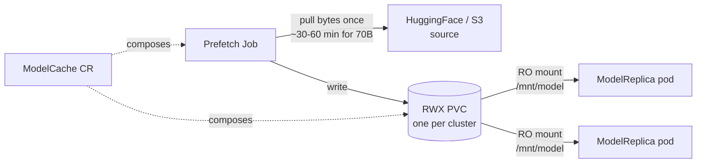
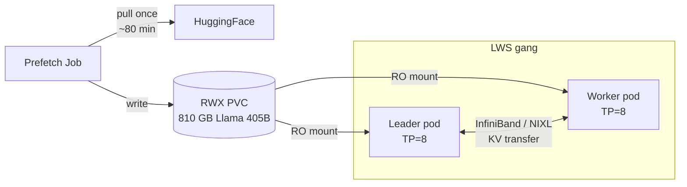
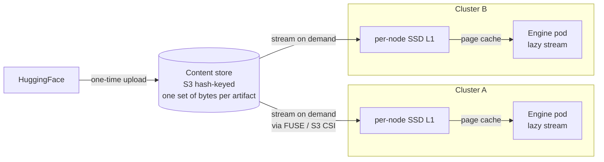
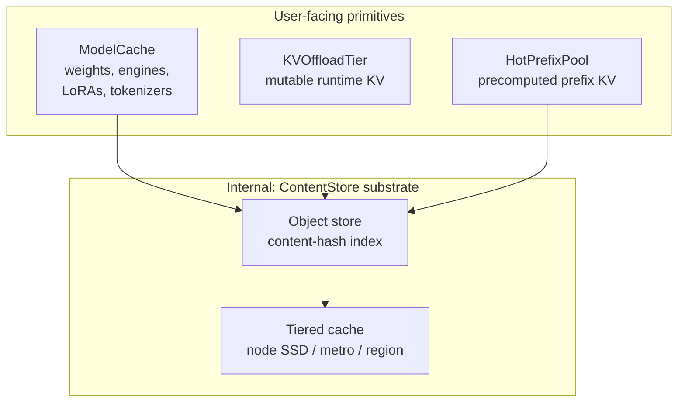

# ModelCache — Fleet-aware artifact staging

**Status**: Draft for review
**Owners**: Dennis
**Related**: [#66](https://github.com/modelplaneai/modelplane/issues/66) (current), [#61](https://github.com/modelplaneai/modelplane/issues/61) (closed), [#72](https://github.com/modelplaneai/modelplane/issues/72) KVOffloadTier, [#73](https://github.com/modelplaneai/modelplane/issues/73) HotPrefixPool, [PR #64](https://github.com/modelplaneai/modelplane/pull/64), [PR #75](https://github.com/modelplaneai/modelplane/pull/75)

## Problem

LLM inference cold starts are dominated by artifact loading. Model weights are 140 GB (Llama 70B) to 800 GB+ (frontier MoE). Compiled engines, tokenizers, and LoRA adapters add more. Today the engine downloads bytes on every replica boot:

- New replicas pay full download every scale-up (typical HuggingFace pull: 30–60 min for a 70B model, hours for 405B)
- Multi-cluster deployments fetch the same bytes N times
- Multi-node serving (TensorPipeline) requires shared weights across LWS pods — per-pod download is wasteful and racy
- Burst-scale deployments thundering-herd HuggingFace
- Air-gapped and regulated environments need controlled fetch paths

This is fleet-level territory. Multiple deployments share base weights, platform teams want to pre-stage commonly-used artifacts proactively, and the bytes themselves don't change once written. The right primitive stages artifacts once per cluster (v0.1) and eventually once per fleet (v0.2+).

## Design principle: pluggable backends across the cache family

ModelCache, [KVOffloadTier (#72)](https://github.com/modelplaneai/modelplane/issues/72), and [HotPrefixPool (#73)](https://github.com/modelplaneai/modelplane/issues/73) share an architectural pattern:

- **Domain-meaningful user-facing CRD** with a stable contract (artifact, mount, replication, selector)
- **Pluggable storage backend** discriminator that swaps the mechanism underneath without changing user intent
- **Composition function renders** the actual infrastructure (PVCs, Jobs, DaemonSets, scrape configs) from declarative intent

The pattern lets us start simple in v0.1 (PVC for ModelCache, single backend for each) and evolve to content-addressed / tiered substrates in v0.2+ without breaking the user-facing API. Same shape will apply when [KVOffloadTier (#72)](https://github.com/modelplaneai/modelplane/issues/72) ships with LMCache/Mooncake/NIXL backends, and when [HotPrefixPool (#73)](https://github.com/modelplaneai/modelplane/issues/73) adds object-store / LMCache / Mooncake / Custom backends. ModelCache is the first instance; the pattern generalizes.

## Shape

```yaml
apiVersion: modelplane.ai/v1alpha1
kind: ModelCache
metadata:
  name: llama-3-3-70b
  namespace: ml-team
spec:
  artifact:
    kind: Weights                       # | Tokenizer | LoraAdapter | Engine | Bytes
    source:
      huggingFace:
        repo: meta-llama/Llama-3.3-70B-Instruct
        revision: main
        secretRef: { name: hf-token, key: token }
    baseRef:                            # only for kind: LoraAdapter
      cacheName: llama-3-3-70b
  mount:
    path: /mnt/model
  storage:
    backend: PVC                        # v0.1 — PVC + Job
    pvc:
      storageClassName: filestore-rwx
  clusterSelector: { matchLabels: { tier: prod } }
  replication: AllMatchingClusters      # one PVC per matching cluster
```

Referenced from `ModelDeployment.spec.caches: [{ name: llama-3-3-70b }]`. The renderer threads the mount path into the engine container; engine args auto-adjust (e.g. `--model=/mnt/model` instead of `--model=hf://repo`).

**Artifact kind discriminator** keeps one primitive instead of fracturing into `ModelWeights`, `EngineCache`, `LoraCache`, etc. The kind affects validation (LoraAdapter requires `baseRef`; Engine requires a `(model, hardware, config)` tuple) and engine wiring (LoRA flags, engine-dir args), not the user-visible top-level fields.

## v0.1 — PVC backend, eager, multi-node ready

Targets the load-bearing case: dense models on TensorPipeline gangs without per-pod download races.

**Mechanism** (absorbing [#61](https://github.com/modelplaneai/modelplane/issues/61)'s design):
- ReadWriteMany PVC per cluster, sized to the source artifact
- One-shot Job pulls from source, writes to PVC
- All pods in the LWS gang (leader + workers) mount the same PVC read-only
- ModelReplica scheduling gated on cache `Ready` condition per target cluster
- Storage class declared on `InferenceCluster.spec.storage.storageClassName` (RWX-capable: Filestore, EFS, FSx, Azure Files, BYO CSI)



**Artifact kinds in v0.1**:
- `Weights` — primary case
- `Tokenizer` — naturally bundles with HF weight download
- `Bytes` — opaque escape hatch (compiled engines, chat templates, eval datasets, custom artifacts) without dedicated typing

**Out of scope for v0.1**:
- `LoraAdapter` kind (dynamic-load semantics differ; v0.2)
- `Engine` kind with `(model, hardware, config)` tuple keying (v0.2)
- Lazy loading / streaming (v0.2)
- Cross-deployment dedup (v0.2)
- Cross-cluster content sharing (v0.2+)

No dedup, no streaming, no tiering. But it solves the v0.1 problem: engine doesn't redownload at every replica restart, multi-node gangs share weights cleanly, platform teams own the source/auth path.

### Multi-node serving — the load-bearing case



The mechanism #61 proposed becomes the v0.1 default. Without it, every pod independently downloads (impractical for 810 GB × N pods) or KServe explicitly fails (per its multi-node docs).

## v0.2 — Content-addressed backend, lazy loading, full artifact taxonomy

**Storage backend**: object store keyed by content hash + per-cluster tiered cache (per-node SSD as L1, object store as L2). Bytes are stored once globally; clusters hydrate on demand. Cross-deployment dedup is automatic — 50 deployments of Llama 3.3 70B = one set of bytes. Cross-tenant dedup for public artifacts (with opt-in for non-public).



**Lazy loading**: engine starts before all bytes have arrived; weights stream via FUSE or S3 CSI mountpoint. Cold-start target: vLLM 95s → ~14s ([Modal benchmark](https://modal.com/blog/truly-serverless-gpus)). Path conventions stable from v0.1 so the backend swap is transparent to the engine container.

**New artifact kinds**:
- `LoraAdapter` — per-adapter mounting, base-model `baseRef`. Natural fit for multi-LoRA serving (thousands of small adapters per base — RFT-class deployments).
- `Engine` — compiled TRT-LLM blobs keyed by `(model, hardware, config)`. Compile cost is minutes per tuple; cache wins big.

**Why now**: market signal is clear (Modal, Tensormesh, others) that content-addressed is the right pattern for AI artifacts. v0.1 PVC ships fast and gives us the user-facing shape; v0.2 wins on dedup, cold-start, and scale.

## v0.3 — Substrate unification (architectural option)

The cache family fits a single mechanism with three user-facing primitives, each retaining its domain identity:



The pattern repeats with progressively more interesting artifacts:
- **ModelCache** stages *immutable static* artifacts (weights, engines, LoRAs, tokenizers)
- **[KVOffloadTier (#72)](https://github.com/modelplaneai/modelplane/issues/72)** stages *mutable runtime state* (live KV cache offload)
- **[HotPrefixPool (#73)](https://github.com/modelplaneai/modelplane/issues/73)** stages *immutable precomputed runtime state* (KV blocks for common prefixes)

One object-store + tiered-cache substrate, three user-facing primitives. Users still write `ModelCache` (domain-meaningful name); internal composition shares infrastructure. Cross-region replication and intra-metro caching tiers land here.

This is an architectural option, not a v0.1 commitment. Decide when v0.2 ships and we have measured numbers from the [HotPrefixPool (#73)](https://github.com/modelplaneai/modelplane/issues/73) prefix-distribution work and Modal-style cold-start benchmarks.

## Key decisions

1. **Name**: `ModelCache`. Matches the `Model*` naming family. Internal substrate (when unified) becomes `ContentStore` — users never write that.
2. **Artifact kind discriminator** instead of separate primitives. One ModelCache, multiple kinds.
3. **Pluggable storage backends** (PVC, ContentAddressed, Custom). Same pattern as [#72](https://github.com/modelplaneai/modelplane/issues/72) and [#73](https://github.com/modelplaneai/modelplane/issues/73) — the family's unifying architectural principle.
4. **Lazy loading is architectural prep in v0.1, ships in v0.2**. v0.1 doesn't bake "all files must exist at boot" into the engine pod contract.
5. **Scheduler gates on per-cluster cache readiness** before placing a ModelReplica. Real dependency wired into the composition function.
6. **Substrate unification deferred to v0.3**. Decide once v0.2 numbers are in hand.

## Alternatives considered

**Per-deployment download init container (today's behavior).** Trivial; breaks at scale and on multi-node. The status quo we're replacing.

**Content-addressed from day one.** Cleaner long-term, much more complex to land. Pluggable backends let us start with PVC and evolve. Lower risk to v0.1 timeline.

**Engine-native solutions only** (KServe storage initializer, vLLM downloader). Cluster-bounded, no fleet primitive, no LoRA story, no shared substrate path.

**Separate primitives per artifact kind** (`ModelWeights`, `EngineCache`, `LoraCache`). More surface area, fractured mental model. Unified `ModelCache` with kind discriminator is cleaner.

**`ContentCache` name.** Better for positioning if Modelplane is "the AI content CAS company"; worse for the Model* naming family. Use `ContentStore` for the internal substrate; keep `ModelCache` user-facing.

## Open questions for review

1. v0.1 artifact kinds — `Weights` + `Tokenizer` + `Bytes` enough, or push for `LoraAdapter` in v0.1?
2. v0.1 sources — `huggingFace` + `s3` only, or also `gcs` / `azure` / `oci` / `http` / `pvc-clone`?
3. Storage class on `InferenceCluster.spec.storage` (per-cluster default) vs on `ModelCache.spec.storage.pvc.storageClassName` (per-cache override)? Probably both — cluster default + cache override.
4. One ModelCache holds one artifact, or multiple artifacts (weights + tokenizer bundled)? My lean: one artifact per cache, deployments reference multiple caches if needed. Cleaner status semantics.
5. Eviction policy for v0.1 PVC backend — LRU, TTL, manual? Probably manual (`spec.retention.policy: Manual`); LRU/TTL is v0.2 when the substrate is smarter.
6. Migration from v0.1 PVC to v0.2 ContentAddressed — backend switch transparent or destructive? Probably backend-switch is transparent: PVC stays, gradually evolves to ContentAddressed when operator flips the field.
7. v0.3 substrate unification — file as roadmap marker now, or wait until v0.2 ships?
8. Replication modes — `AllMatchingClusters` (one PVC per cluster) is the v0.1 default. Worth `AllMatchingNodes` (per-node SSD pre-stage) in v0.2 when content-addressed lands, or skip entirely?

## Roadmap / issue alignment

After review, the issue cleanup looks like:

- **[#66](https://github.com/modelplaneai/modelplane/issues/66) ModelCache** — refactor to this design; scope to v0.1 (PVC + multi-node + Weights/Tokenizer/Bytes)
- **New: "ModelCache v0.2 — content-addressed backend + lazy loading + LoRA/Engine kinds"** — cites Modal + this design doc as references
- **Optional: "v0.3 ContentStore substrate unification"** — placeholder for cross-primitive substrate sharing
- **[#61](https://github.com/modelplaneai/modelplane/issues/61)** — already closed, mechanism absorbed; no further action
- **[#72 KVOffloadTier](https://github.com/modelplaneai/modelplane/issues/72), [#73 HotPrefixPool](https://github.com/modelplaneai/modelplane/issues/73)** — small follow-up comments referencing the shared design principle and v0.3 substrate-unification path
- **[PR #64](https://github.com/modelplaneai/modelplane/pull/64) design doc** — once this lands, link from there to here
- **[PR #75](https://github.com/modelplaneai/modelplane/pull/75)** — Nic's spike adds `engine.env` and `imagePullSecrets`; ModelCache rides on those for credential-bearing sources

## Examples

See `examples/` for complete (ModelCache + ModelDeployment) references for each use case. Cold-start time estimates are rough order-of-magnitude (~50 MB/s typical HF pull, ~1 GB/s typical intra-region S3):

- `01-basic-weights.yaml` — single-cluster Llama 3.3 70B. *Saves ~45 min cold start per replica.*
- `02-multi-node-llama-405b.yaml` — 405B TensorPipeline gang. *Saves ~80 min × N pods (810 GB shared via RWX PVC).*
- `03-multi-cluster-replication.yaml` — Qwen3-32B replicated across regions. *One ~25-min pull per cluster instead of per replica.*
- `04-separate-tokenizer.yaml` — Weights + Tokenizer as distinct ModelCaches.
- `05-private-s3-source.yaml` — air-gapped / GDPR. *Intra-region S3 ~10× faster than HF (~3 min vs ~30+ min for 140 GB).*
- `06-v0.2-content-addressed.yaml` *(preview)* — same as 01 on ContentAddressed backend. *vLLM cold start 95s → ~14s ([Modal](https://modal.com/blog/truly-serverless-gpus)).*
- `07-v0.2-lora-adapter.yaml` *(preview)* — base model + per-tenant LoRA. *Saves ~5–10s of per-adapter mount + dedup across tenants.*
- `08-v0.2-compiled-engine.yaml` *(preview)* — TensorRT-LLM compiled engine. *Saves ~10–30 min TRT-LLM compile per (model, hardware, config) tuple per replica.*
- `09-bytes-opaque.yaml` — `Bytes` kind for chat templates / eval datasets / arbitrary artifacts.

## References

- Modal's truly serverless GPUs (content-addressed tiered cache): https://modal.com/blog/truly-serverless-gpus
- Kiely's *Inference Engineering* §7.2.2 (cold-start phases), §5.3 (caching)
- [#61](https://github.com/modelplaneai/modelplane/issues/61) Shared storage for multi-node inference (closed; mechanism here)
- [#66](https://github.com/modelplaneai/modelplane/issues/66) Current ModelCache sketch
