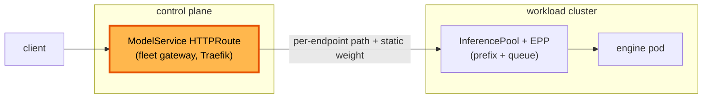
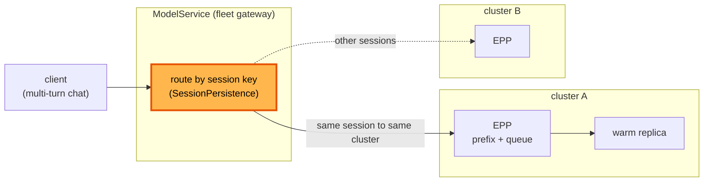

# Inference-aware fleet routing

**Status:** Draft
**Date:** July 2026
**Author:** Dennis Ramdass

This document proposes cache-locality affinity and criticality on the
`ModelService`, the resource a user routes inference through. It composes both
against the Gateway API standard so the design stays portable across gateways. It
builds on [design.md](./design.md) and addresses
[#71](https://github.com/modelplaneai/modelplane/issues/71) (routing affinity for
cache locality) and [#8](https://github.com/modelplaneai/modelplane/issues/8)
(inference-aware routing on the control plane gateway). It relates to
[#89](https://github.com/modelplaneai/modelplane/pull/89) (why the fleet gateway
is Traefik) and [#179](https://github.com/modelplaneai/modelplane/issues/179)
(per-cluster EPP config).

## Summary

A user routes inference through a `ModelService`: one OpenAI-compatible address
that weight-splits traffic across a set of `ModelEndpoint`s. Modelplane composes
that split into an HTTPRoute on the control plane's fleet gateway, and each
endpoint resolves to a replica on some cluster, where the cluster's own gateway
and endpoint picker (EPP) choose a pod.

The per-cluster layer is already inference-aware: the EPP scores pods by
prefix-cache hit and queue depth. The `ModelService` layer is not. It routes by
path and static weight, so it is cache-blind. A multi-turn chat reaches a
different cluster each turn and pays full prefill every time (~800ms TTFT against a
cold cache, ~150ms against a warm one), and the fleet can't express request
priority.

The fix is to make the `ModelService` route the same session to the same cluster
(cache locality, #71) and express criticality and weighting (#8). The design
composes these against the Gateway API standard and its inference extension,
rather than any one gateway's own resources, so a conformant gateway works without
Modelplane carrying a codepath per vendor.

Concretely, this proposes:

1. an `affinity` block on `ModelService` (Session or ClientIP)
2. criticality and weighting expressed through GAIE, replacing the static HTTPRoute
   weights `compose-model-service` emits today
3. moving the fleet gateway from Traefik to the standard profile (Envoy Gateway with
   GAIE and Envoy AI Gateway), with heterogeneous path rewrites handled by an ext_proc

Approving this means agreeing to that direction and that gateway profile. The YAML
below illustrates the shapes. It isn't the committed field spec.

## The user model: ModelService and ModelEndpoint

A user works with two resources.

**`ModelService`** is the fleet ingress. It carries a list of endpoint groups,
each a label selector with a weight, and publishes one address:

```yaml
apiVersion: modelplane.ai/v1alpha1
kind: ModelService
metadata:
  name: chat
  namespace: ml-team
spec:
  endpoints:
  - selector:
      matchLabels:
        modelplane.ai/deployment: kimi-k2
    weight: 90
  - selector:
      matchLabels:
        modelplane.ai/deployment: kimi-k2-canary
    weight: 10
```

Traffic splits across the groups by weight and load-balances across the endpoints
each group matches. `status.address` is the one URL clients call. A single
`ModelService` can front several deployments and external providers behind that
address, so request priority and weighting belong on it.

**`ModelEndpoint`** is a routable backend: a `url` and a `rewritePath`. Modelplane
composes one per replica (see below), or a user authors one by hand to register an
external provider. A `ModelService` never names endpoints directly. It selects
them by label, so the endpoint set changes under it as replicas come and go.

## How Modelplane's components map to it

The user model rests on three composition functions and two gateways.

- **`compose-model-deployment`** fans a `ModelDeployment` out to one
  `ModelReplica` per scheduled cluster and one `ModelEndpoint` per replica. It
  labels each endpoint with its deployment and cluster (`modelplane.ai/deployment`,
  `modelplane.ai/cluster`), which is what a `ModelService` selector matches later.
  The endpoint's `url` points at the replica's path on its cluster gateway, and
  `rewritePath` is that path.
- **`compose-model-service`** turns a `ModelService` into one HTTPRoute on the
  control plane's fleet gateway (Traefik), parented to the `InferenceGateway`. It
  reads the selected endpoints and emits one backendRef per endpoint, weighted,
  each with a per-backendRef `URLRewrite` to that endpoint's `rewritePath`. The
  per-backendRef rewrite is beyond the Gateway API spec, which permits `URLRewrite`
  only at the rule level (#85). Spec-compliant gateways reject it and Envoy
  returned 500s (envoyproxy/gateway#7099), so the control plane runs Traefik (#89),
  which allows it. It is what lets one weighted split rewrite each backend's path
  differently, a self-hosted model at `/v1/` next to a provider at `/openai/v1/`.
- **`compose-model-replica`** deploys a replica's engines on its cluster and fronts
  them with an InferencePool and an EPP on the per-cluster gateway (Envoy Gateway).
  The EPP scores the replica's pods by prefix cache and queue depth, and for
  disaggregated serving decides prefill versus decode by uncached-suffix length.

A request flows through both layers:



The per-cluster hop is cache-aware. The `ModelService` hop, highlighted, is not.
It picks an endpoint by path and static weight with no view of which cluster is
warm for a session.

## What ModelService should add

### Cache-locality affinity (#71)

An `affinity` block on `ModelService`, routing a session to a cluster and
delegating the pod pick to that cluster's EPP:

```yaml
spec:
  endpoints:
  - selector:
      matchLabels:
        modelplane.ai/deployment: kimi-k2
  affinity:
    type: Session             # Session | ClientIP | None
    sessionHeader: X-Session-ID
```

- **Session.** Route by a session header, so a client that carries a conversation
  ID reaches the same cluster each turn. This covers the multi-turn case #71 is
  about.
- **ClientIP.** Route by client source IP. No header needed, but coarse: clients
  behind one egress IP share a cluster, and affinity is lost when an IP changes.

Both key on the client's identity and pin a conversation to a cluster, which is
what multi-turn locality needs. Routing by prompt content instead, to co-locate
different sessions that share a prefix, is a possible later mode (see open
questions).

### Criticality and weighting (#8)

Request priority (production preempts experimentation under load) and weighted
splitting, expressed through the inference extension rather than the static
HTTPRoute weights `compose-model-service` emits today. Path-based multi-tenancy
stays: model-name routing can't tell apart two teams that deploy the same model,
so the `/<ns>/<name>/` prefix remains the tenant boundary.

### Route to a cluster, not a replica

Today each `ModelEndpoint` is a single replica, so the `ModelService` HTTPRoute
fans across replicas, one backendRef per replica. Affinity should instead pin a
session to a cluster and let that cluster choose the warm replica. The endpoints
already carry `modelplane.ai/cluster`, so the fleet can group its backendRefs by
cluster with no new plumbing.



The fleet forwards to a cluster and stops there. It doesn't track KV state across
clusters or move KV over the WAN. The cluster's picker makes the
warm-replica choice with real cache-state visibility. Scoping that picker to a
cluster's replicas rather than a single one is the per-cluster-gateway side of this
(#179). A cold cluster warms up as matching prompts reinforce it.

## Compose to the standard, not to a vendor

One rule keeps this from fragmenting. Modelplane composes standard resources and
requires the gateway to conform, rather than writing a routing codepath per
gateway. Most of what `ModelService` should add is already standard.

- **Session and ClientIP affinity** are Gateway API `SessionPersistence`
  (GEP-1619). The standard covers both header-based and cookie-based persistence,
  so the Session mode above is a standard resource, not a vendor extension.
- **Criticality and inference-aware weighting** are the Gateway API Inference
  Extension (GAIE): `InferencePool` and `InferenceModel`. GAIE is the emerging
  multi-vendor standard for inference routing, implemented by GKE Inference
  Gateway, Istio, kgateway, Envoy Gateway, and Kong.

So the composition target is Gateway API core plus `SessionPersistence` plus GAIE.
Any gateway conformant to that profile works with one codepath, and the
`InferenceGateway` `backend` discriminator selects among conformant gateways
rather than among bespoke codepaths.

The standard is a baseline, not a ceiling. The `backend` discriminator, the
per-cluster EPP's configurable policy (#179), and the gateway's ext_proc chain are
seams where extra routing logic can attach without forking the composition. The
baseline stays standard and portable, and richer behavior layers on top through
those seams rather than living in core.

### Heterogeneous rewrites without the beyond-spec feature

One feature pins us to Traefik: the per-backendRef `URLRewrite`. Each `ModelEndpoint`
carries its own rewrite path, so a multi-endpoint `ModelService` needs a different
rewrite per backend, which the Gateway API spec allows only at the rule level (#85).
A spec-compliant gateway rejects it, so the standard profile has to do heterogeneous
rewrites another way. There are two cases.

**Self-hosted replicas** each sit at `/<ns>/<replica>/`. Two ways to handle them on a
standard gateway:

1. Normalize the path away. Serve a deployment's replicas at one deployment-scoped
   path, so a single rule-level `URLRewrite` covers them, and weight canaries through
   GAIE `InferenceModel` rather than per-backendRef weights. No per-request rewrite is
   left.
2. Rewrite in an ext_proc. Where a per-endpoint path is unavoidable, an external
   processing filter (`EnvoyExtensionPolicy` with `extProc`) rewrites `:path` for the
   chosen backend. GAIE already runs an ext_proc in the request path, the EPP, so the
   rewrite rides a mechanism the profile already introduces.

**External providers** sit at their own path (`/openai/v1/`) and need their own API
key. This isn't a Modelplane-built adapter. Envoy AI Gateway, the GAIE gateway in the
profile, already does it: an `AIServiceBackend` declares the provider's API shape and a
`BackendSecurityPolicy` supplies its credential. The gateway's ext_proc does the path
and schema translation and injects the auth on the way to the provider. So provider
aggregation, the path rewrite and the credential this doc used to defer to a separate
design, is a built-in feature of the gateway we are adopting.

Both cases put the rewrite in an ext_proc rather than a beyond-spec gateway feature,
which is what lets the standard profile replace Traefik without losing heterogeneous
rewrites.

## Which gateway

The profile targets one gateway, Envoy Gateway with GAIE and Envoy AI Gateway.
It is the gateway that covers `SessionPersistence`, GAIE, and provider aggregation
together, once the ext_proc rewrite above is in place. Composing to the standard
rather than to Envoy's own resources isn't about supporting every gateway. It keeps us
off Traefik's beyond-spec behavior and lets us adopt the inference-aware features, and
the `InferenceGateway` `backend` discriminator stays as the seam if a platform team
ever needs a different conformant gateway. Breadth of support is a consequence,
not the goal.

## Validation

Every gateway behavior this design relies on has to be proven on the real gateway
before we commit to it. Where each stands:

- **Per-backendRef `URLRewrite` on Traefik.** Proven. It is in use today (#89).
- **`SessionPersistence` (Session affinity).** Traefik's Gateway-API provider
  doesn't support it (traefik#11243), so Session affinity does not work on the
  backend we run. It needs a gateway that supports GEP-1619 (the Envoy Gateway
  family), where it's still in the experimental channel. Unvalidated.
- **GAIE (criticality, weighting).** Traefik doesn't support it. Needs a GAIE
  gateway, tested against our composed `InferencePool` and `InferenceModel`.
  Unvalidated.
- **Client-IP affinity on Traefik.** Its HRW strategy is set through the
  `TraefikService` CRD, not standard HTTPRoute, so even the interim ClientIP
  option is Traefik-specific. Unvalidated.
- **Deployment-scoped path normalization.** Serving a deployment's replicas at one
  path changes the two-gateway path contract, so it needs an end-to-end test:
  fleet route, per-cluster match, pod mount.
- **ext_proc rewrite and Envoy AI Gateway provider aggregation.** The replacements
  for the per-backendRef rewrite. `EnvoyExtensionPolicy`/`extProc` for a self-hosted
  per-endpoint path, and `AIServiceBackend` plus `BackendSecurityPolicy` for a
  provider, both need proving against our composed shapes. Built-in gateway features,
  unvalidated against Modelplane.

The consequence is blunt: the inference-aware features do not run on the Traefik
backend we run. They require the standard backend (Envoy Gateway with GAIE and Envoy
AI Gateway) with the ext_proc rewrite in place, and that backend has to be stood up
and tested before this design is committed.

## Alternatives considered

### A codepath per gateway backend

The tempting shape is a Traefik backend and an Envoy backend, each composing that
gateway's own resources. It fragments fast: every routing feature has to be built
and tested against each backend, and the backends drift. Composing to the standard
keeps one codepath and pushes the variation into a conformance question.

### Require only base Gateway-API conformance

Too weak to promise. Base conformance guarantees neither `SessionPersistence`
(experimental channel) nor GAIE, so a conformant gateway may still be unable to run
this routing. The profile has to name `SessionPersistence` and GAIE.

### Lean on Traefik's own features

Traefik's HRW strategy (client IP) and cookie stickiness (`TraefikService` CRD) give
coarse affinity, and its per-backendRef rewrite handles provider aggregation today.
But those are coarse and partly outside Gateway API, and leaning on them forecloses
the inference-aware routing this document is about. The one feature that pinned us to
Traefik, the per-backendRef rewrite, has an ext_proc replacement on the standard
profile, so nothing requires staying. Client-IP affinity is worth keeping as an
interim on the Traefik backend until the standard one is stood up.

### Replica-level routing from the fleet

The fleet would guess without per-replica cache-state visibility and duplicate what
the EPP and Dynamo already do inside a cluster. This is #71's own boundary.

## Open questions

- **Content-based affinity.** Routing by prompt hash (#71's PrefixHash) would
  co-locate different sessions that share a prefix. It attaches at the ext_proc seam
  rather than core, and overlaps the per-cluster EPP, which already routes by prefix
  inside a cluster. Worth adding only if a shared-prefix workload shows the
  cross-cluster consistency beats letting each cluster warm its own copy.
- **Backend selection.** Chosen per `InferenceGateway` only, or can a deployment
  request inference-aware routing and let the platform resolve the backend?
- **Hot key.** A heavily shared session pins to one cluster while peers idle. Some
  gateways offer a hybrid consistent-hash-then-least-loaded policy. Expose it or
  default it.

## Interaction with related issues

- **#89 (Traefik rationale):** the per-backendRef rewrite that pins the current
  backend, and the feature this design proposes relocating.
- **#179 (EPP config):** the per-cluster picker whose replica decision the fleet
  delegates to. Making its config user-overridable turns it into an extension seam
  for custom routing policy, complementary to this design.
- **#68 (scheduler) and #70 (capacity signal):** companions from #71, same
  delegation pattern.
- **#225 (canary docs):** weighted splitting documented there moves to GAIE.
