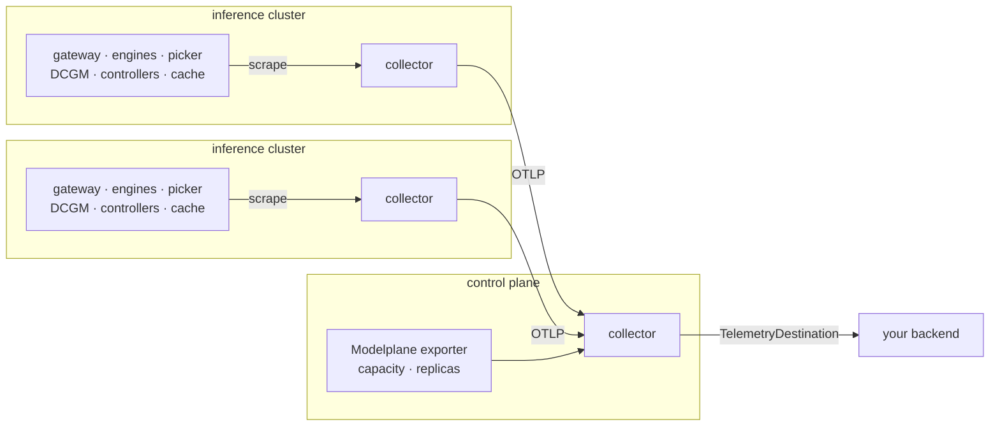

# Telemetry collection

**Status:** Draft
**Date:** September 2026
**Author:** Dennis Ramdass

## Summary

What Modelplane offers today is rudimentary. It installs a Prometheus on every workload
cluster and stops: an operator writes their own `PodMonitor`, keeps it in sync as the
serving shape changes, and reaches the store by `port-forward`. Every component names its
metrics differently, and every cluster answers only for itself.

The mechanism is an OpenTelemetry collector on every inference cluster, exporting to one
collector on the control plane. That collector is the fleet's single egress point and holds
no store, so the control plane stays a reconciler and the operator keeps whatever backend
they already run. Nothing in the pipeline is specific to metrics except the receivers at one
end, so logs and traces reuse it instead of each arriving with a path of its own.



The telemetry is a normalized `modelplane_*` surface, collected with no configuration for
the engines people actually run and for everything Modelplane installs around them. An
operator writes one object saying where it all goes, and what lands there means one thing
everywhere, whatever produced it:

```
modelplane_frontend_ttft_seconds_bucket{cluster="prod-us-east", model="Qwen/Qwen3-8B",
  deployment="qwen3-8b", namespace="ml-team", le="0.25"} 1841
```

Metrics land first, and this document designs them. Logs and traces get their own design
when they land.

## Background

`compose-serving-stack` installs a kube-prometheus-stack on every workload cluster with
`PodMonitor` discovery open, and stops there. Everything after that belongs to the operator.
They write the `PodMonitor`, keep it matching the serving shape as deployments change, and
reach the store by `port-forward`. Until they do, a deployment emits nothing at all,
including the signal that would have explained why it failed. Nothing reconciles one
engine's metric names against another's, so a dashboard covering two engines gets written
twice. And nothing leaves the cluster, so answering "how is this model doing everywhere"
means visiting each one and merging by hand. The published
[collecting-engine-metrics](../docs/content/guides/collecting-engine-metrics.md) guide is
that workflow written down.

The gap would matter less if these were ordinary numbers. Time to first token is how long a
user waits before anything appears, and time per output token is the speed of what follows.
Both come from a queue in front of a GPU and a KV cache on it. When the cache fills, the
engine evicts work and recomputes it, so latency does not degrade gradually. It steps.

Reconciling those numbers is also harder than renaming them.
`vllm:time_to_first_token_seconds` and `sglang:time_to_first_token_seconds` measure the same
thing, and a rename settles them. SGLang's `inter_token_latency` and vLLM's time per output
token are not that: the names are close, the measurements differ, and renaming one onto the
other produces a number that is confidently wrong. Even where two engines agree on the
measurement they can disagree on the histogram. vLLM resolves down to a millisecond and
SGLang to a hundred of them, so a quantile taken across both is wrong rather than
approximate.

One component sidesteps most of this. Envoy AI Gateway proxies every request and measures it
itself, reporting under the OpenTelemetry GenAI conventions: time to first token, time per
output token, request duration and token usage, each labelled with the model. It measures
the same way whatever engine is behind it, and it measures for engines that report none of
this themselves. Its histograms share one bucket layout, because there is only one of it.

## Guiding principles

- **One namespace.** Every metric in the fleet's contract is a `modelplane_*` name with the
  same labels, whatever component produced it.
- **Zero configuration for anything Modelplane installs.** The engines, the gateway, the
  picker, DCGM and the controllers all report without being asked.
- **Any engine, without a release.** Modelplane runs any OpenAI-compatible server. One it
  has never seen still reports the fleet's top-line metrics.
- **Upstream conventions, upstream tools.** The wire format, the collector and its
  configuration language are OpenTelemetry's, not Modelplane's. The names are ours, because
  the conventions cover what the gateway measures and nothing else in the set.
- **No store in the control plane.** The control plane reconciles a fleet. The operator
  keeps whatever backend they already run.
- **Egress only.** A workload cluster reaches out. Nothing reaches in.
- **One pipeline.** Logs and traces reuse these collectors, this egress point and this
  credential.

## Proposal

### Where they come from

What each component emits is verified against a live deployment running vLLM, Envoy AI
Gateway, the llm-d picker and DCGM, rather than read off documentation.

**The gateway** measures what the caller experienced, in GenAI vocabulary, for whatever
engine sits behind it. It is one component, so its histograms share a bucket layout and a
fleet quantile over them is sound. The SLO metrics come from here for that reason.

Two things about scraping it. The GenAI metrics sit on the ext-proc sidecar's admin port, so
the gateway needs a target of its own rather than riding the proxy's. And time to first
token exists only for a streaming request, since a non-streaming one has no first token to
time. That histogram therefore counts fewer requests than the duration histogram beside it.
Envoy's own proxy statistics come across too, which is where a refusal at a rate limit shows
up.

**The engine** explains what the gateway measured. vLLM and SGLang both publish queue depth,
running and waiting counts, KV utilization and preemptions as gauges and counters, which
aggregate cleanly. Their latency histograms come across too, under `modelplane_request_*`,
though those stay per-engine diagnostics, since their buckets do not merge.

**The endpoint picker** publishes `llm_d_epp_*`, the source of
`modelplane_route_decision_seconds`. That is the time the picker spent choosing a backend,
which inflates the gateway's time to first token without appearing anywhere in the engine's
own numbers.

**The GPUs** are read through DCGM, which reports memory, compute activity, bandwidth,
power and energy per device, and the fault taxonomy behind a drain: temperature, throttling,
ECC and interconnect errors. The last two need collectors that DCGM leaves off by default,
and Modelplane enables them, because on a multi-node gang one bad NVLink degrades an engine
that otherwise looks healthy.

**The substrate** reports whether the machinery works. The gang controller, LeaderWorkerSet
or Grove, carries completeness in its status. That is the only place a half-placed gang
shows up: the leader is running, so every per-pod view looks fine while the workers never
scheduled. The DRA driver counts allocation failures, which is why a replica stays Pending.
`kube-state-metrics` reads both controller statuses through its custom-resource-state
collector, and supplies container restart counts.

**ModelExpress** times staging a model onto a cluster and the engine's warmup to first
inference. Those two are most of a cold start, and a `ModelCache` exists to shorten them, so
a fleet deciding whether to scale onto a cold cluster is reading these numbers.

**Modelplane's own resources** answer what none of them can. Under DRA a driver advertises
its devices as `ResourceSlices`, and no exporter turns those into an allocatable count, so
capacity has no series at all. DCGM labels a GPU with its UUID and its host and nothing
about the workload, so nothing joins a GPU to a replica. Nothing times a replica from
created to serving. And only the control plane knows whether it can still reach a cluster.

Every one of those answers is already a field on an object Modelplane reconciles, so
nothing has to be written to observe them. `resource-state-metrics` turns custom resource
fields into series from a `ResourceMetricsMonitor`, and the control-plane collector
scrapes it. A `ModelReplica` carries the GPUs it holds, the devices its claim resolved to,
and when it was allocated and when it became ready; an `InferenceCluster` carries
reachability and the allocatable count read off the slices.

What `resource-state-metrics` will not do is accumulate. It reports what an object says now,
so there is no GPU-seconds counter. Modelplane records the allocation timestamp instead,
and the backend multiplies elapsed time by GPUs, which is where every other rate and ratio
in this design is computed anyway. So the design adds no component at
all: two collectors and one exporter, all upstream, all configured rather than written.

### Normalizing

Normalizing happens in the collector's own configuration. A `transform` processor renames
what the stack emits, and Modelplane provides the statements for every component it
installs:

```yaml
processors:
  transform/modelplane:
    metric_statements:
    - context: metric
      statements:
      - set(name, "modelplane_frontend_ttft_seconds")
          where name == "gen_ai_server_time_to_first_token"
      - set(name, "modelplane_request_queue_seconds")
          where name == "vllm:request_queue_time_seconds"
      - set(name, "modelplane_request_queue_seconds")
          where name == "sglang:queue_time_seconds"
```

OTTL is the stable, well-documented part of the collector, and renaming, scaling a unit and
setting a label are what it is for. Each engine prefixes its metrics with its own name, so
nothing declares which engine a deployment runs. A fork that kept vLLM's names is handled by
vLLM's statements without knowing it is a fork.

Only `modelplane_*` leaves a cluster. A series the statements did not rename is a series
whose meaning Modelplane cannot vouch for across engines, and the cardinality argument below
applies to it in full, so the cluster collector drops it after the `transform` stage. An
operator who wants an engine's raw names too sets `passthrough: true` on the
`MetricMapping`, which is the toggle for someone debugging one engine rather than watching a
fleet.

Renaming is only safe where the measurements agree. SGLang's `inter_token_latency` is not
vLLM's time per output token, so neither is renamed onto a shared name; the gateway supplies
that measurement for both. A metric absent on an engine stays absent, never
approximated by a neighbour.

### Rolling up

Collection is two hops: a collector on each inference cluster, and one on the control plane
that every cluster reports to.

**On each inference cluster**, a collector scrapes everything above that runs there: the
gateway and its sidecar, the engines, the picker, DCGM, the controllers through
`kube-state-metrics`, and ModelExpress. It renames what it scraped, merges each deployment's
replicas into one series, stamps `cluster`, and exports OTLP to the control plane. It needs
egress and nothing inbound.

Targets come from the receiver's own Kubernetes service discovery, matching the
`modelplane.ai/serving` label Modelplane stamps and selecting the port by name. No
`PodMonitor` and no Prometheus operator: the CRD was a consequence of having chosen
Prometheus, and choosing a collector instead removes it from the path. Discovery is a scrape
config in the collector's configuration, which Modelplane composes with everything else in
it.

The Prometheus receiver puts each pod's identity in resource attributes, which a metric
processor cannot see. So `groupbyattrs` removes those attributes and merges the resources,
and `aggregate_on_attributes` then combines the data points. Order matters, and so does the
function: counters and counts are summed, while a ratio is averaged, since four replicas
each at 0.5 are not a cache two hundred percent full.

**On the control plane**, a collector receives from every cluster, scrapes
`resource-state-metrics` and Crossplane's runtime metrics, and exports onward. It sees one
merged stream, so it adds nothing that varies by cluster; `cluster` is already on every
series. It is the fleet's single egress point.

Where it exports to is the one thing an operator has to write, and a
`TelemetryDestination` is where they write it:

```yaml
apiVersion: modelplane.ai/v1alpha1
kind: TelemetryDestination
metadata:
  name: default
spec:
  secretRef:
    name: telemetry-credentials     # keys become env vars in the collector
  extensions:
    bearertokenauth:
      token: ${env:OTLP_TOKEN}
  exporters:
    otlphttp:
      endpoint: https://otel.acme.example
      auth:
        authenticator: bearertokenauth
    prometheusremotewrite:
      endpoint: https://prom.acme.example/api/v1/write
```

`spec.exporters` and `spec.extensions` are the collector's own blocks, passed through
unread. Modelplane validates that they parse and reports whether the destination accepts
writes; it does not model what an exporter is. So any exporter the collector provides works,
with its TLS, retry and queue settings intact, and so does any authenticator:
bearer token, basic auth, OIDC, AWS SigV4. A field-by-field schema would have had to restate
all of that or cap it. This one keeps working when the collector gains an exporter
Modelplane has never heard of.

Credentials stay out of the object. `secretRef` names a Secret in Modelplane's namespace.
Modelplane mounts its keys into the collector as environment variables, so the configuration
references `${env:OTLP_TOKEN}` and the token itself never appears in an XR or in
`kubectl get -o yaml` output.

No destination, no collectors. Neither tier stores anything, so collecting with nowhere to
export is GPU-cluster memory and CPU spent on samples nobody will ever read. A fleet with no
`TelemetryDestination` composes no collectors at all, and writing one turns collection on
everywhere at once. That is the only switch: there is no per-deployment opt-out, because a
`ModelDeployment`'s author owns neither the destination nor its bill.

That is the same bargain as `MetricMapping`. Both kinds are typed, named homes for a piece
of collector configuration, and neither interprets what it holds.

A cluster authenticates to it with a client certificate Modelplane issues and propagates the
way `ModelCache` already propagates a HuggingFace token.

This replaces the kube-prometheus-stack `compose-serving-stack` installs today, which is
the one breaking change. It lands on its own with a release note. A hand-written
`PodMonitor` stops being read by anything, quietly, so the note has to say that the store
and the CRD are both going and where the series go instead.

### What the backend computes

A collector transforms each measurement as it passes. It holds no history, so it produces no
rate, no quantile and no ratio between series that arrived from different clusters. Those
are real answers an operator wants, and under this design the backend produces them:

| Question | Computed as |
|---|---|
| Are we meeting the latency target? | `histogram_quantile` over the gateway's TTFT buckets |
| What is it costing? | GPUs times elapsed since `..._allocated_time_seconds`, and joules |
| Is it efficient? | tokens over those GPU-seconds, tokens over joules |
| Is capacity used? | `modelplane_replica_gpus` summed, over `modelplane_cluster_gpus_allocatable` |
| Is a GPU idle but allocated? | allocation joined against compute-active below a threshold |

Modelplane ships these as queries and dashboards rather than recorded series. An operator
with no backend still gets a normalized fleet-wide stream, but no fleet SLO series. Two
collector processors would narrow that gap, `interval` for windowed aggregation and
`metricsgeneration` for arithmetic between two metrics. This design uses neither. Both are
alpha, `interval` is lossy for gauges, and `metricsgeneration` matches data points by
position instead of by label unless a feature gate is enabled.

## Advanced

None of what follows is on the path for a fleet running engines Modelplane knows.

### An engine Modelplane doesn't know

Its top-line latency and token counts already arrive, because the gateway measures them and
does not care what served the request. What is missing is the engine's own saturation
picture: queue depth, KV utilization, preemptions.

Those are OTTL statements, and a `MetricMapping` carries them to every cluster:

```yaml
apiVersion: modelplane.ai/v1alpha1
kind: MetricMapping
metadata:
  name: my-engine
spec:
  statements:
  - set(name, "modelplane_requests_waiting")
      where name == "my_engine_queued_requests"
  - set(name, "modelplane_requests_running")
      where name == "my_engine_active_requests"
  - set(name, "modelplane_kv_cache_utilization_ratio")
      where name == "my_engine_kv_used_ratio"
status:
  clusters: 3
```

Modelplane does not interpret `statements`. It renders them into each collector's
`transform` processor beside its own, and reports how many clusters took them. The kind is
an envelope and a way to reach every cluster, not a language. What an operator writes is the
collector's own configuration, documented upstream, and identical in form to what Modelplane
writes for vLLM.

A fork that kept its parent's metric names needs none of this, since the parent's statements
already match. The statements do the selecting through their own `where` clauses, so nothing
declares which engine a deployment runs.

### Precomputing the derived series

The queries in the table above are evaluated when someone runs them. A fleet that wants them
standing, alerting on them, or reading them without a dashboard points the
`prometheusremotewrite` exporter at a Prometheus and writes recording rules there. That is
ordinary Prometheus and needs nothing from Modelplane.

### Reaching a backend a cluster cannot

Every cluster exports to the control plane, and only the control plane exports onward, so a
cluster with no route to the operator's backend still reports. Where a whole region cannot
reach the control plane either, a second control-plane collector in that region exports to
the same backend, and the fleet is the union of what the backend holds.

## Future improvements

Logs and traces reuse all of this. vLLM already exports OTLP traces; #77 proposes following
one request through the gateway and picker into the engine that served it, which is the same
spans joined up. A gateway's usage records are a structured access log the `filelog`
receiver reads. Each needs a receiver and a decision about
sampling or retention. None needs another collector, another egress point, or another
credential. That is the argument for building the pipeline on OpenTelemetry and not on a
metrics protocol.

vLLM has an open proposal to adopt the GenAI conventions and another to export OTLP
directly. If either lands, the statements for vLLM shrink or disappear.

## Alternatives considered

**Prometheus on every cluster, remote-writing to a Prometheus on the control plane.** The
derivations above stop being the backend's problem and become recording rules Modelplane
ships and an operator can read. Fleet quantiles, GPU-hours and efficiency ratios arrive as
series to read rather than queries to assemble, and every one works the day the fleet is
installed, with no backend at all. Prometheus is also what the components already speak, so
nothing converts.

The cost lands on the control plane. A Prometheus there is a
stateful store to run, size and back up, on a cluster whose job is reconciliation. It
commits the project to one query language and one wire format in the layer an operator is
most likely to already have opinions about. And it answers only metrics: the per-request
traces in #77 and the gateway's usage logs would each need a second path, built
separately, with their own egress and their own credential. Recording rules are a real
loss, taken deliberately, and the `prometheusremotewrite` exporter leaves that door open
for anyone who wants them.

**No control-plane collector.** Every cluster exports straight to the operator's backend.
One fewer thing to run and one fewer hop, and since the tier computes nothing, the metric
surface and every fleet query survive intact. It is a real option and it is what a control
plane that cannot host a collector should do.

It gives up four things. A cluster with no route to the backend loses its telemetry rather
than reaching the control plane instead. The backend's credential goes onto every GPU
cluster. Repointing the fleet becomes a per-cluster edit. And the control plane's own
series, the ones `resource-state-metrics` reads off Modelplane's resources, would need a
path of their own.

**ConfigMaps instead of kinds.** Both `MetricMapping` and `TelemetryDestination` hold
collector configuration and neither reads it, so a ConfigMap would carry the same bytes and
cost no API surface at all. A kind is permanent, and two of them is a real price for
something that is, underneath, a string.

They earn it on what a ConfigMap cannot do. A ConfigMap is namespaced, so a cluster-scoped
fact about an engine would live in somebody's namespace. It is matched by label convention
instead of by schema, so a typo yields silence. It validates nothing, so a malformed
exporter block is discovered when telemetry stops rather than when it is applied. And it has
no status, so nothing reports that a mapping matched no series on any cluster, or that a
destination is refusing writes. Those are the failures this design is otherwise built to
avoid, and a kind is where the condition that reports them lives.

## Appendix: the metric surface

Four things read these metrics, and the set is what they need between them.

- **Alerting**, on latency targets, availability and saturation.
- **Autoscaling**, which places and sizes whole replicas from cost and capacity signals.
- **Cost**, which needs GPU-time and energy attributed to a tenant.
- **Performance tuning**, which needs the queue, cache and routing numbers behind a
  latency figure.

Latency appears twice on purpose: once as the caller experienced it and once as the engine
did. The gap between them is routing, queueing and network, and one number alone cannot
separate those from a slow model.

**What the caller got.**

| Metric | Type | Source |
|---|---|---|
| `modelplane_frontend_request_duration_seconds` | histogram | gateway |
| `modelplane_frontend_ttft_seconds` | histogram | gateway, streaming only |
| `modelplane_frontend_tpot_seconds` | histogram | gateway |
| `modelplane_requests_total{status}` | counter | gateway |
| `modelplane_tokens_total{direction}` | counter | gateway |
| `modelplane_requests_throttled_total` | counter | Envoy rate limits |

**Why it served that way.**

| Metric | Type | Source |
|---|---|---|
| `modelplane_request_ttft_seconds` | histogram | engine |
| `modelplane_request_duration_seconds` | histogram | engine |
| `modelplane_request_queue_seconds` | histogram | engine |
| `modelplane_request_prefill_seconds` | histogram | engine, where reported |
| `modelplane_request_decode_seconds` | histogram | engine, where reported |
| `modelplane_request_kv_transfer_seconds` | histogram | engine, disaggregated only |
| `modelplane_request_input_tokens` | histogram | engine |
| `modelplane_request_output_tokens` | histogram | engine |
| `modelplane_requests_running` | gauge | engine |
| `modelplane_requests_waiting` | gauge | engine |
| `modelplane_kv_cache_utilization_ratio` | gauge (0 to 1) | engine |
| `modelplane_requests_preempted_total` | counter | engine |
| `modelplane_tokens_recomputed_total` | counter | engine, where reported |
| `modelplane_route_decision_seconds` | histogram | picker |
| `modelplane_route_requests_total{decision}` | counter | picker |
| `modelplane_route_pd_pairings_total{status}` | counter | picker, disaggregated only |

**What it costs.**

| Metric | Type | Source |
|---|---|---|
| `modelplane_gpu_memory_used_bytes` | gauge | DCGM |
| `modelplane_gpu_compute_active_ratio` | gauge (0 to 1) | DCGM |
| `modelplane_gpu_memory_bandwidth_ratio` | gauge (0 to 1) | DCGM |
| `modelplane_energy_joules_total` | counter | DCGM, scaled from millijoules |
| `modelplane_replica_gpus` | gauge | `ModelReplica` via RSM |
| `modelplane_replica_gpu{gpu_uuid}` | gauge (0 or 1) | `ModelReplica` via RSM |
| `modelplane_replica_allocated_time_seconds` | gauge | `ModelReplica` via RSM |
| `modelplane_cluster_gpus_allocatable` | gauge | `InferenceCluster` via RSM |

**Whether the machinery works.**

| Metric | Type | Source |
|---|---|---|
| `modelplane_replicas_desired` | gauge | `ModelDeployment` via RSM |
| `modelplane_replicas_ready` | gauge | `ModelDeployment` via RSM |
| `modelplane_replica_ready_duration_seconds` | gauge | `ModelReplica` via RSM |
| `modelplane_replica_cache_hit` | gauge (0 or 1) | `ModelReplica` via RSM |
| `modelplane_replica_staging_seconds` | histogram | ModelExpress |
| `modelplane_replica_warmup_seconds` | histogram | ModelExpress |
| `modelplane_gang_incomplete` | gauge | LWS or Grove status |
| `modelplane_dra_allocation_errors_total` | counter | DRA driver |
| `modelplane_engine_restarts_total` | counter | kube-state-metrics |
| `modelplane_cluster_connected` | gauge (0 or 1) | `InferenceCluster` via RSM |

**When the hardware is the problem.** A bad link or a throttling card explains a latency
regression that load alone does not, and on a multi-node gang one bad link degrades the
whole engine. Some of these need the exporter's optional collectors enabled.

| Metric | Type | Source |
|---|---|---|
| `modelplane_gpu_temperature_celsius` | gauge | DCGM |
| `modelplane_gpu_thermal_throttle_seconds_total` | counter | DCGM |
| `modelplane_gpu_ecc_errors_total{type}` | counter | DCGM, off by default |
| `modelplane_gpu_interconnect_errors_total{link}` | counter | DCGM, off by default |

Every series carries `cluster`, stamped by the collector that scraped it. A series about a
deployment also carries `deployment`, `namespace` and `model`. `engine` goes only on
series an engine produced, because it is read from the engine's own metric prefix and the
gateway does not know what served a request. Under disaggregated serving an engine series
carries a `role` of `prefill` or `decode`, because the two do different work and an average
of them describes neither. GPU series carry `gpu_uuid` and the node, which is all DCGM
knows.

Two labels have closed value sets: `status` on `modelplane_requests_total` is `ok`,
`client_error` or `server_error`, and `direction` on `modelplane_tokens_total` is `input` or
`output`.

Cardinality is bounded by construction, and deliberately. Every label above is something
Modelplane created, so the series count is the number of deployments times the clusters they
run on, times two where a deployment is disaggregated. It does not grow with traffic, with
callers, or with time. Three labels that would have broken that are absent: `pod`, which a
rolling update mints afresh on every deploy and which a billing backend counts as active for
fifteen to thirty minutes after it dies; `caller`, which is unbounded by definition; and the
raw HTTP status code, which is why `status` carries three values instead of forty.

Dropping them is the per-cluster collector's job rather than the backend's, because a series
that never leaves the cluster costs nothing to store and nothing to ingest. A histogram is
the one thing here that multiplies, by its bucket count, which is why the set carries as few
of them as the questions allow.

`modelplane_replica_gpu` is how a GPU reaches a workload. DCGM knows a GPU's UUID and its
host and nothing else, so it cannot answer a question about a deployment on its own.
Modelplane placed the replica and holds its DRA claim, so it publishes one series per
GPU-to-replica binding, and a backend joins DCGM's figures through it. Every cost and
efficiency question in this design is that join.

The gateway and the engines both count requests and tokens, and only the gateway's counts
are renamed onto `modelplane_requests_total` and `modelplane_tokens_total`. It counts the
same way for every engine, and it sees requests an engine rejected or never received. An
engine's own counters stay under the engine's names, where they are still readable and
cannot double the fleet's total.

Tokens per second is absent on purpose. It means one user's rate to some readers and the
service's total throughput to others, so this publishes the counter and lets a query say
which it wants. GPU utilization as the accelerator reports it is absent for a better
reason. It says the card was not idle, which for inference is almost always true, since the
work is memory-bandwidth bound. `modelplane_gpu_compute_active_ratio` and the memory figures
separate a busy GPU from an efficient one.

