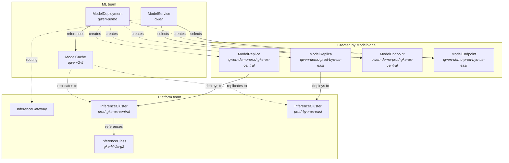

# Concepts

Modelplane manages AI model inference across a fleet of GPU clusters. It draws a
boundary between two teams: platform teams who provision infrastructure and
define hardware classes, and ML teams who deploy models and get unified
endpoints.

This page explains the key resources and how they relate.

## Resource model



## InferenceGateway

The InferenceGateway creates a unified, OpenAI-compatible endpoint on the
control plane cluster. It installs [Envoy
Gateway](https://gateway.envoyproxy.io) and creates a Gateway that routes
requests to model endpoints on remote inference clusters.

Create one InferenceGateway per control plane. It must be named `default`. When
running the control plane in kind, set `loadBalancer: MetalLB` to get a
LoadBalancer IP inside the Docker network.

Once ready, read the gateway's external address from the resource's status:

```bash
kubectl get ig default
```

## InferenceClass

An InferenceClass is a tested recipe for a GPU node pool. It bundles:

- **Resources**: what hardware the class exposes (GPU count, memory). Used by
  the scheduler to match deployments to clusters.
- **Provisioning** (optional): how to create a node pool of this class on a
  specific cloud. Classes without provisioning are for existing clusters where
  the pool already exists.

Different clouds and GPU types imply different classes. A GKE L4 pool is
`gke-l4-1x-g2`. A bare-metal H100 pool is `h100-8x-ib` (no provisioning).

## InferenceCluster

An InferenceCluster represents a Kubernetes cluster configured for model
serving. Platform teams create these to provide GPU capacity.

Each cluster has:

- A **cluster source**: `GKE` (Modelplane provisions the full cluster) or
  `Existing` (bring a cluster you manage yourself).
- One or more **node pools**, each referencing an `InferenceClass` for its
  hardware capabilities and provisioning recipe.
- **Labels** for organizational metadata: tier, region, provider. These are the
  matching surface for `ModelDeployment.clusterSelector`.

Modelplane installs an inference stack (e.g. LeaderWorkerSet, llm-d, Dynamo,
Envoy Gateway, etc) on every cluster it manages. This includes existing
clusters, which Modelplane assumes are solely for its use.

## ModelDeployment

A ModelDeployment is the ML team's interface. It carries everything needed to
deploy a model to the fleet: the worker template, hardware topology, and replica
count.

When you create a ModelDeployment, the scheduler:

1. Discovers all ready InferenceClusters (filtered by `clusterSelector` labels
   if set).
2. Derives the physical shape from `workers.topology`: GPUs per node (tensor)
   and nodes per worker (pipeline, default 1).
3. Checks GPU capacity: does the cluster have a pool with enough GPUs per node
   and enough available nodes?
4. Creates a `ModelReplica` for each selected cluster.
5. Creates a `ModelEndpoint` for each replica, carrying the URL and rewrite path
   for routing.

The worker template is a curated subset of `PodTemplateSpec`. The container
named `engine` is the inference engine (e.g. vLLM); additional containers pass
through as sidecars.

An optional `spec.modelCacheRef` mounts a [ModelCache](#modelcache)'s PVC into
every worker pod, so the engine reads weights from the staged cache instead of
fetching from the source at boot.

### Scaling

Replicas are the only scaling axis. Each `ModelReplica` is a complete,
fixed-topology serving instance. Scaling `spec.replicas` adds or removes whole
instances. There's no in-cluster pod autoscaling.

## ModelCache

A ModelCache stages a model artifact on workload-cluster storage as a
first-class resource, independently of any deployment. It enables
cross-deployment sharing (one cache referenced by many ModelDeployments),
independent lifecycle (the cache persists when deployments come and go),
and proactive pre-staging.

For multi-node deployments without a ModelCache reference, Modelplane
auto-provisions per-replica storage using the target
[InferenceCluster](#inferencecluster)'s `spec.storage.rwxCache` config —
same RWX behavior, no shared lifecycle. ModelCache is the explicit opt-in
for ML teams who want sharing, lifecycle control, or a size override.

Each cache has:

- An **artifact source**: today, a HuggingFace repo, with an optional
  `revision` and `tokenSecretRef` for gated models.
- A **mount path**: where the artifact appears inside consuming pods.
- An optional **size override**. The storage class is inherited from
  the target cluster's `rwxCache`; ML teams don't pick it.
- Optional `clusterSelector` labels to scope replication. If omitted, the
  cache replicates to every InferenceCluster.

ModelDeployments reference a cache via `spec.modelCacheRef.name`;
Modelplane mounts the cache's PVC into every worker pod automatically.

These benefits scale with model size. A 1 TB+ frontier-scale model is hours
of download and significant storage cost; ModelCache pays that cost once
across every deployment that references it, and the per-cache size override
avoids forcing the platform team to raise the cluster default for outliers.

<!-- TODO(dennis): auto-mount behavior requires compose-model-replica to
read modelCacheRef and mount the cache's PVC into every worker pod. Ships
in the ModelCache impl MR. -->


## ModelReplica

The ModelDeployment's composition function creates ModelReplicas. Don't create
them directly.

Each replica represents a model deployed to a specific cluster. It reads the
worker template and topology, finds the engine container, and composes a KServe
`LLMInferenceService` on the remote cluster. For multi-node serving (pipeline >
1), it uses LeaderWorkerSet via KServe.

## ModelEndpoint

A ModelEndpoint is a reachable inference endpoint. Modelplane composes one per
ModelReplica, but ML teams can also create them manually for external SaaS
providers (Together, BaseTen).

Each endpoint composes an Envoy Gateway `Backend` on the control plane.
ModelEndpoint surfaces the Backend's name in `status.routing.backendName` so
ModelService can reference it in its HTTPRoute.

## ModelService

A ModelService exposes one or more ModelEndpoints via a unified, OpenAI-
compatible endpoint. It selects endpoints by label and composes a Gateway API
`HTTPRoute` that load-balances across them.

Each backendRef in the HTTPRoute carries its own `URLRewrite` filter derived
from the endpoint's `spec.rewritePath`, so endpoints from different deployments
or external providers with different path layouts coexist correctly.

Read the service's public address from `status.address`:

```bash
kubectl get ms qwen -n ml-team -o jsonpath='{.status.address}'
```
