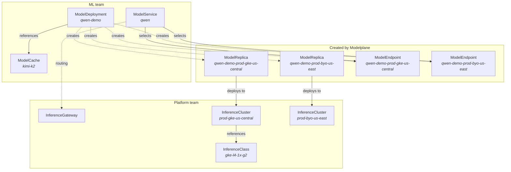

<!-- vale write-good.Passive = NO -->
Modelplane runs as a control plane on its own cluster, the **control cluster**,
above the **inference clusters** that actually serve models. It's built on
[Crossplane](https://crossplane.io): platform teams and developers describe what
they want as Kubernetes resources, and Modelplane continuously reconciles the
fleet to match, composing the clusters, scheduling replicas, and exposing
endpoints. This page is the high-altitude tour. The
[Concepts]() page defines each resource in full.

## The two-team boundary

Modelplane's API is two sets of resources, one per team, with everything in
between filled in for you.

- **Platform teams** create an `InferenceGateway` (one unified,
  OpenAI-compatible entry point on the control cluster), `InferenceClasses`
  (tested hardware recipes: the devices a node pool offers, and how to provision
  it), and `InferenceClusters` (the clusters in the fleet, labeled with tier,
  region, and provider).
- **ML teams** create a `ModelDeployment` (the engine and replica count, with an
  optional `ModelCache` for staged weights) and a `ModelService` (one endpoint
  that routes across replicas).
- **Modelplane** composes the rest: a `ModelReplica` per cluster a model lands
  on, and a `ModelEndpoint` per replica for routing.

The resource hierarchy deliberately mirrors Kubernetes core: ModelDeployment →
ModelReplica → ModelService → ModelEndpoint parallels Deployment → Pod → Service
→ Endpoint, one scope up, across a fleet instead of within a cluster.

## What the control plane reconciles

Once the resources exist, Modelplane keeps the fleet matching them. Five concerns
run continuously:

1. **Provisioning.** From an `InferenceCluster`, Modelplane creates a full GKE or
   EKS cluster and its GPU node pools, or brings in a cluster you already run on
   any Kubernetes, and installs the serving stack on each.
2. **Scheduling.** A two-level scheduler places work: it pins each `ModelReplica`
   to a cluster and pool whose hardware meets the model's requirements, then the
   cluster's own scheduler binds the GPUs to the serving pods through DRA.
3. **Autoscaling.** Replicas are the scaling axis. Scaling a `ModelDeployment`'s
   `spec.replicas` adds or removes whole serving instances through the standard
   Kubernetes scale subresource, so `kubectl scale` or a KEDA `ScaledObject` work
   out of the box.
4. **Routing.** A `ModelService` exposes one OpenAI-compatible endpoint through
   the gateway and load-balances across the deployment's `ModelEndpoints`, with
   weights for canary and A/B rollouts.
5. **Caching.** A `ModelCache` stages model weights on cluster storage once, so
   serving pods read them locally instead of re-downloading on every start.

## You describe the shape. You bring the engine.

Modelplane is deliberately unopinionated about the engine. A `ModelDeployment`
describes the *shape* of a deployment, how many pods, on how many nodes, with
which devices, and nothing about how the engine runs internally. Parallelism
(tensor, pipeline, data, expert), quantization, and KV transfer all live in the
engine flags you write on the container; Modelplane never injects them.

This is what lets one API serve any container-based engine and any topology
without special cases. Modelplane composes the engine onto the right cluster
resource and injects almost nothing, just the address a multi-node leader is
reachable at, so a worker can join it. New engines and new parallelism strategies
work without a change to Modelplane. The docs ship recipes (worked, copyable
manifests) to bridge the gap that flexibility leaves, rather than hard-coding
choices into the API.

## How the fleet scheduler places work

For each replica, the scheduler picks a `(cluster, pool)` in two steps:

1. **Filter clusters** by `clusterSelector.matchLabels` against the standard
   Kubernetes labels on each `InferenceCluster`, the organizational metadata:
   tier, region, provider, compliance posture.
2. **Filter pools** by matching each device request in the deployment's
   `nodeSelector.devices` against the pool's `InferenceClass`. A request is real
   DRA: a `count` and CEL selectors over a device's attributes and capacity, like
   "a GPU with at least 141Gi of memory." A pool fits when it has the devices the
   model asks for and enough free nodes to hold a replica.

Capacity is accounted at the node level across the fleet, so Modelplane never
overcommits a pool. Replicas are pinned to their cluster once placed and stay
there across reconciles; if a cluster is deleted, the scheduler re-places its
replicas elsewhere.

## What happens when you deploy a model

Creating a `ModelDeployment` kicks off the loop end to end. The scheduler
discovers the ready clusters (filtered by your label selector if you set one),
matches each engine's device requests against their pools, and pins each replica
to a cluster that fits. Modelplane composes a `ModelReplica` on each chosen
cluster, turns it into the right serving workload there, creates a `ModelEndpoint`
per replica, and your `ModelService` routes traffic across them through one stable
endpoint on the gateway. Scale the deployment up or down and the same loop
re-converges.

## Multi-node and disaggregation

A single-node deployment composes to a Kubernetes Deployment fronted by a
service. When a model is too large for one node, an engine becomes a gang: a
`Leader` member and one or more `Worker` members that Modelplane composes into a
LeaderWorkerSet, serving the model together across nodes. Gang deployments stage
their weights through a `ModelCache`, which is required once more than one pod
loads the same model.

Disaggregated serving splits prefill and decode into separate engines
(`serving.mode: PrefillDecode`) that land on the same cluster and hand off the KV
cache between them. Modelplane wires up the cluster-edge routing that pairs each
request's prefill and decode; the engines carry the KV-transfer flags. Both are
described in full in the [model deployment docs]().



Every resource in the API, defined, with how they relate.


Provision clusters, define hardware classes, and set up the gateway.


Deploy models, cache weights, and route to one endpoint.


Put it together: deploy Modelplane and serve a model.


<!-- vale write-good.Passive = YES -->
