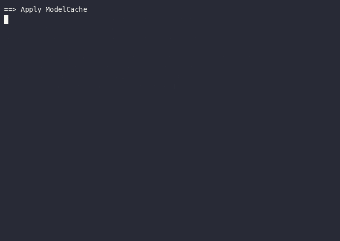
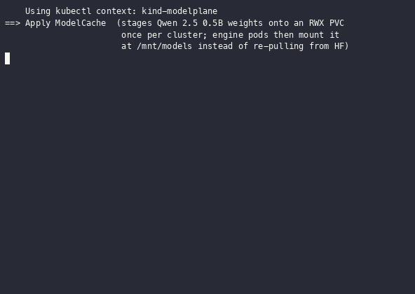

# Qwen + ModelCache demo

Idempotent, scripted end-to-end demo of `ModelCache` plus multi-node `TensorPipeline` serving. Provisions a 2-node T4 GKE cluster, hydrates a `ModelCache` from HuggingFace onto a shared RWX PVC, brings up a 2-pod LWS gang that mounts the cached weights, and serves a real chat completion over HTTP.



*Warm-cluster run: cache pre-hydrated, LWS gang Ready in 65s, engine answers 86s after gang Ready. 4× speed.*



*Fresh-cache run: `demo.sh` against an InferenceCluster that's already Ready but with no cache. Cache hydration → ModelDeployment → 2-pod LWS gang on two T4 nodes → IO-proof block (same NFS endpoint + same safetensors inode on both pods) → real chat-completion response. Real-time playback; pauses ≥5s collapsed so each phase has time to read.*

| Phase | Script | What it does |
|---|---|---|
| Setup | `./setup.sh` | Applies shared prereqs (gateway, class), provisions a 2-node T4 `InferenceCluster`, waits for Ready (~5–10 min) |
| Demo | `./demo.sh` | Applies `ModelCache`, waits for hydration, applies `ModelDeployment` (TensorPipeline 1×2) + `ModelService`, waits for the LWS gang, retries the curl until the engine is serving, sends a sanity chat-completion request |
| Reset demo | `./cleanup-demo.sh` | Removes workload + cache. Cluster + shared infra stay so `demo.sh` re-runs fast |
| Teardown | `./cleanup.sh` | Removes workload AND the InferenceCluster (deprovisions GKE) |

## Prerequisites

- Modelplane Configuration installed on the control-plane cluster, pointing at this branch's package (`./nix.sh run .#build-crossplane && ./nix.sh run .#push-crossplane`, then `kubectl apply` a Configuration manifest pointing at the pushed tag)
- Crossplane GCP provider configured with credentials that can create GKE clusters in your project
- GPU quota for **2× nvidia-tesla-t4** on `n1-standard-4` in `us-central1`
- `envsubst` available locally (from gettext)
- `GCP_PROJECT` env var set to your project ID

```sh
export GCP_PROJECT=my-gcp-project
./setup.sh    # 5–10 min: GKE provision + stack install
./demo.sh     # cache hydrate + LWS gang up + chat completion
```

## What you should see

```
==> Apply ModelCache
==> Wait for cache hydration
    Cache hydrated in <Ns>
==> Apply ModelDeployment (TensorPipeline 1x2 LWS gang) + ModelService
==> Waiting for the 2-pod LWS gang to be Ready
    LWS gang Ready in <Ms>
==> Wait for service address
    Service ready at http://<gateway>/<ns>/qwen-cached-demo
==> Send a test request (retries until engine is serving)
{"id":"chatcmpl-...","object":"chat.completion",...,"content":"A model cache is ..."}
    Engine answered after <Ks> of post-gang wait
==> Demo complete.
```

The two LWS gang pods (`qwen-cached-demo-kserve-mn-0` leader + `qwen-cached-demo-kserve-mn-0-1` worker) both mount the same `modelcache-qwen-2-5-0-5b` PVC at `/mnt/models`. Neither pod fetches weights from HuggingFace at boot. The leader runs `ray start --head` and the engine; the worker runs `ray start --address=$LWS_LEADER_ADDRESS:6379 --block` so vLLM's pipeline-parallel placement group sees both GPUs as one Ray cluster.

See [`TOPOLOGY.md`](TOPOLOGY.md) for the full XR / MR composition.

## Files

| File | Purpose |
|---|---|
| `infra/cluster.yaml` | InferenceCluster (2× T4 nodes, templated via `envsubst`) |
| `infra/class-t4.yaml` | InferenceClass for `n1-standard-4` + 1× T4 |
| `01-cache.yaml` | ModelCache: HuggingFace → per-cluster RWX PVC |
| `02-deployment.yaml` | ModelDeployment (TensorPipeline 1×2, references the cache via `spec.caches`) |
| `03-service.yaml` | ModelService for the deployment |
| `02b-deployment-uncached.yaml` / `03b-service-uncached.yaml` | Optional uncached side-by-side comparison (requires a 3rd GPU node) |
| `setup.sh` / `demo.sh` / `cleanup-demo.sh` / `cleanup.sh` | Sequenced lifecycle |
| `TOPOLOGY.md` | XR / MR composition diagram + prose |
| `demo.gif` | Recording of a warm-cluster run |
