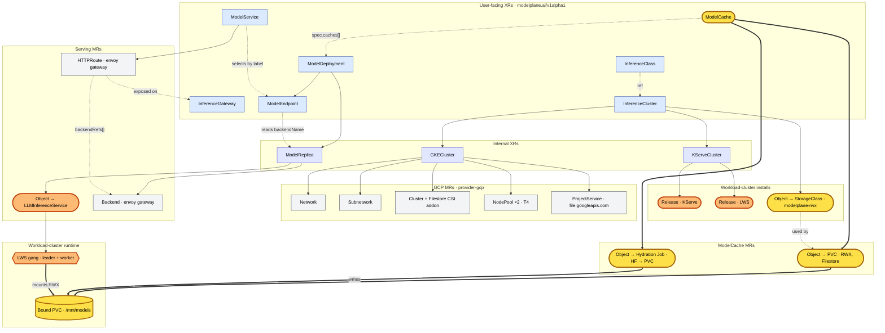

# qwen-cached-demo — XR / MR topology

Composition tree for the demo, top-down from user-facing XRs to live workload pods.

- 🟡 **ModelCache work** (new in PR #78)
- 🟠 **External substrate we may swap** (KServe LLMInferenceService, LWS gang, KServe/LWS installs — owned by upstream operators today)

## What changed in PR #78 / on this branch

**ModelCache primitive (yellow).** New user-facing XR + composition function that takes an artifact source (HuggingFace, S3, OCI, …) and a backend (PVC for v0.1) and emits a per-cluster RWX `PVC` + a one-shot hydration `Job`. `ModelDeployment.spec.caches[]` references the cache, and the deployment's composition sets `model.uri = pvc://modelcache-<name>` on the `LLMInferenceService` so every pod in the LWS gang mounts the same pre-populated PVC.

**Cloud-agnostic storage capability.** `InferenceCluster.spec.storage.csiDrivers: [SharedFilesystem]` is the *semantic* capability the user requests. The GKE branch of `compose-inference-cluster` reads the underlying VPC name from `GKECluster.status.network.name` and composes a workload-cluster `StorageClass` (`modelplane-rwx`) with `parameters.network=<our VPC>` so Filestore PVCs land in the reachable network. EKS / AKS branches will follow the same pattern with their respective knobs.

**GCP API auto-enable.** `compose-gke-cluster` now also composes a `ProjectService` MR for `file.googleapis.com` whenever the user opts into the Filestore CSI addon — without it, PVCs sit Pending forever with `SERVICE_DISABLED` in their workload-cluster events.

## Why the orange band is interesting

The orange items (`KServe Release`, `LWS Release`, `Object → LLMInferenceService`, and the LWS gang itself) are upstream-operator territory. We compose them today because they exist, work, and ship `model.uri = pvc://…` semantics out of the box. If/when Modelplane introduces an internal serving primitive that owns engine-pod + gang lifecycle directly, the swap point is exactly this band — `ModelDeployment` / `ModelService` / `ModelEndpoint` and the yellow ModelCache path are untouched.

## Why the yellow band is the minimum

Multi-node LWS serving structurally requires the same weight bytes on every gang pod. The minimum primitive that delivers that — and works without KServe's storage-initializer init-container OOMing on big models — is a per-cluster RWX PVC, hydrated once by a side Job, mounted read-only by every gang pod. v0.1 ships exactly that. Single-node scale-up benefits as a side effect (no per-replica HF pull). The harder content-addressed wins stay in v0.2 behind the same user-facing API.
