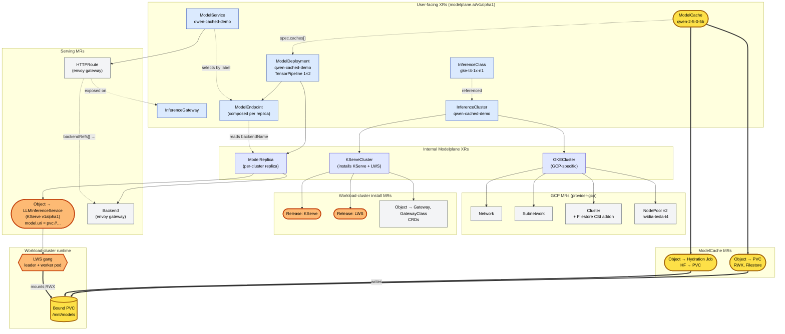

# qwen-cached-demo — XR / MR topology

What the demo composes, from user-facing XRs (top) down to live workload-cluster pods (bottom). **ModelCache work highlighted in yellow.** **External substrate we may replace with Modelplane-internal primitives highlighted in orange (KServe, LWS, LLMInferenceService).**

## Legend

| Color | Layer |
|---|---|
| 🟡 yellow | **ModelCache work** — XR, PVC MR, Job MR, mounted PVC (new in PR #78) |
| 🟠 orange | **External substrate we may replace** — KServe `LLMInferenceService`, LWS gang, KServe/LWS Helm releases. Internalising these would let us own the engine-pod + gang lifecycle directly instead of riding on top of two upstream operators. |
| 🔵 blue | User-facing Modelplane XR |
| 🟣 indigo | Internal Modelplane XR (composition-only, not user-applied) |
| ⚪ grey | Managed Resource (cloud or k8s primitive) |
| 🟢 green | Workload-cluster runtime |

## Key paths

**Cluster provisioning** (cold infra, runs once per cluster):
`InferenceCluster` → `GKECluster` → `Network` / `Subnetwork` / `Cluster (+Filestore CSI addon)` / `NodePool ×2`
`InferenceCluster` → `KServeCluster` → Helm `Release` for KServe + LWS, plus Gateway CRDs.

**Cache hydration** (yellow path, runs once per cluster per ModelCache):
`ModelCache` → `Object → PVC` (RWX, Filestore-backed) + `Object → Hydration Job` (HF → PVC).
The Job writes weights into the PVC and exits. Cache reports `ArtifactReady`.

**Serving** (one ModelDeployment, one ModelService, all the orange stuff is currently KServe/LWS):
`ModelDeployment` → `ModelReplica` (one per matching cluster) → `Object → LLMInferenceService` + `Backend`.
The LLMInferenceService spec has `model.uri = pvc://modelcache-<name>` so KServe + LWS spin up a **gang of 2 pods** that both mount the cached PVC at `/mnt/models` — the yellow `mounts RWX` edge from the gang back to the cached PVC.
`ModelDeployment` → `ModelEndpoint` (one per replica) — reads `backendName` from the `ModelReplica`'s composed `Backend`.
`ModelService` selects `ModelEndpoint`s by label and emits an `HTTPRoute` whose `backendRefs[]` point at those backends; the route attaches to `InferenceGateway`.

## Why the orange highlight matters

The orange items are *substrate we don't own*. KServe's `LLMInferenceService` shape and LWS gang semantics are upstream contracts; today we compose them as MRs because they exist and they work. If/when Modelplane introduces an internal serving primitive (one that owns engine-pod + gang lifecycle without two operators in the middle), the swap point is exactly the orange band — the user-facing API (`ModelDeployment` / `ModelService` / `ModelEndpoint`) is unaffected.

The minimum needed to unblock multi-node LWS today is the **yellow path**. Everything orange is here because the existing OSS substrate makes it free to plug in for v0.1.
