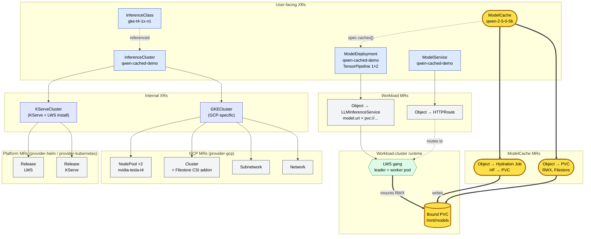

# qwen-cached-demo — XR / MR topology

What the demo composes, from user-facing XRs (top) down to live workload-cluster pods (bottom). **ModelCache work highlighted in yellow.**

## Legend

| Color | Layer |
|---|---|
| 🟡 yellow | **ModelCache** — XR, MRs, hydrated PVC (the new primitive in PR #78) |
| 🔵 blue | User-facing XR |
| 🟣 indigo | Internal XR (one layer down) |
| ⚪ grey | Managed Resource (a real cloud / k8s object) |
| 🟢 green | Runtime objects on the workload cluster |

## What the highlighted path shows

1. `ModelCache` XR composes two MRs: a `PVC` (RWX, backed by Filestore via the cluster's `csiDrivers: [SharedFilesystem]` capability) and a one-shot hydration `Job` that pulls weights from HuggingFace and writes them to the PVC.
2. `ModelDeployment.spec.caches: [{name: qwen-2-5-0-5b}]` makes the composition function set `LLMInferenceService.spec.model.uri = pvc://modelcache-qwen-2-5-0-5b`.
3. KServe + LWS expand that into a **gang of 2 pods (leader + worker)** that both mount the same PVC at `/mnt/models` — no per-pod HF download, no init-container OOM.

The minimum needed to unblock multi-node LWS is exactly the yellow path. Everything else (cluster, KServe, gateway) is shared infrastructure that exists whether ModelCache exists or not.
